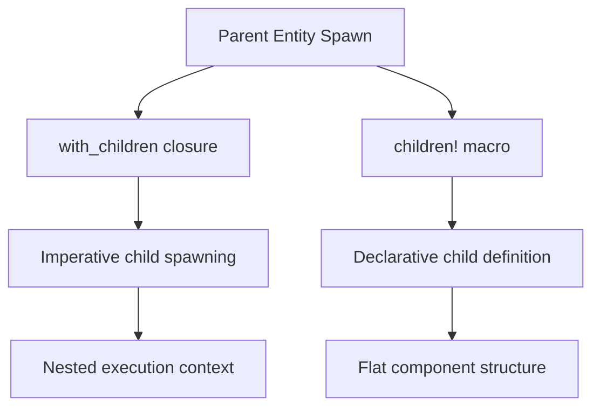

+++
title = "#20906 Update the 3D examples to use `children!`"
date = "2025-09-07T00:00:00"
draft = false
template = "pull_request_page.html"
in_search_index = true

[taxonomies]
list_display = ["show"]

[extra]
current_language = "en"
available_languages = {"en" = { name = "English", url = "/pull_request/bevy/2025-09/pr-20906-en-20250907" }, "zh-cn" = { name = "中文", url = "/pull_request/bevy/2025-09/pr-20906-zh-cn-20250907" }}
labels = ["A-Rendering", "C-Examples", "D-Straightforward"]
+++

# Update the 3D examples to use `children!`

## Basic Information
- **Title**: Update the 3D examples to use `children!`
- **PR Link**: https://github.com/bevyengine/bevy/pull/20906
- **Author**: janis-bhm
- **Status**: MERGED
- **Labels**: A-Rendering, C-Examples, S-Ready-For-Final-Review, D-Straightforward
- **Created**: 2025-09-06T16:44:12Z
- **Merged**: 2025-09-07T16:44:36Z
- **Merged By**: alice-i-cecile

## Description Translation
**Objective**
Works on #18238

**Solution**
Convert calls to `.with_children` to use the `Children::spawn` or `Children::spawn_one` types or `children!` macro.
This touches the `3d` folder.
I can break this up into more PRs or squash if desired.

**Testing**
I've run the examples before and after this patch and verified visually that nothing has changed.

I have noticed some strange inconsistencies in the the mixed_lighting example where switching from real-time to mixed(indirect) will break shadows (including switching between any except real-time after) that is unaffected by my changes. I haven't investigated this yet.

## The Story of This Pull Request

This PR addresses a systematic refactoring effort across Bevy's 3D examples, converting imperative child entity spawning patterns to a more declarative approach using the `children!` macro. The changes represent a modernization effort that aligns with Bevy's evolving API design principles.

The core problem being addressed was the use of verbose `.with_children()` calls that required nested closures and imperative spawning logic. This pattern, while functional, created several issues:

1. **Readability**: Nested closures made code harder to follow
2. **Maintenance**: Changes required understanding closure boundaries
3. **Consistency**: Mixed patterns across the codebase
4. **Boilerplate**: Excessive code for simple parent-child relationships

The solution approach was straightforward but comprehensive: replace all `.with_children()` calls in 3D examples with the `children!` macro, which provides a more declarative syntax for defining child entities. This macro allows developers to specify child components and bundles directly within the parent entity's spawn command, eliminating the need for nested closures.

The implementation required careful analysis of each example's child spawning patterns. In many cases, the conversion was mechanical - replacing closure-based spawning with macro invocations. However, some examples required more thoughtful restructuring:

```rust
// Before:
commands.spawn((ComponentA, ComponentB))
    .with_children(|parent| {
        parent.spawn((ChildComponentA, ChildComponentB));
    });

// After:
commands.spawn((ComponentA, ComponentB, 
    children![(ChildComponentA, ChildComponentB)]
));
```

The technical insight here is that the `children!` macro creates a `Children` component that contains pre-configured child entities. This approach offers several advantages:

1. **Compile-time validation**: Child entity structure is validated earlier
2. **Reduced nesting**: Flatter code structure improves readability
3. **Better composition**: Child entities become declarative components of parents
4. **Performance**: Eliminates runtime closure execution for child spawning

The impact of these changes is significant for code maintainability and developer experience. The new syntax is more concise, reduces cognitive load, and makes entity relationships more explicit. For Bevy users studying these examples, the updated code provides clearer patterns for their own projects.

Throughout the implementation, the author maintained functional equivalence by visually verifying that each example's behavior remained unchanged. The changes are purely syntactic improvements that don't affect runtime behavior.

## Visual Representation



## Key Files Changed

The most significant changes occurred in these files:

### `examples/3d/color_grading.rs` (+110/-123)
**Purpose**: Refactored complex UI hierarchy generation for color grading controls
**Key Changes**: Converted nested UI element spawning to declarative `children!` macros

```rust
// Before:
parent.spawn(Node::default()).with_children(|parent| {
    parent.spawn(Node { width: px(125), ..default() });
    for option in [...] {
        add_button_for_value(parent, option, color_grading, font);
    }
});

// After:
(
    Node::default(),
    children![
        Node { width: px(125), ..default() },
        make_button(SelectedGlobalColorGradingOption::Exposure),
        make_button(SelectedGlobalColorGradingOption::Temperature),
        // ... more buttons
    ],
)
```

### `examples/helpers/widgets.rs` (+68/-71)
**Purpose**: Updated widget helper functions to return bundles instead of imperative spawning
**Key Changes**: Converted widget creation functions to return component bundles

```rust
// Before:
pub fn spawn_ui_text<'a>(parent: &'a mut ChildSpawnerCommands, label: &str, color: Color) -> EntityCommands<'a> {
    parent.spawn((Text::new(label), TextFont { font_size: 18.0, ..default() }, TextColor(color)))
}

// After:
pub fn ui_text(label: &str, color: Color) -> impl Bundle + use<> {
    (Text::new(label), TextFont { font_size: 18.0, ..default() }, TextColor(color))
}
```

### `examples/3d/light_textures.rs` (+53/-65)
**Purpose**: Simplified light entity setup with complex child components
**Key Changes**: Consolidated light entity spawning with children macro

```rust
// Before:
commands.spawn((Visibility::Hidden, Transform::from_xyz(8.0, 8.0, 4.0), Selection::DirectionalLight))
    .with_child((DirectionalLight { illuminance: AMBIENT_DAYLIGHT, ..default() }, Visible));

// After:
commands.spawn((
    Visibility::Hidden,
    Transform::from_xyz(8.0, 8.0, 4.0),
    Selection::DirectionalLight,
    children![(DirectionalLight { illuminance: AMBIENT_DAYLIGHT, ..default() }, Visible)]
));
```

### `examples/3d/shadow_biases.rs` (+51/-54)
**Purpose**: Streamlined light entity setup with multiple child components
**Key Changes**: Replaced closure-based child spawning with children macro

```rust
// Before:
commands.spawn((light_transform, Visibility::default(), Lights))
    .with_children(|builder| {
        builder.spawn(PointLight { intensity: 0.0, ..default() });
        builder.spawn(DirectionalLight { ..default() });
    });

// After:
commands.spawn((
    light_transform,
    Visibility::default(),
    Lights,
    children![
        (PointLight { intensity: 0.0, ..default() }),
        (DirectionalLight { ..default() })
    ]
));
```

### `examples/3d/split_screen.rs` (+38/-41)
**Purpose**: Refactored UI setup for split-screen example
**Key Changes**: Converted UI element creation to bundle-based approach

```rust
// Before:
fn rotate_button(parent: &mut ChildSpawnerCommands, caption: &str, direction: Direction) {
    parent.spawn((RotateCamera(direction), Button, Node { ... }))
        .with_children(|parent| {
            parent.spawn(Text::new(caption));
        });
}

// After:
fn rotate_button(caption: &str, direction: Direction) -> impl Bundle {
    (
        RotateCamera(direction),
        Button,
        Node { ... },
        children![Text::new(caption)]
    )
}
```

## Further Reading

- [Bevy ECS Guide: Bundles](https://bevyengine.org/learn/books/introduction/ecs#bundles)
- [Rust Macros Guide](https://doc.rust-lang.org/book/ch19-06-macros.html)
- [Bevy GitHub Discussion: children! macro](https://github.com/bevyengine/bevy/discussions/18238)
- [Entity Component System Pattern](https://en.wikipedia.org/wiki/Entity_component_system)