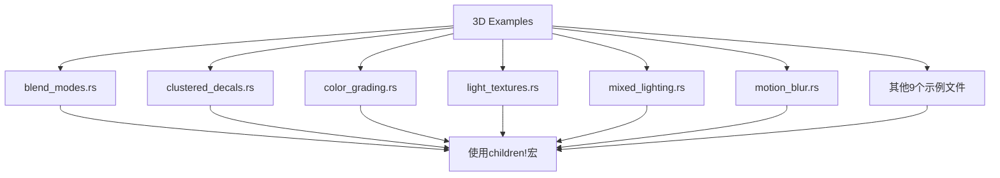

+++
title = "#20906 Update the 3D examples to use `children!"
date = "2025-09-07T00:00:00"
draft = false
template = "pull_request_page.html"
in_search_index = false

[extra]
current_language = "zh-cn"
available_languages = {"en" = { name = "English", url = "/pull_request/bevy/2025-09/pr-20906-en-20250907" }, "zh-cn" = { name = "中文", url = "/pull_request/bevy/2025-09/pr-20906-zh-cn-20250907" }}
+++

# Update the 3D examples to use `children!`

## 基本信息
- **标题**: Update the 3D examples to use `children!`
- **PR链接**: https://github.com/bevyengine/bevy/pull/20906
- **作者**: janis-bhm
- **状态**: 已合并
- **标签**: A-Rendering, C-Examples, S-Ready-For-Final-Review, D-Straightforward
- **创建时间**: 2025-09-06T16:44:12Z
- **合并时间**: 2025-09-07T16:44:36Z
- **合并者**: alice-i-cecile

## 描述翻译
### 目标
解决 #18238

### 解决方案
将 `.with_children` 调用转换为使用 `Children::spawn` 或 `Children::spawn_one` 类型，或者使用 `children!` 宏。
这涉及 `3d` 文件夹的修改。
如果需要，可以将此拆分为多个 PR 或进行压缩提交。

### 测试
我在应用此补丁前后都运行了示例，并通过视觉验证确认没有任何变化。

我注意到在 mixed_lighting 示例中存在一些奇怪的不一致性：从实时（real-time）切换到混合（间接）（mixed(indirect)）会破坏阴影（包括在实时之后切换到任何其他模式），但这与我的更改无关。我尚未对此进行调查。

## 这个Pull Request的故事

这个PR主要解决了一个代码现代化的问题。在Bevy引擎的早期版本中，创建带有子实体的实体通常使用`.with_children()`方法，这种方式需要传入一个闭包来构建子实体。随着Bevy的发展，引入了更简洁的`children!`宏和相关的spawn方法，这些新方法提供了更直观、更函数式的API。

### 问题和背景
Bevy的ECS（Entity Component System）架构中，实体之间的关系通过父子层级（parent-child hierarchy）来管理。传统的`.with_children()`方法虽然功能完整，但在代码可读性和简洁性方面存在不足：
- 需要嵌套闭包，导致代码缩进层次深
- 闭包中的变量捕获有时会让代码逻辑不够清晰
- 与Bevy其他部分的命令式生成模式不一致

### 解决方案方法
开发者选择了最直接的方法：将现有的`.with_children()`调用替换为新的`children!`宏。这种方法有几个优势：
1. **代码简洁性**：`children!`宏允许在一行内定义所有子实体
2. **一致性**：使所有3D示例使用相同的API风格
3. **可读性**：减少了嵌套层次，使代码结构更扁平化

### 具体实现
这个PR修改了14个3D示例文件，将传统的`.with_children()`模式转换为使用`children!`宏。转换的基本模式是从：

```rust
commands.spawn((/* components */))
    .with_children(|parent| {
        parent.spawn((/* child components */));
        parent.spawn((/* another child */));
    });
```

转换为：

```rust
commands.spawn((
    /* components */,
    children![
        (/* child components */),
        (/* another child */)
    ]
));
```

### 技术洞察
`children!`宏的实现基于Bevy的bundle系统，它实际上创建了一个包含所有子实体的bundle。这种方式的优势在于：
- **编译时检查**：宏在编译时展开，能捕获一些类型错误
- **零成本抽象**：运行时性能与手动编写代码相同
- **组合性**：可以与其他bundle轻松组合使用

### 影响
这些更改虽然不改变功能，但带来了重要的代码质量改进：
1. **一致性**：所有3D示例现在使用相同的子实体创建模式
2. **可维护性**：更简洁的代码意味着更少的bug和更容易的理解
3. **示范作用**：为Bevy用户提供了使用新API的最佳实践示例

## 可视化表示



## 关键文件变更

### `examples/3d/color_grading.rs` (+110/-123)
这个文件包含了颜色分级示例的UI控件，修改将复杂的嵌套UI构建逻辑转换为更扁平化的`children!`宏使用。

**修改前:**
```rust
commands.spawn(Node { /* ... */ })
    .with_children(|parent| {
        for section in [/* ... */] {
            add_buttons_for_section(parent, section, color_grading, font);
        }
    });
```

**修改后:**
```rust
commands.spawn((
    Node { /* ... */ },
    children![
        buttons_for_section(SelectedColorGradingSection::Highlights, color_grading, font),
        buttons_for_section(SelectedColorGradingSection::Midtones, color_grading, font),
        buttons_for_section(SelectedColorGradingSection::Shadows, color_grading, font),
    ],
));
```

### `examples/helpers/widgets.rs` (+68/-71)
这个辅助文件包含了共享的UI组件，修改将原有的命令式生成函数转换为返回bundle的函数式风格。

**修改前:**
```rust
pub fn spawn_option_button<T>(parent: &mut ChildSpawnerCommands, /* ... */) {
    parent.spawn((/* ... */))
        .with_children(|parent| {
            spawn_ui_text(parent, option_name, fg_color);
        });
}
```

**修改后:**
```rust
pub fn option_button<T>(/* ... */) -> impl Bundle {
    (
        /* ... */,
        children![(
            ui_text(option_name, fg_color),
            /* ... */
        )],
    )
}
```

### `examples/3d/light_textures.rs` (+53/-65)
光照纹理示例中的灯光实体构建被简化，使用`children!`宏将多个组件组合在一起。

**修改前:**
```rust
commands.spawn((Visibility::Hidden, Transform::from_xyz(8.0, 8.0, 4.0), Selection::DirectionalLight))
    .with_child((
        DirectionalLight { /* ... */ },
        DirectionalLightTexture { /* ... */ },
        Visibility::Visible,
    ));
```

**修改后:**
```rust
commands.spawn((
    Visibility::Hidden,
    Transform::from_xyz(8.0, 8.0, 4.0),
    Selection::DirectionalLight,
    children![(
        DirectionalLight { /* ... */ },
        DirectionalLightTexture { /* ... */ },
        Visibility::Visible,
    )],
));
```

### `examples/3d/shadow_biases.rs` (+51/-54)
阴影偏置示例中的灯光和UI构建被重构，使用更简洁的语法。

### `examples/3d/split_screen.rs` (+38/-41)
分屏示例中的UI按钮生成逻辑被简化，使用函数返回bundle而不是直接生成实体。

## 延伸阅读

- [Bevy ECS 官方文档](https://bevyengine.org/learn/book/getting-started/ecs/)
- [Bevy UI 系统指南](https://bevyengine.org/learn/book/getting-started/ui/)
- [Rust 宏编程指南](https://doc.rust-lang.org/book/ch19-06-macros.html)
- [Bevy 子实体和层级系统](https://bevyengine.org/learn/book/getting-started/parenting/)