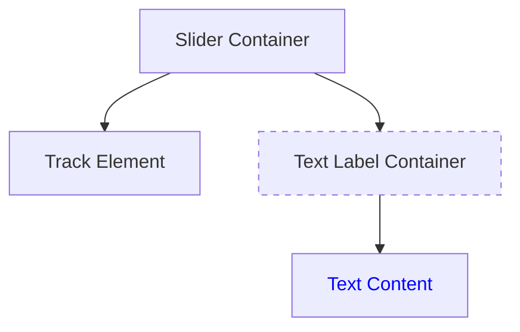

+++
title = "#20909 Set feather's slider's text to use absolute positioning"
date = "2025-09-07T00:00:00"
draft = false
template = "pull_request_page.html"
in_search_index = true

[taxonomies]
list_display = ["show"]

[extra]
current_language = "en"
available_languages = {"en" = { name = "English", url = "/pull_request/bevy/2025-09/pr-20909-en-20250907" }, "zh-cn" = { name = "中文", url = "/pull_request/bevy/2025-09/pr-20909-zh-cn-20250907" }}
labels = ["C-Bug", "A-UI", "D-Straightforward"]
+++

# Set feather's slider's text to use absolute positioning

## Basic Information
- **Title**: Set feather's slider's text to use absolute positioning
- **PR Link**: https://github.com/bevyengine/bevy/pull/20909
- **Author**: ickshonpe
- **Status**: MERGED
- **Labels**: C-Bug, A-UI, D-Straightforward
- **Created**: 2025-09-06T21:32:50Z
- **Merged**: 2025-09-07T03:01:27Z
- **Merged By**: james7132

## Description Translation
The original description is in English, so it is included as-is:

# Objective

The slider value label's container isn't absolutely positioned, which causes the slider to expand if the label becomes wider than the slider

## Solution

Set it to use absolute positioning.

## The Story of This Pull Request

This PR addresses a layout issue in Bevy's feather UI slider component where the text label displaying the slider's value could cause unintended layout expansion. The problem occurred when the text label content became wider than the slider itself - instead of the text overlapping or clipping, the entire slider container would expand to accommodate the wider text.

The root cause was that the text container node used flexbox layout without absolute positioning. In CSS terms, this meant the text element was participating in the normal document flow, causing its parent container to resize when the text content exceeded the slider's width.

The solution implemented was straightforward and effective: add `position_type: PositionType::Absolute` to the text container's node properties. This change removes the text container from the normal layout flow, allowing it to overflow without affecting the slider's dimensions. The existing flexbox properties (`flex_direction`, `align_items`, `justify_content`) continue to control the text alignment within this now-absolutely positioned container.

This fix maintains the visual appearance and functionality of the slider while preventing layout disruptions caused by variable-width text content. The change is minimal and surgical, affecting only the specific layout behavior that was causing the issue.

From an engineering perspective, this demonstrates proper use of absolute positioning in UI layouts - isolating elements that shouldn't affect their container's dimensions while maintaining their intended visual presentation.

## Visual Representation



*Note: Dashed border indicates absolutely positioned element after the fix*

## Key Files Changed

### `crates/bevy_feathers/src/controls/slider.rs` (+3/-2)

This file contains the slider UI component implementation. The changes modify the text container's positioning behavior.

**Key modifications:**
```rust
// Before:
Node {
    display: Display::Flex,
    flex_direction: FlexDirection::Row,
    align_items: AlignItems::Center,
    justify_content: JustifyContent::Center,
    // ... other properties
}

// After:
Node {
    display: Display::Flex,
    position_type: PositionType::Absolute, // Added this line
    flex_direction: FlexDirection::Row,
    align_items: AlignItems::Center,
    justify_content: JustifyContent::Center,
    // ... other properties
}
```

The change adds a single property (`position_type: PositionType::Absolute`) to make the text container use absolute positioning instead of participating in the normal layout flow.

Additionally, the import section was updated to include `PositionType`:
```rust
// Import change: Added PositionType to the use statement
use bevy_ui::{
    widget::Text, AlignItems, BackgroundGradient, ColorStop, Display, FlexDirection, Gradient,
    InteractionDisabled, InterpolationColorSpace, JustifyContent, LinearGradient, Node,
    PositionType, UiRect, Val,  // PositionType was added here
};
```

## Further Reading

- [Bevy UI Documentation](https://docs.rs/bevy_ui/latest/bevy_ui/)
- [CSS Position Property (for conceptual reference)](https://developer.mozilla.org/en-US/docs/Web/CSS/position)
- [Flexbox Layout Guide](https://css-tricks.com/snippets/css/a-guide-to-flexbox/)
- [Absolute vs Relative Positioning](https://developer.mozilla.org/en-US/docs/Web/CSS/position#types_of_positioning)

# Full Code Diff
```diff
diff --git a/crates/bevy_feathers/src/controls/slider.rs b/crates/bevy_feathers/src/controls/slider.rs
index d618057dfc0df..d649ae62050e7 100644
--- a/crates/bevy_feathers/src/controls/slider.rs
+++ b/crates/bevy_feathers/src/controls/slider.rs
@@ -21,8 +21,8 @@ use bevy_picking::PickingSystems;
 use bevy_reflect::{prelude::ReflectDefault, Reflect};
 use bevy_ui::{
     widget::Text, AlignItems, BackgroundGradient, ColorStop, Display, FlexDirection, Gradient,
-    InteractionDisabled, InterpolationColorSpace, JustifyContent, LinearGradient, Node, UiRect,
-    Val,
+    InteractionDisabled, InterpolationColorSpace, JustifyContent, LinearGradient, Node,
+    PositionType, UiRect, Val,
 };
 
 use crate::{
@@ -111,6 +111,7 @@ pub fn slider<B: Bundle>(props: SliderProps, overrides: B) -> impl Bundle {
             // Text container
             Node {
                 display: Display::Flex,
+                position_type: PositionType::Absolute,
                 flex_direction: FlexDirection::Row,
                 align_items: AlignItems::Center,
                 justify_content: JustifyContent::Center,
```