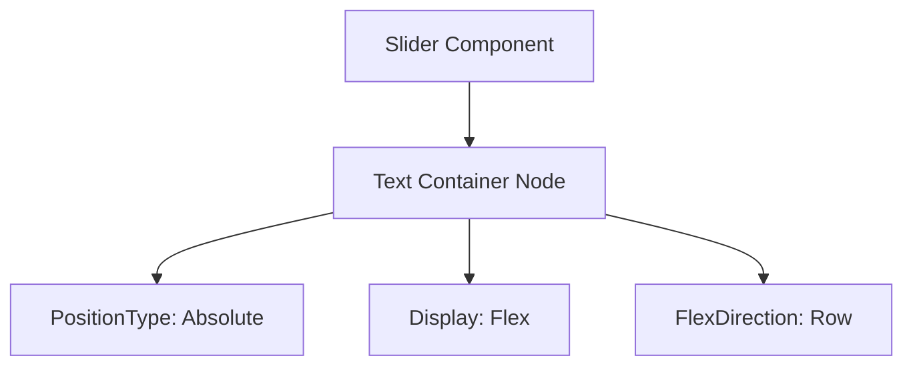

+++
title = "#20909 Set feather's slider's text to use absolute positioning"
date = "2025-09-07T00:00:00"
draft = false
template = "pull_request_page.html"
in_search_index = false

[extra]
current_language = "zh-cn"
available_languages = {"en" = { name = "English", url = "/pull_request/bevy/2025-09/pr-20909-en-20250907" }, "zh-cn" = { name = "中文", url = "/pull_request/bevy/2025-09/pr-20909-zh-cn-20250907" }}
+++

# Set feather's slider's text to use absolute positioning

## 基本信息
- **标题**: Set feather's slider's text to use absolute positioning
- **PR链接**: https://github.com/bevyengine/bevy/pull/20909
- **作者**: ickshonpe
- **状态**: 已合并
- **标签**: C-Bug, A-UI, D-Straightforward
- **创建时间**: 2025-09-06T21:32:50Z
- **合并时间**: 2025-09-07T03:01:27Z
- **合并者**: james7132

## 描述翻译
# 目标

滑块值标签的容器未使用绝对定位，这导致当标签比滑块更宽时，滑块会扩展

## 解决方案

将其设置为使用绝对定位。

## 这个PR的故事

这个PR解决了一个UI布局中的具体问题。在Bevy引擎的feathers UI组件库中，滑块控件的数值标签存在布局缺陷。当标签文本的宽度超过滑块本身的宽度时，会导致整个滑块控件意外扩展，破坏了预期的UI布局。

问题的根本原因在于文本容器的定位方式。原来的实现使用了相对定位（默认的position_type），这意味着文本容器会参与正常的文档流布局，其尺寸变化会影响父容器的尺寸计算。当文本内容变长时，整个滑块控件就会被撑大。

解决方案很直接：将文本容器的定位方式改为绝对定位。这样文本容器就脱离了正常的文档流，其尺寸变化不会影响父容器的布局。文本标签会相对于其最近的已定位祖先元素进行定位，而不会影响滑块本身的尺寸。

从技术实现角度看，这个修改涉及两个部分：
1. 在导入语句中添加`PositionType`枚举
2. 在文本容器的Node组件中设置`position_type: PositionType::Absolute`

这种修改是UI开发中处理类似布局问题的标准做法。绝对定位在这种场景下是合适的选择，因为数值标签本质上是一个覆盖在滑块上的装饰性元素，不应该影响主要控件的布局行为。

修改后的代码确保了无论文本内容如何变化，滑块控件都能保持其预期的尺寸和布局行为，同时文本标签仍然能够正确显示在滑块上方。

## 视觉表示



## 关键文件更改

- `crates/bevy_feathers/src/controls/slider.rs` (+3/-2)

主要修改了滑块控件的文本容器定位方式：

```rust
// File: crates/bevy_feathers/src/controls/slider.rs
// 导入部分修改前:
use bevy_ui::{
    widget::Text, AlignItems, BackgroundGradient, ColorStop, Display, FlexDirection, Gradient,
    InteractionDisabled, InterpolationColorSpace, JustifyContent, LinearGradient, Node, UiRect,
    Val,
};

// 导入部分修改后:
use bevy_ui::{
    widget::Text, AlignItems, BackgroundGradient, ColorStop, Display, FlexDirection, Gradient,
    InteractionDisabled, InterpolationColorSpace, JustifyContent, LinearGradient, Node,
    PositionType, UiRect, Val,
};

// Node组件修改前:
Node {
    display: Display::Flex,
    flex_direction: FlexDirection::Row,
    align_items: AlignItems::Center,
    justify_content: JustifyContent::Center,
    // ... 其他属性
}

// Node组件修改后:
Node {
    display: Display::Flex,
    position_type: PositionType::Absolute,
    flex_direction: FlexDirection::Row,
    align_items: AlignItems::Center,
    justify_content: JustifyContent::Center,
    // ... 其他属性
}
```

这些修改确保了文本容器使用绝对定位，解决了滑块因文本宽度而扩展的问题。

## 延伸阅读

- [CSS Position属性文档](https://developer.mozilla.org/en-US/docs/Web/CSS/position)
- [Bevy UI布局系统](https://bevyengine.org/learn/books/bevy-ui/)
- [Flexbox布局指南](https://css-tricks.com/snippets/css/a-guide-to-flexbox/)

# 完整代码差异
```diff
diff --git a/crates/bevy_feathers/src/controls/slider.rs b/crates/bevy_feathers/src/controls/slider.rs
index d618057dfc0df..d649ae62050e7 100644
--- a/crates/bevy_feathers/src/controls/slider.rs
+++ b/crates/bevy_feathers/src/controls/slider.rs
@@ -21,8 +21,8 @@ use bevy_picking::PickingSystems;
 use bevy_reflect::{prelude::ReflectDefault, Reflect};
 use bevy_ui::{
     widget::Text, AlignItems, BackgroundGradient, ColorStop, Display, FlexDirection, Gradient,
-    InteractionDisabled, InterpolationColorSpace, JustifyContent, LinearGradient, Node, UiRect,
-    Val,
+    InteractionDisabled, InterpolationColorSpace, JustifyContent, LinearGradient, Node,
+    PositionType, UiRect, Val,
 };
 
 use crate::{
@@ -111,6 +111,7 @@ pub fn slider<B: Bundle>(props: SliderProps, overrides: B) -> impl Bundle {
             // Text container
             Node {
                 display: Display::Flex,
+                position_type: PositionType::Absolute,
                 flex_direction: FlexDirection::Row,
                 align_items: AlignItems::Center,
                 justify_content: JustifyContent::Center,
```