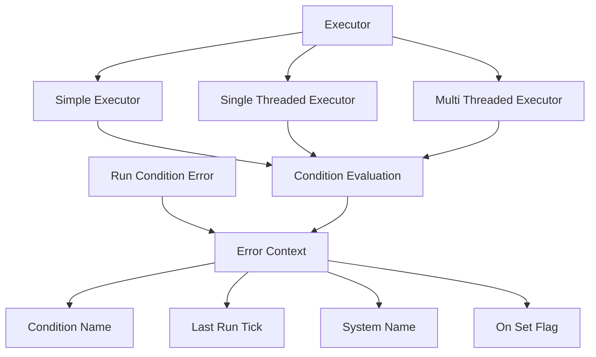

+++
title = "#20911 Run condition error tracks system"
date = "2025-09-11T00:00:00"
draft = false
template = "pull_request_page.html"
in_search_index = true

[taxonomies]
list_display = ["show"]

[extra]
current_language = "en"
available_languages = {"en" = { name = "English", url = "/pull_request/bevy/2025-09/pr-20911-en-20250911" }, "zh-cn" = { name = "中文", url = "/pull_request/bevy/2025-09/pr-20911-zh-cn-20250911" }}
labels = ["A-ECS", "C-Usability", "D-Straightforward"]
+++

# Run condition error tracks system

## Basic Information
- **Title**: Run condition error tracks system
- **PR Link**: https://github.com/bevyengine/bevy/pull/20911
- **Author**: janis-bhm
- **Status**: MERGED
- **Labels**: A-ECS, C-Usability, S-Ready-For-Final-Review, X-Uncontroversial, D-Straightforward
- **Created**: 2025-09-06T22:58:34Z
- **Merged**: 2025-09-11T20:17:12Z
- **Merged By**: alice-i-cecile

## Description Translation
# Objective

fixes #20235

## Solution

add `system` and `on_set` fields to RunCondition error context

## Testing

I've added a test that checks the correct system is referenced, and whether or not the condition was on a set containing the system.
I don't believe there is a good way of tracking the set itself because sets don't have names, only type paths, which would also be harder to access where conditions are run.

## The Story of This Pull Request

This PR addresses a debugging issue in Bevy's ECS system where run condition errors lacked sufficient context. When a run condition failed, the error message only indicated which condition failed, but didn't specify which system or system set the condition was associated with. This made debugging complex schedules difficult, especially when the same condition was used across multiple systems or sets.

The core problem was in the error context structure for run conditions. The original `ErrorContext::RunCondition` variant only contained the condition name and last run tick:

```rust
// Before
Self::RunCondition { name, last_run } => {
    write!(f, "Run condition `{name}` failed")
}
```

The solution adds two critical pieces of information to the error context: the system name the condition is attached to, and whether the condition was applied to a system set. This required changes across multiple components of the ECS scheduling system.

The implementation follows a consistent pattern across all three executor types (simple, single-threaded, and multi-threaded). Each executor's condition evaluation function now receives additional parameters:

```rust
// After in all executors
unsafe fn evaluate_and_fold_conditions(
    conditions: &mut [ConditionWithAccess],
    world: UnsafeWorldCell,
    error_handler: ErrorHandler,
    for_system: &ScheduleSystem,  // New parameter
    on_set: bool,                 // New parameter
) -> bool
```

When a condition evaluation fails, the error handler now receives the complete context:

```rust
// Updated error context
Self::RunCondition {
    name,
    system,  // New field
    on_set,  // New field
    ..
} => {
    write!(
        f,
        "Run condition `{name}` failed for{} system `{system}`",
        if *on_set { " set containing" } else { "" }
    )
}
```

The changes maintain backward compatibility while significantly improving debugging capabilities. The error messages now clearly indicate whether a condition failed on a specific system or on a set containing that system.

The testing approach demonstrates practical validation of the feature. The test creates two different scenarios - one with a condition on a system, and another with a condition on a set - and verifies that the error context contains the correct system reference and set flag.

```rust
#[test]
fn run_if_error_contains_system() {
    // Test setup with custom error handler
    fn my_error_handler(_: BevyError, ctx: ErrorContext) {
        let a = IntoSystem::into_system(system_a);
        let b = IntoSystem::into_system(system_b);
        assert!(
            matches!(ctx, ErrorContext::RunCondition { system, on_set, .. } 
                if (on_set && system == b.name()) || (!on_set && system == a.name()))
        );
    }
}
```

This implementation represents a pragmatic solution to the debugging problem. While it doesn't track the specific set (which would require more complex changes due to sets being identified by type paths rather than names), it provides the essential information needed to pinpoint where a run condition failure occurred.

## Visual Representation



## Key Files Changed

### `crates/bevy_ecs/src/error/handler.rs` (+15/-2)
This file defines the error context structure. The changes add two new fields to the RunCondition variant and update the display formatting to include the system context.

**Before:**
```rust
pub enum ErrorContext {
    RunCondition {
        name: DebugName,
        last_run: Tick,
    },
    // ... other variants
}
```

**After:**
```rust
pub enum ErrorContext {
    RunCondition {
        name: DebugName,
        last_run: Tick,
        system: DebugName,  // Added
        on_set: bool,       // Added
    },
    // ... other variants
}
```

### `crates/bevy_ecs/src/schedule/executor/multi_threaded.rs` (+8/-0)
**Changes:** Added parameters to condition evaluation function calls to pass system context and set information.

**Key modification:**
```rust
// In condition evaluation calls
evaluate_and_fold_conditions(
    &mut conditions.set_conditions[set_idx],
    world,
    error_handler,
    system,    // Added
    true,      // Added - indicates this is for a set
)
```

### `crates/bevy_ecs/src/schedule/executor/simple.rs` (+12/-4)
**Changes:** Similar to multi-threaded executor, plus reordering to get system reference before condition evaluation.

**Key modification:**
```rust
// System reference moved before condition evaluation
let system = &mut schedule.systems[system_index].system;

// Condition evaluation now includes system context
evaluate_and_fold_conditions(
    &mut schedule.system_conditions[system_index],
    world,
    error_handler,
    system,  // Added
    false,   // Added - indicates this is for a system
)
```

### `crates/bevy_ecs/src/schedule/executor/single_threaded.rs` (+12/-4)
**Changes:** Same pattern as simple executor - system reference extraction and additional parameters to condition evaluation.

### `crates/bevy_ecs/src/schedule/condition.rs` (+40/-2)
**Changes:** Added comprehensive test to verify the error context contains correct system information for both system-level and set-level conditions.

## Further Reading

- [Bevy ECS Scheduling Documentation](https://bevyengine.org/learn/books/ecs-scheduling/)
- [Run Conditions in Bevy](https://bevyengine.org/learn/books/ecs-run-conditions/)
- [Error Handling in Rust](https://doc.rust-lang.org/book/ch09-00-error-handling.html)