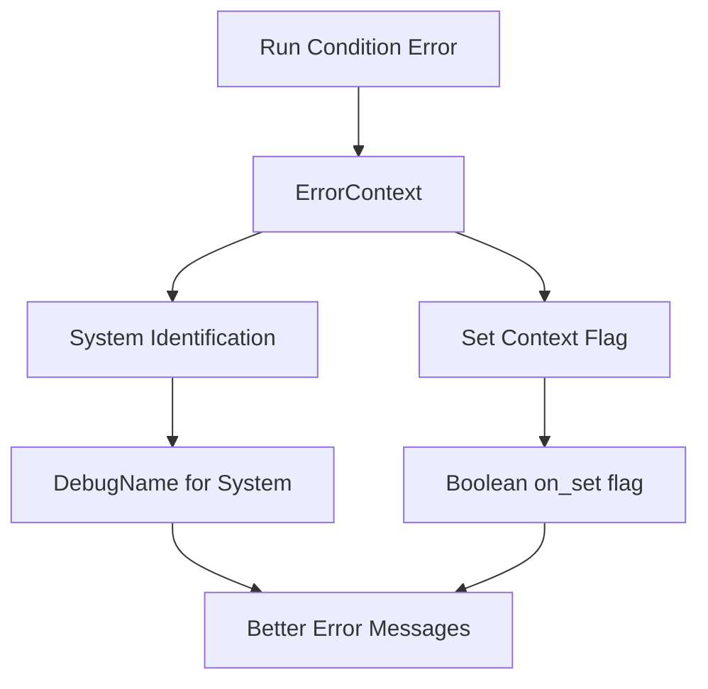

+++
title = "#20911 Run condition error tracks system"
date = "2025-09-11T00:00:00"
draft = false
template = "pull_request_page.html"
in_search_index = false

[extra]
current_language = "zh-cn"
available_languages = {"en" = { name = "English", url = "/pull_request/bevy/2025-09/pr-20911-en-20250911" }, "zh-cn" = { name = "中文", url = "/pull_request/bevy/2025-09/pr-20911-zh-cn-20250911" }}
labels = ["A-ECS", "C-Usability", "D-Straightforward"]
+++

# Title

## Basic Information
- **Title**: Run condition error tracks system
- **PR Link**: https://github.com/bevyengine/bevy/pull/20911
- **Author**: janis-bhm
- **Status**: MERGED
- **Labels**: A-ECS, C-Usability, S-Ready-For-Final-Review, X-Uncontroversial, D-Straightforward
- **Created**: 2025-09-06T22:58:34Z
- **Merged**: 2025-09-11T20:17:12Z
- **Merged By**: alice-i-cecile

## Description Translation
# Objective

修复 #20235

## Solution

向 RunCondition 错误上下文添加 `system` 和 `on_set` 字段

## Testing

我添加了一个测试来验证是否正确引用了系统，以及条件是否位于包含该系统的集合上。
我认为没有好的方法来跟踪集合本身，因为集合没有名称，只有类型路径，这在条件运行的地方也更难访问。

## The Story of This Pull Request

这个PR解决了一个具体的调试问题：当运行条件(run condition)失败时，错误信息缺乏足够的上下文来定位问题。在Bevy的ECS系统中，运行条件可以附加到单个系统(system)或系统集(system set)上，但在错误发生时，开发者无法从错误信息中知道是哪个系统或集合的条件失败了。

问题的核心在于`ErrorContext::RunCondition`结构体缺少关键信息。原来的实现只包含条件名称和最后一次运行的时间戳：

```rust
// Before
ErrorContext::RunCondition {
    name: DebugName,
    last_run: Tick,
}
```

当运行条件失败时，开发者只能看到类似"Run condition 'my_condition' failed"的错误信息，但不知道这个条件是为哪个系统或集合服务的。

解决方案是在错误上下文中添加两个新字段：
1. `system`: 标识这个运行条件附加到的系统
2. `on_set`: 布尔值，表示这个条件是否位于包含该系统的集合上

```rust
// After  
ErrorContext::RunCondition {
    name: DebugName,
    last_run: Tick,
    system: DebugName,  // 新增字段
    on_set: bool,       // 新增字段
}
```

这个修改需要在整个执行器栈中传递额外的上下文信息。三个执行器实现（simple、single_threaded、multi_threaded）都需要修改它们调用条件评估函数的方式。

在`evaluate_and_fold_conditions`函数中，现在需要接收两个新参数：
- `for_system`: 当前正在检查条件的系统
- `on_set`: 布尔值，表示是否在检查集合条件

```rust
// 修改后的函数签名
unsafe fn evaluate_and_fold_conditions(
    conditions: &mut [ConditionWithAccess],
    world: UnsafeWorldCell,
    error_handler: ErrorHandler,
    for_system: &ScheduleSystem,  // 新增参数
    on_set: bool,                 // 新增参数
) -> bool
```

当条件评估失败时，错误处理现在能够提供更详细的上下文信息：

```rust
// 错误处理现在包含系统和集合信息
ErrorContext::RunCondition {
    name: condition.name(),
    last_run: condition.get_last_run(),
    system: for_system.name(),  // 新增
    on_set,                     // 新增
}
```

这个实现选择是务实的。作者考虑过跟踪具体的集合名称，但发现集合只有类型路径而没有易读的名称，且在条件执行时难以访问集合信息。因此采用了`on_set`布尔值这种简单但有效的方法来区分系统级条件和集合级条件。

测试用例`run_if_error_contains_system`验证了这个功能的正确性，检查错误上下文是否包含了正确的系统引用和集合标识信息。

这个改进显著提升了调试体验。开发者现在能够明确知道是哪个系统或集合的运行条件失败了，大大减少了定位问题所需的时间。虽然这是一个相对小的改动，但它体现了良好的错误处理设计原则：提供足够上下文来快速诊断问题。

## Visual Representation



## Key Files Changed

### `crates/bevy_ecs/src/error/handler.rs` (+15/-2)
这个文件修改了错误上下文的定义和显示格式，添加了系统和集合信息。

```rust
// Before:
Self::RunCondition { name, .. } => {
    write!(f, "Run condition `{name}` failed")
}

// After:
Self::RunCondition {
    name,
    system,
    on_set,
    ..
} => {
    write!(
        f,
        "Run condition `{name}` failed for{} system `{system}`",
        if *on_set { " set containing" } else { "" }
    )
}
```

### `crates/bevy_ecs/src/schedule/condition.rs` (+40/-2)
添加了测试用例来验证错误上下文包含正确的系统信息和集合标识。

```rust
#[test]
fn run_if_error_contains_system() {
    // 测试验证错误上下文正确引用系统和标识集合条件
    assert!(
        matches!(ctx, ErrorContext::RunCondition { system, on_set, .. } 
            if (on_set && system == b.name()) || (!on_set && system == a.name()))
    );
}
```

### 三个执行器文件 (`simple.rs`, `single_threaded.rs`, `multi_threaded.rs`) 
这些文件修改了条件评估函数的调用方式，传递额外的系统和集合上下文信息。

```rust
// 修改调用evaluate_and_fold_conditions的地方，添加两个新参数
evaluate_and_fold_conditions(
    &mut conditions.system_conditions[system_index],
    world,
    error_handler,
    system,    // 新增参数
    false,     // 新增参数：on_set
)
```

## Further Reading

- [Bevy ECS 官方文档](https://bevyengine.org/learn/books/ecs/)
- [错误处理最佳实践](https://doc.rust-lang.org/book/ch09-00-error-handling.html)
- [系统与系统集的概念](https://bevyengine.org/learn/books/ecs/systems/)
- [运行条件的使用指南](https://bevyengine.org/learn/books/ecs/run-conditions/)