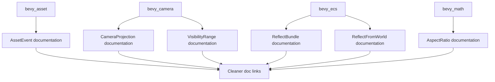

+++
title = "#20912 Hide `super` from more doc-links"
date = "2025-09-07T00:00:00"
draft = false
template = "pull_request_page.html"
in_search_index = true

[taxonomies]
list_display = ["show"]

[extra]
current_language = "en"
available_languages = {"en" = { name = "English", url = "/pull_request/bevy/2025-09/pr-20912-en-20250907" }, "zh-cn" = { name = "中文", url = "/pull_request/bevy/2025-09/pr-20912-zh-cn-20250907" }}
labels = ["C-Docs", "D-Trivial"]
+++

# Hide `super` from more doc-links

## Basic Information
- **Title**: Hide `super` from more doc-links
- **PR Link**: https://github.com/bevyengine/bevy/pull/20912
- **Author**: ickshonpe
- **Status**: MERGED
- **Labels**: C-Docs, D-Trivial
- **Created**: 2025-09-06T23:06:31Z
- **Merged**: 2025-09-06T23:46:58Z
- **Merged By**: mockersf

## Description Translation
# Objective

Hide `super` from more doc-links

## The Story of This Pull Request

This PR addresses a documentation formatting issue across multiple crates in the Bevy engine. The problem was that Rustdoc was displaying `super::` prefixes in documentation links, which made the generated documentation appear more verbose and less readable than necessary.

The solution approach was straightforward but systematic: replace direct `super::` references in doc comments with explicit path references using square bracket syntax. This change tells Rustdoc to render cleaner link text while maintaining the same underlying reference.

The implementation involved modifying six files across different modules, each following the same pattern. The changes are purely cosmetic - they don't affect runtime behavior or functionality, but significantly improve the quality of the generated documentation.

Here's how the pattern works: instead of writing `[super::SomeType]` which renders as "super::SomeType", the PR changes these to `[SomeType][super::SomeType]` or `[SomeType](super::SomeType)` syntax. This tells Rustdoc to display just "SomeType" as the link text while still linking to the correct type in the parent module.

The impact of these changes is better documentation readability. When developers browse the API docs, they'll see clean type names instead of verbose module paths, making the documentation more professional and easier to read. This is particularly helpful for new contributors who might find the `super::` prefixes confusing.

The changes follow Rust's documentation conventions and demonstrate good practices for writing maintainable doc comments. Each modification is minimal and focused, affecting only the documentation rendering without changing any actual code logic.

## Visual Representation



## Key Files Changed

**crates/bevy_asset/src/event.rs** (+1/-1)
- Changed AssetEvent documentation to hide super:: prefix in Handle::Strong reference

```rust
// Before:
/// Emitted when the last [`super::Handle::Strong`] of an [`Asset`] is dropped.

// After:
/// Emitted when the last [`Handle::Strong`](`super::Handle::Strong`) of an [`Asset`] is dropped.
```

**crates/bevy_camera/src/projection.rs** (+1/-1)
- Updated DynCameraProjection trait documentation for cleaner linking

```rust
// Before:
/// A wrapper trait to make it possible to implement Clone for boxed [`super::CameraProjection`]

// After:
/// A wrapper trait to make it possible to implement Clone for boxed [`CameraProjection`][`super::CameraProjection`]
```

**crates/bevy_camera/src/visibility/range.rs** (+1/-1)
- Improved VisibilityRange documentation by cleaning up ViewVisibility reference

```rust
// Before:
/// This doesn't store the results of frustum or occlusion culling; use
/// [`super::ViewVisibility`] for that.

// After:
/// This doesn't store the results of frustum or occlusion culling; use
/// [`ViewVisibility`](`super::ViewVisibility`) for that.
```

**crates/bevy_ecs/src/reflect/bundle.rs** (+2/-2)
- Updated module documentation and ReflectBundleFns documentation

```rust
// Before:
//! Same as [`super::component`], but for bundles.

// After:
//! Same as [`component`](`super::component`), but for bundles.
```

```rust
// Before:
/// The also [`super::component::ReflectComponentFns`].

// After:
/// The also [`ReflectComponentFns`](`super::component::ReflectComponentFns`).
```

**crates/bevy_ecs/src/reflect/from_world.rs** (+1/-1)
- Updated module documentation for ReflectFromWorld

```rust
// Before:
//! Same as [`super::component`], but for [`FromWorld`].

// After:
//! Same as [`component`](`super::component`), but for [`FromWorld`].
```

**crates/bevy_math/src/aspect_ratio.rs** (+1/-1)
- Cleaned up AspectRatioError documentation

```rust
// Before:
/// An Error type for when [`super::AspectRatio`] is provided invalid width or height values

// After:
/// An Error type for when [`AspectRatio`](`super::AspectRatio`) is provided invalid width or height values
```

## Further Reading

- [Rustdoc Documentation Guide](https://doc.rust-lang.org/rustdoc/how-to-write-documentation.html)
- [Rustdoc Link Syntax](https://doc.rust-lang.org/rustdoc/linking-to-items-by-name.html)
- [Bevy Engine Documentation Guidelines](https://github.com/bevyengine/bevy/blob/main/docs/plugins_guidelines.md#documentation)