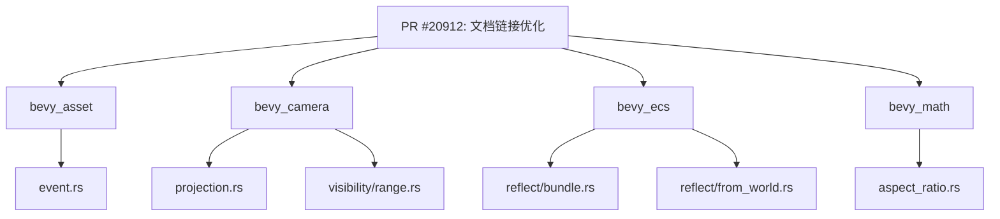

+++
title = "#20912 Hide `super` from more doc-links"
date = "2025-09-07T00:00:00"
draft = false
template = "pull_request_page.html"
in_search_index = false

[extra]
current_language = "zh-cn"
available_languages = {"en" = { name = "English", url = "/pull_request/bevy/2025-09/pr-20912-en-20250907" }, "zh-cn" = { name = "中文", url = "/pull_request/bevy/2025-09/pr-20912-zh-cn-20250907" }}
+++

# 隐藏文档链接中的 `super` - PR #20912 技术分析报告

## 基本信息
- **标题**: Hide `super` from more doc-links
- **PR链接**: https://github.com/bevyengine/bevy/pull/20912
- **作者**: ickshonpe
- **状态**: 已合并
- **标签**: C-Docs, D-Trivial
- **创建时间**: 2025-09-06T23:06:31Z
- **合并时间**: 2025-09-06T23:46:58Z
- **合并者**: mockersf

## 描述翻译
### 目标
在更多文档链接中隐藏 `super`

## 本次PR的故事

这个PR解决了一个文档可读性的小问题，但体现了对代码文档质量的持续关注。在Rust的文档注释中，使用Markdown链接语法可以创建到其他项的链接，但当这些链接显示在生成的文档中时，包含`super::`前缀会让链接文本显得冗长且技术性过强。

问题的核心在于Rust文档系统中链接渲染的方式。当使用`[super::SomeType]`这样的语法时，生成的文档会完整显示`super::SomeType`作为链接文本，而不是更简洁的`SomeType`。虽然这对于了解模块结构有帮助，但对于大多数阅读文档的开发者来说，他们更关心类型名称本身，而不是其在模块层次中的确切位置。

开发者采取了直接而有效的解决方案：使用Rust文档链接的显式文本语法。通过将`[super::SomeType]`改为`[SomeType](super::SomeType)`，链接目标保持不变，但显示文本变得更加简洁。这种修改不需要改变任何功能代码，纯粹是文档呈现的优化。

从技术实现角度看，这个PR涉及多个crate的修改，表明这是一个系统性的文档清理工作。每个修改都遵循相同的模式：

```rust
// 修改前：
/// Some documentation referring to [`super::SomeType`]

// 修改后：
/// Some documentation referring to [`SomeType`](`super::SomeType`)
```

这种修改虽然简单，但对提升文档的可读性有实际价值。阅读文档时，开发者看到的将是清晰的类型名而不是包含模块路径的复杂表达式。这对于新用户尤其友好，因为他们可能还不熟悉Bevy的模块结构。

从工程角度看，这类修改属于"代码卫生"(code hygiene)工作 - 小的改进累积起来能显著提升代码库的整体质量。虽然每个单独修改的影响很小，但合在一起能使文档更加专业和易读。

值得注意的是，这个PR被标记为"C-Docs"(文档相关)和"D-Trivial"(简单修改)，准确反映了其性质和范围。快速合并(40分钟内)也表明这些修改是直接且无争议的。

## 可视化表示



## 关键文件变更

### `crates/bevy_asset/src/event.rs`
**变更描述**: 修改AssetEvent枚举的文档注释，优化Handle::Strong的链接显示
```rust
// 修改前:
/// Emitted when the last [`super::Handle::Strong`] of an [`Asset`] is dropped.

// 修改后:
/// Emitted when the last [`Handle::Strong`](`super::Handle::Strong`) of an [`Asset`] is dropped.
```

### `crates/bevy_camera/src/projection.rs`
**变更描述**: 修改密封特质(sealed trait)的文档注释，优化CameraProjection的链接显示
```rust
// 修改前:
/// A wrapper trait to make it possible to implement Clone for boxed [`super::CameraProjection`]

// 修改后:
/// A wrapper trait to make it possible to implement Clone for boxed [`CameraProjection`][`super::CameraProjection`]
```

### `crates/bevy_camera/src/visibility/range.rs`
**变更描述**: 修改VisibilityRangeEntities的文档注释，优化ViewVisibility的链接显示
```rust
// 修改前:
/// [`super::ViewVisibility`] for that. Thus entities in this list may not

// 修改后:
/// [`ViewVisibility`](`super::ViewVisibility`) for that. Thus entities in this list may not
```

### `crates/bevy_ecs/src/reflect/bundle.rs`
**变更描述**: 修改模块级别文档注释，优化component模块的链接显示
```rust
// 修改前:
//! Same as [`super::component`], but for bundles.

// 修改后:
//! Same as [`component`](`super::component`), but for bundles.
```

**变更描述**: 修改ReflectBundleFns的文档注释，优化ReflectComponentFns的链接显示
```rust
// 修改前:
/// The also [`super::component::ReflectComponentFns`].

// 修改后:
/// The also [`ReflectComponentFns`](`super::component::ReflectComponentFns`).
```

### `crates/bevy_ecs/src/reflect/from_world.rs`
**变更描述**: 修改模块级别文档注释，优化component模块的链接显示
```rust
// 修改前:
//! Same as [`super::component`], but for [`FromWorld`].

// 修改后:
//! Same as [`component`](`super::component`), but for [`FromWorld`].
```

### `crates/bevy_math/src/aspect_ratio.rs`
**变更描述**: 修改AspectRatioError的文档注释，优化AspectRatio的链接显示
```rust
// 修改前:
/// An Error type for when [`super::AspectRatio`] is provided invalid width or height values

// 修改后:
/// An Error type for when [`AspectRatio`](`super::AspectRatio`) is provided invalid width or height values
```

## 延伸阅读

- [Rust Documentation Comments](https://doc.rust-lang.org/rustdoc/how-to-write-documentation.html) - Rust官方文档注释指南
- [Bevy Engine Documentation Guidelines](https://github.com/bevyengine/bevy/blob/main/docs/plugins_guidelines.md#documentation) - Bevy引擎的文档编写指南
- [Rustdoc Link Syntax](https://doc.rust-lang.org/rustdoc/linking-to-items-by-name.html) - Rustdoc中链接到其他项的语法说明

## 完整代码差异
```diff
diff --git a/crates/bevy_asset/src/event.rs b/crates/bevy_asset/src/event.rs
index b3e70aec49041..6f99362ee23cd 100644
--- a/crates/bevy_asset/src/event.rs
+++ b/crates/bevy_asset/src/event.rs
@@ -54,7 +54,7 @@ pub enum AssetEvent<A: Asset> {
     Modified { id: AssetId<A> },
     /// Emitted whenever an [`Asset`] is removed.
     Removed { id: AssetId<A> },
-    /// Emitted when the last [`super::Handle::Strong`] of an [`Asset`] is dropped.
+    /// Emitted when the last [`Handle::Strong`](`super::Handle::Strong`) of an [`Asset`] is dropped.
     Unused { id: AssetId<A> },
     /// Emitted whenever an [`Asset`] has been fully loaded (including its dependencies and all "recursive dependencies").
     LoadedWithDependencies { id: AssetId<A> },
diff --git a/crates/bevy_camera/src/projection.rs b/crates/bevy_camera/src/projection.rs
index 7a1cb5f80ea01..12db2c5bf885a 100644
--- a/crates/bevy_camera/src/projection.rs
+++ b/crates/bevy_camera/src/projection.rs
@@ -81,7 +81,7 @@ pub trait CameraProjection {
 mod sealed {
     use super::CameraProjection;
 
-    /// A wrapper trait to make it possible to implement Clone for boxed [`super::CameraProjection`]
+    /// A wrapper trait to make it possible to implement Clone for boxed [`CameraProjection`][`super::CameraProjection`]
     /// trait objects, without breaking object safety rules by making it `Sized`. Additional bounds
     /// are included for downcasting, and fulfilling the trait bounds on `Projection`.
     pub trait DynCameraProjection:
diff --git a/crates/bevy_camera/src/visibility/range.rs b/crates/bevy_camera/src/visibility/range.rs
index b827dedbbf10c..c874edbec833c 100644
--- a/crates/bevy_camera/src/visibility/range.rs
+++ b/crates/bevy_camera/src/visibility/range.rs
@@ -173,7 +173,7 @@ impl VisibilityRange {
 /// Stores which entities are in within the [`VisibilityRange`]s of views.
 ///
 /// This doesn't store the results of frustum or occlusion culling; use
-/// [`super::ViewVisibility`] for that. Thus entities in this list may not
+/// [`ViewVisibility`](`super::ViewVisibility`) for that. Thus entities in this list may not
 /// actually be visible.
 ///
 /// For efficiency, these tables only store entities that have
diff --git a/crates/bevy_ecs/src/reflect/bundle.rs b/crates/bevy_ecs/src/reflect/bundle.rs
index 133591c405ebf..72dc16b2fd181 100644
--- a/crates/bevy_ecs/src/reflect/bundle.rs
+++ b/crates/bevy_ecs/src/reflect/bundle.rs
@@ -3,7 +3,7 @@
 //!
 //! This module exports two types: [`ReflectBundleFns`] and [`ReflectBundle`].
 //!
-//! Same as [`super::component`], but for bundles.
+//! Same as [`component`](`super::component`), but for bundles.
 use alloc::boxed::Box;
 use bevy_utils::prelude::DebugName;
 use core::any::{Any, TypeId};
@@ -30,7 +30,7 @@ pub struct ReflectBundle(ReflectBundleFns);
 
 /// The raw function pointers needed to make up a [`ReflectBundle`].
 ///
-/// The also [`super::component::ReflectComponentFns`].
+/// The also [`ReflectComponentFns`](`super::component::ReflectComponentFns`).
 #[derive(Clone)]
 pub struct ReflectBundleFns {
     /// Function pointer implementing [`ReflectBundle::insert`].
diff --git a/crates/bevy_ecs/src/reflect/from_world.rs b/crates/bevy_ecs/src/reflect/from_world.rs
index c4f5912ff4b5f..62ab4438f9e68 100644
--- a/crates/bevy_ecs/src/reflect/from_world.rs
+++ b/crates/bevy_ecs/src/reflect/from_world.rs
@@ -4,7 +4,7 @@
 //!
 //! This module exports two types: [`ReflectFromWorldFns`] and [`ReflectFromWorld`].
 //!
-//! Same as [`super::component`], but for [`FromWorld`].
+//! Same as [`component`](`super::component`), but for [`FromWorld`].
 
 use alloc::boxed::Box;
 use bevy_reflect::{FromType, Reflect};
diff --git a/crates/bevy_math/src/aspect_ratio.rs b/crates/bevy_math/src/aspect_ratio.rs
index 7b7ae6d3bad04..79c5ad6a786ff 100644
--- a/crates/bevy_math/src/aspect_ratio.rs
+++ b/crates/bevy_math/src/aspect_ratio.rs
@@ -88,7 +88,7 @@ impl TryFrom<Vec2> for AspectRatio {
     }
 }
 
-/// An Error type for when [`super::AspectRatio`] is provided invalid width or height values
+/// An Error type for when [`AspectRatio`](`super::AspectRatio`) is provided invalid width or height values
 #[derive(Error, Debug, PartialEq, Eq, Clone, Copy)]
 pub enum AspectRatioError {
     /// Error due to width or height having zero as a value.
```