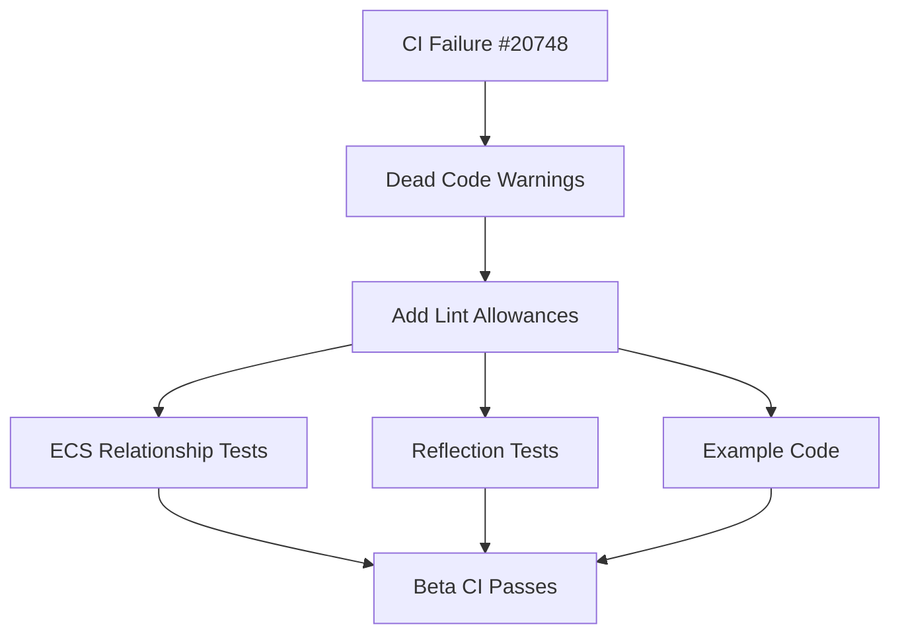

+++
title = "#20913 (stable) CI Fix"
date = "2025-09-20T00:00:00"
draft = false
template = "pull_request_page.html"
in_search_index = true

[taxonomies]
list_display = ["show"]

[extra]
current_language = "en"
available_languages = {"en" = { name = "English", url = "/pull_request/bevy/2025-09/pr-20913-en-20250920" }, "zh-cn" = { name = "中文", url = "/pull_request/bevy/2025-09/pr-20913-zh-cn-20250920" }}
labels = ["C-Code-Quality", "A-Cross-Cutting"]
+++

# (stable) CI Fix

## Basic Information
- **Title**: (stable) CI Fix
- **PR Link**: https://github.com/bevyengine/bevy/pull/20913
- **Author**: janis-bhm
- **Status**: MERGED
- **Labels**: C-Code-Quality, S-Ready-For-Final-Review, A-Cross-Cutting
- **Created**: 2025-09-07T00:53:26Z
- **Merged**: 2025-09-20T23:18:07Z
- **Merged By**: alice-i-cecile

## Description Translation
# Objective
fixes #20748

## Solution
add `dead_code` to a bunch of test and example structs.

## Testing

`cargo run -p ci` works on beta (but not nightly)
There's a handful of `unfulfilled_lint_expectations` on these `dead_code`s that I'm not sure how to suppress in some compilation runs but not in others.

## The Story of This Pull Request

This PR addresses a CI failure on the beta Rust toolchain caused by dead code warnings in test and example code. The issue (#20748) was that several structs used for compilation testing were never actually instantiated, triggering Rust's dead code lint. While these warnings didn't cause failures on nightly Rust, they broke the CI pipeline on beta.

The solution was straightforward: add appropriate lint allowances to suppress these warnings. The developer used a combination of `#[expect(dead_code)]` and `#[allow(dead_code)]` attributes with detailed explanations about why the code was intentionally unused. These structs serve as compilation tests for derive macros and reflection functionality - they need to exist for the compiler to verify the macros work correctly, but they don't need to be instantiated in normal execution.

The implementation touches four files across two crates and two examples. In the ECS relationships module, test structs for relationship derive macros were marked with `#[expect(dead_code)]`. In the reflection crate, similar test structs for reflection macros received the same treatment. The examples also needed adjustments - one received explicit dead code allowances, while another used a clever closure trick to reference otherwise unused types.

The developer noted some challenges with `unfulfilled_lint_expectations` - cases where the `expect` attribute was used but the lint wasn't actually triggered in certain compilation scenarios. This is a known limitation of the expect lint feature in Rust.

## Visual Representation



## Key Files Changed

### `crates/bevy_ecs/src/relationship/mod.rs` (+24/-2)
Added `#[expect(dead_code)]` attributes to test structs used for compilation verification of relationship derive macros.

**Key changes:**
```rust
// Before:
#[derive(Component)]
#[relationship(relationship_target=Target)]
#[expect(dead_code, reason = "test struct")]
struct Source {
    #[relationship]
    target: Entity,
    bar: u8,
}

// After:
#[expect(
    dead_code,
    reason = "This struct is used as a compilation test to test the derive macros, and as such is intentionally never constructed."
)]
#[derive(Component)]
#[relationship(relationship_target=Target)]
struct Source {
    #[relationship]
    target: Entity,
    bar: u8,
}
```

### `crates/bevy_reflect/src/lib.rs` (+32/-0)
Added dead code allowances to various test structs used for reflection macro compilation tests.

**Key changes:**
```rust
// Added to multiple test structs:
#[allow(
    clippy::allow_attributes,
    dead_code,
    reason = "This struct is used as a compilation test to test the derive macros, and as such is intentionally never constructed."
)]
```

### `examples/reflection/auto_register_static/src/lib.rs` (+5/-0)
Added dead code allowance to a private struct used for compilation testing.

**Key change:**
```rust
#[allow(
    clippy::allow_attributes,
    dead_code,
    reason = "This struct is used as a compilation test to test the derive macros, and as such is intentionally never constructed."
)]
#[derive(Reflect)]
struct PrivateStruct {
    a: i32,
}
```

### `examples/reflection/reflection_types.rs` (+4/-0)
Added a closure that references otherwise unused types to prevent dead code warnings.

**Key change:**
```rust
// Added at end of setup() function:
_ = || -> (A, B, C, D, E, F) { unreachable!() };
```

## Further Reading

- [Rust Dead Code lint documentation](https://doc.rust-lang.org/rustc/lints/listing/warn-by-default.html#dead-code)
- [Rust lint expectations (unstable feature)](https://doc.rust-lang.org/rustc/lints/levels.html#lint-expectations)
- [Bevy CI documentation](https://github.com/bevyengine/bevy/blob/main/docs/ci.md)