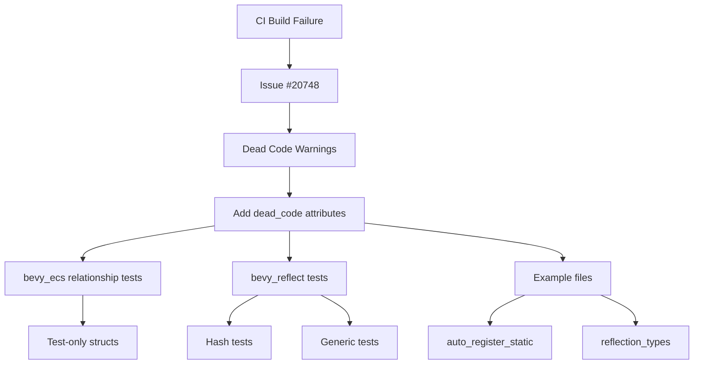

+++
title = "#20913 (stable) CI Fix"
date = "2025-09-20T00:00:00"
draft = false
template = "pull_request_page.html"
in_search_index = false

[extra]
current_language = "zh-cn"
available_languages = {"en" = { name = "English", url = "/pull_request/bevy/2025-09/pr-20913-en-20250920" }, "zh-cn" = { name = "中文", url = "/pull_request/bevy/2025-09/pr-20913-zh-cn-20250920" }}
labels = ["C-Code-Quality", "A-Cross-Cutting"]
+++

# Title
(stable) CI Fix

## Basic Information
- **Title**: (stable) CI Fix
- **PR Link**: https://github.com/bevyengine/bevy/pull/20913
- **Author**: janis-bhm
- **Status**: MERGED
- **Labels**: C-Code-Quality, S-Ready-For-Final-Review, A-Cross-Cutting
- **Created**: 2025-09-07T00:53:26Z
- **Merged**: 2025-09-20T23:18:07Z
- **Merged By**: alice-i-cecile

## Description Translation
# Objective
修复 #20748

## Solution
给一堆测试和示例结构体添加 `dead_code` 属性。

## Testing
`cargo run -p ci` 在 beta 版本可以工作（但在 nightly 版本不行）
有一批 `unfulfilled_lint_expectations` 出现在这些 `dead_code` 上，我不确定如何只在某些编译运行中抑制这些警告。

## The Story of This Pull Request

这个PR的故事始于一个看似简单但影响广泛的CI构建问题。Bevy项目在稳定版本（stable）的CI构建中遇到了编译失败，具体问题是issue #20748中报告的dead code警告。

问题的核心在于Rust编译器对未使用代码的严格检查。在Bevy的代码库中，存在大量专门用于编译测试的结构体——这些结构体仅用于验证derive宏是否能正确编译，而从未在实际代码中被实例化使用。在Rust编译器的视角中，这些从未被使用的结构体就变成了"dead code"，触发了警告。

开发者janis-bhm采取的解决方案直接而有效：在这些测试专用的结构体上添加`#[expect(dead_code)]`或`#[allow(dead_code)]`属性。这种做法明确告知编译器这些代码是故意不被使用的，从而避免了警告。

从技术实现角度来看，这个PR涉及两个主要模块的修改：

**在bevy_ecs模块中**，修改了relationship模块的测试代码。这些测试验证了关系组件的derive宏功能，特别是处理具有多个非目标字段的情况。添加的`#[expect(dead_code)]`属性包含了详细的reason说明，解释了这些结构体的特殊用途。

**在bevy_reflect模块中**，修改了多个测试用例，包括哈希测试、泛型测试、where子句测试和外部crate类型测试。这些修改确保了反射系统的各种边界情况都能正确编译。

此外，还修改了两个示例文件：`auto_register_static`和`reflection_types`，确保示例代码也能通过CI检查。

这个解决方案的一个技术挑战是如何处理`unfulfilled_lint_expectations`警告。正如作者在PR描述中提到的，在某些编译运行中需要抑制这些dead code警告，而在其他运行中则不需要，这需要更精细的控制机制。

从工程角度看，这个PR展示了处理测试代码中编译器警告的良好实践：不是简单地禁用所有警告，而是针对性地为特定用途的代码添加明确的属性说明，既解决了构建问题，又保持了代码的清晰性和可维护性。

## Visual Representation



## Key Files Changed

### `crates/bevy_ecs/src/relationship/mod.rs`
这个文件包含关系组件的测试代码。修改为测试专用的结构体添加了`#[expect(dead_code)]`属性，并提供了详细的reason说明。

```rust
// 修改前：
#[derive(Component)]
#[relationship(relationship_target=Target)]
#[expect(dead_code, reason = "test struct")]
struct Source {
    #[relationship]
    target: Entity,
    #[relationship]
    bar: u8,
}

// 修改后：
#[expect(
    dead_code,
    reason = "This struct is used as a compilation test to test the derive macros, and as such is intentionally never constructed."
)]
#[derive(Component)]
#[relationship(relationship_target=Target)]
struct Source {
    #[relationship]
    target: Entity,
    #[relationship]
    bar: u8,
}
```

### `crates/bevy_reflect/src/lib.rs`
这个文件包含反射系统的核心实现和测试。在多处测试代码中添加了dead_code属性。

```rust
// 添加的代码示例：
#[allow(
    clippy::allow_attributes,
    dead_code,
    reason = "This struct is used as a compilation test to test the derive macros, and as such is intentionally never constructed."
)]
#[derive(Reflect, Hash)]
#[reflect(Hash)]
struct Foo {
    bar: i32,
}
```

### `examples/reflection/auto_register_static/src/lib.rs`
这个示例文件演示了自动注册静态类型的功能。为私有结构体添加了dead_code属性。

```rust
// 添加的代码：
#[allow(
    clippy::allow_attributes,
    dead_code,
    reason = "This struct is used as a compilation test to test the derive macros, and as such is intentionally never constructed."
)]
#[derive(Reflect)]
struct PrivateStruct {
    a: i32,
}
```

### `examples/reflection/reflection_types.rs`
这个示例文件展示了各种反射类型的使用。添加了代码来引用上面定义的类型，避免dead code警告。

```rust
// 添加的代码：
// reference types defined above that are only used to demonstrate reflect
// derive functionality:
_ = || -> (A, B, C, D, E, F) { unreachable!() };
```

## Further Reading

1. [Rust编译器死代码检测文档](https://doc.rust-lang.org/rustc/lints/listing/warn-by-default.html#dead-code)
2. [Clippy lint检查工具](https://github.com/rust-lang/rust-clippy)
3. [Bevy引擎的CI流程](https://github.com/bevyengine/bevy/blob/main/ci/README.md)
4. [Rust属性系统指南](https://doc.rust-lang.org/reference/attributes.html)