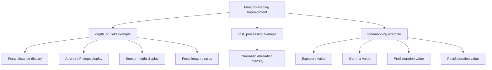

+++
title = "#20915 Formatting Float Output for Improved Readability in Bevy Examples"
date = "2025-09-07T00:00:00"
draft = false
template = "pull_request_page.html"
in_search_index = true

[taxonomies]
list_display = ["show"]

[extra]
current_language = "en"
available_languages = {"en" = { name = "English", url = "/pull_request/bevy/2025-09/pr-20915-en-20250907" }, "zh-cn" = { name = "中文", url = "/pull_request/bevy/2025-09/pr-20915-zh-cn-20250907" }}
labels = ["D-Trivial", "C-Examples"]
+++

# Title: Formatting Float Output for Improved Readability in Bevy Examples

## Basic Information
- **Title**: Limit float output in some examples to two decimal places.
- **PR Link**: https://github.com/bevyengine/bevy/pull/20915
- **Author**: Breakdown-Dog
- **Status**: MERGED
- **Labels**: D-Trivial, C-Examples, S-Ready-For-Final-Review
- **Created**: 2025-09-07T04:47:38Z
- **Merged**: 2025-09-07T05:44:46Z
- **Merged By**: alice-i-cecile

## Description Translation
# Objective

- Improve the readability of float output in the depth_of_field, post_processing, and tonemapping examples by limiting it to two decimal places
- This makes the output cleaner and more consistent.

## Solution

- Use Rust's formatting syntax (e.g., {:.2}) to ensure floats are displayed with exactly two decimal places.
- Apply this to all relevant print and debug output lines in these examples.

## The Story of This Pull Request

This PR addresses a common UI readability issue in three of Bevy's graphical examples. The problem was straightforward: floating-point values in the on-screen text displays were showing excessive decimal precision, creating visual clutter and making it difficult for users to quickly parse the numerical values.

The core issue stemmed from Rust's default floating-point formatting behavior. When displaying f32 values using standard formatting, Rust shows as many decimal places as needed to represent the value precisely. In practical UI contexts, this often results in long strings of digits that don't provide meaningful information to the user.

The solution implemented was both simple and effective: using Rust's built-in float formatting syntax to limit output to two decimal places. This approach required minimal code changes while delivering significant improvements to readability. The developer used the `{:.2}` format specifier throughout the affected examples, which tells Rust's formatting system to display floating-point numbers with exactly two digits after the decimal point.

From an engineering perspective, this change demonstrates good attention to user experience details. While the technical complexity is low, the impact on usability is substantial. Users interacting with these examples can now quickly scan and understand the numerical values without being distracted by unnecessary precision.

The implementation follows consistent patterns across all three examples, applying the same formatting approach to similar types of numerical displays. This consistency makes the codebase more maintainable and establishes a clear pattern for future similar improvements.

## Visual Representation



## Key Files Changed

### `examples/3d/depth_of_field.rs` (+4/-4)
This file handles depth of field rendering effects. The changes improve the display of camera and lens parameters:

```rust
// Before:
"Focal distance: {} m (Press Up/Down to change)
Aperture F-stops: f/{} (Press Left/Right to change)
Sensor height: {}mm
Focal length: {}mm

// After:
"Focal distance: {:.2} m (Press Up/Down to change)
Aperture F-stops: f/{:.2} (Press Left/Right to change)
Sensor height: {:.2}mm
Focal length: {:.2}mm
```

### `examples/3d/post_processing.rs` (+1/-1)
This file demonstrates post-processing effects. The change improves chromatic aberration intensity display:

```rust
// Before:
"Chromatic aberration intensity: {} (Press Left or Right to change)"

// After:
"Chromatic aberration intensity: {:.2} (Press Left or Right to change)"
```

### `examples/3d/tonemapping.rs` (+4/-4)
This file handles tonemapping and color grading. The changes improve multiple parameter displays:

```rust
// Before:
text.push_str(&format!("Exposure: {}\n", color_grading.global.exposure));
text.push_str(&format!("Gamma: {}\n", color_grading.shadows.gamma));
text.push_str(&format!("PreSaturation: {}\n", color_grading.shadows.saturation));
text.push_str(&format!("PostSaturation: {}\n", color_grading.global.post_saturation));

// After:
text.push_str(&format!("Exposure: {:.2}\n", color_grading.global.exposure));
text.push_str(&format!("Gamma: {:.2}\n", color_grading.shadows.gamma));
text.push_str(&format!("PreSaturation: {:.2}\n", color_grading.shadows.saturation));
text.push_str(&format!("PostSaturation: {:.2}\n", color_grading.global.post_saturation));
```

## Further Reading

- [Rust Formatting Syntax Documentation](https://doc.rust-lang.org/std/fmt/index.html#syntax)
- [Bevy UI and Text Rendering](https://bevyengine.org/learn/books/introduction/11-ui/)
- [Floating-Point Precision Considerations in Graphics](https://learnopengl.com/Advanced-OpenGL/Anti-Aliasing)