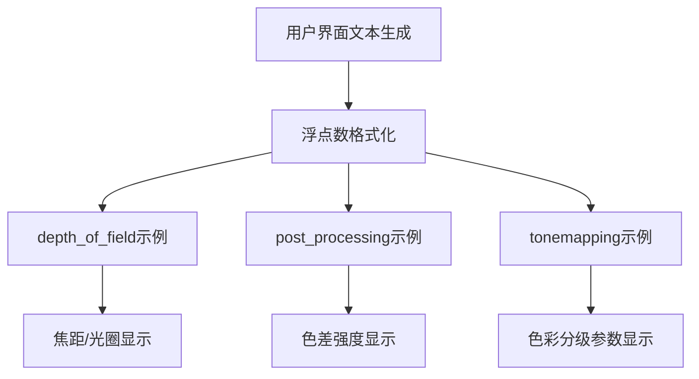

+++
title = "#20915 Limit float output in some examples to two decimal places."
date = "2025-09-07T00:00:00"
draft = false
template = "pull_request_page.html"
in_search_index = false

[extra]
current_language = "zh-cn"
available_languages = {"en" = { name = "English", url = "/pull_request/bevy/2025-09/pr-20915-en-20250907" }, "zh-cn" = { name = "中文", url = "/pull_request/bevy/2025-09/pr-20915-zh-cn-20250907" }}
+++

# Limit float output in some examples to two decimal places.

## 基本信息
- **标题**: Limit float output in some examples to two decimal places.
- **PR链接**: https://github.com/bevyengine/bevy/pull/20915
- **作者**: Breakdown-Dog
- **状态**: 已合并
- **标签**: D-Trivial, C-Examples, S-Ready-For-Final-Review
- **创建时间**: 2025-09-07T04:47:38Z
- **合并时间**: 2025-09-07T05:44:46Z
- **合并者**: alice-i-cecile

## 描述翻译

### 目标
- 通过将浮点数输出限制到两位小数，提高 depth_of_field、post_processing 和 tonemapping 示例中输出的可读性
- 这使输出更清晰和一致

### 解决方案
- 使用 Rust 的格式化语法（例如 {:.2}）确保浮点数精确显示两位小数
- 将这些更改应用到这些示例中所有相关的打印和调试输出行

## 本次PR的故事

这个PR解决了一个简单但影响用户体验的问题：在Bevy引擎的几个3D示例中，浮点数值的显示格式不一致且冗长，影响了输出的可读性。

问题的核心在于这些示例直接输出了完整的浮点数值，导致显示结果包含过多小数位。例如，在景深(depth_of_field)示例中，焦距、光圈值等参数会显示像"2.3999998569488525"这样的长数字，而不是更易读的"2.40"。

开发者Breakdown-Dog采用了最直接有效的解决方案：使用Rust的标准格式化功能。通过在格式字符串中使用`{:.2}`语法，可以强制浮点数只显示两位小数。这种方法不需要引入外部依赖，也不会影响实际的计算精度——只是改变了显示格式。

在实现上，这个PR修改了三个示例文件中的文本生成代码：

在`depth_of_field.rs`中，修改了设置显示文本的format字符串，将四个浮点参数的显示格式统一改为两位小数：
```rust
// 修改前：
"Focal distance: {} m (Press Up/Down to change)
Aperture F-stops: f/{} (Press Left/Right to change)
Sensor height: {}mm
Focal length: {}mm

// 修改后：
"Focal distance: {:.2} m (Press Up/Down to change)
Aperture F-stops: f/{:.2} (Press Left/Right to change)
Sensor height: {:.2}mm
Focal length: {:.2}mm
```

在`post_processing.rs`中，同样修改了色差强度参数的显示格式：
```rust
// 修改前：
"Chromatic aberration intensity: {} (Press Left or Right to change)"

// 修改后：
"Chromatic aberration intensity: {:.2} (Press Left or Right to change)"
```

在`tonemapping.rs`中，修改了四个颜色分级参数的显示格式：
```rust
// 修改了四个参数的显示格式：
"Exposure: {:.2}\n"
"Gamma: {:.2}\n"  
"PreSaturation: {:.2}\n"
"PostSaturation: {:.2}\n"
```

这些修改虽然简单，但体现了良好的用户体验设计原则。对于交互式示例来说，清晰易读的数值显示非常重要，因为用户需要根据这些数值反馈来调整参数。

从技术角度看，这个解决方案选择了最轻量级的方法。`{:.2}`是Rust标准库提供的格式化选项，它会自动对数字进行四舍五入到指定小数位，不需要额外的依赖或复杂逻辑。这种方法的性能开销可以忽略不计，因为它只在文本渲染时执行一次格式化操作。

这个PR被标记为"D-Trivial"（琐碎）和"C-Examples"（示例相关），准确反映了其性质和影响范围。它不会改变任何核心引擎功能，只是改善了示例的用户界面。这也是为什么它能够快速被合并——从创建到合并只用了不到一小时。

对于开发者来说，这个PR提供了一个很好的实践示例：即使是看似小的用户体验改进也值得关注，使用语言内置的格式化功能可以简单有效地提升输出质量。

## 可视化表示



## 关键文件变更

### `examples/3d/depth_of_field.rs` (+4/-4)
**变更描述**: 修改了景深示例中的文本显示格式，将四个浮点参数限制为两位小数显示

**代码片段**:
```rust
// 变更前:
format!(
    "Focal distance: {} m (Press Up/Down to change)
Aperture F-stops: f/{} (Press Left/Right to change)
Sensor height: {}mm
Focal length: {}mm

// 变更后:
format!(
    "Focal distance: {:.2} m (Press Up/Down to change)
Aperture F-stops: f/{:.2} (Press Left/Right to change)
Sensor height: {:.2}mm
Focal length: {:.2}mm
```

### `examples/3d/post_processing.rs` (+1/-1)
**变更描述**: 修改了后处理示例中的色差强度显示格式，限制为两位小数

**代码片段**:
```rust
// 变更前:
format!(
    "Chromatic aberration intensity: {} (Press Left or Right to change)",

// 变更后:
format!(
    "Chromatic aberration intensity: {:.2} (Press Left or Right to change)",
```

### `examples/3d/tonemapping.rs` (+4/-4)
**变更描述**: 修改了色调映射示例中四个颜色分级参数的显示格式，全部限制为两位小数

**代码片段**:
```rust
// 变更了四个参数的显示格式:
"Exposure: {:.2}\n"        // 之前是 "Exposure: {}\n"
"Gamma: {:.2}\n"           // 之前是 "Gamma: {}\n"
"PreSaturation: {:.2}\n"   // 之前是 "PreSaturation: {}\n"
"PostSaturation: {:.2}\n"  // 之前是 "PostSaturation: {}\n"
```

## 延伸阅读

- [Rust标准库格式化语法文档](https://doc.rust-lang.org/std/fmt/index.html) - Rust格式化功能的完整参考
- [Rust的format!宏指南](https://doc.rust-lang.org/rust-by-example/hello/print/fmt.html) - 学习Rust中各种格式化选项
- [Bevy引擎示例文档](https://bevyengine.org/learn/books/introduction/) - 了解Bevy引擎的示例用法和最佳实践
- [浮点数精度处理](https://floating-point-gui.de/) - 理解浮点数精度和显示格式的基本概念