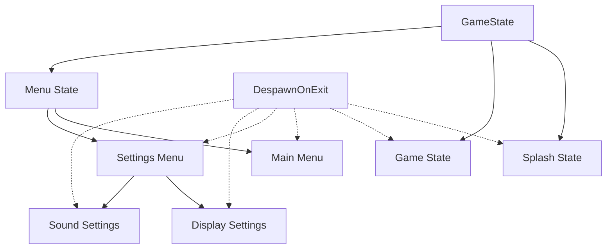

+++
title = "#20916 Use DespawnOnExit instead of generic cleanup system"
date = "2025-09-07T00:00:00"
draft = false
template = "pull_request_page.html"
in_search_index = true

[taxonomies]
list_display = ["show"]

[extra]
current_language = "en"
available_languages = {"en" = { name = "English", url = "/pull_request/bevy/2025-09/pr-20916-en-20250907" }, "zh-cn" = { name = "中文", url = "/pull_request/bevy/2025-09/pr-20916-zh-cn-20250907" }}
labels = ["C-Examples"]
+++

# Title
Use DespawnOnExit instead of generic cleanup system

## Basic Information
- **Title**: Use DespawnOnExit instead of generic cleanup system
- **PR Link**: https://github.com/bevyengine/bevy/pull/20916
- **Author**: Fodesu
- **Status**: MERGED
- **Labels**: C-Examples, S-Ready-For-Final-Review
- **Created**: 2025-09-07T05:51:28Z
- **Merged**: 2025-09-07T16:54:06Z
- **Merged By**: alice-i-cecile

## Description Translation
# Objective

Fixes #20900

## Solution
Add DespawnOnExit to the entity that is expected to be despawned.

## Testing
I test in my linux.
I get the  #[allow(clippy::uninlined_format_args)] clippy error, is this my oversight? 

## The Story of This Pull Request

This PR addresses a cleanup pattern in Bevy's game menu example where entities were being manually despawned using a generic cleanup system. The problem was that the example used a custom `despawn_screen` function that queried for entities with specific marker components and despawned them when exiting application states. While functional, this approach required boilerplate code and manual system registration for each state transition.

The solution replaces this manual cleanup approach with Bevy's built-in `DespawnOnExit` component. This component automatically handles entity cleanup when exiting the specified state, eliminating the need for custom cleanup systems. The implementation involved:

1. Removing the generic `despawn_screen` function and its associated system registrations
2. Adding `DespawnOnExit` components to entities that need cleanup
3. Removing the marker components that were previously used for manual cleanup

The key technical insight here is leveraging Bevy's state-driven entity management system. `DespawnOnExit` is a more declarative approach that integrates directly with Bevy's state management, reducing code complexity and potential errors from manual cleanup systems.

The changes affect the game menu example across multiple states: splash screen, game screen, and various menu states (main, settings, display settings, sound settings). Each entity that needs cleanup now carries a `DespawnOnExit` component specifying which state transition should trigger its despawn.

This approach demonstrates Bevy's built-in capabilities for state-based entity management and serves as a better example for developers learning the engine. It reduces code size by 17 lines while maintaining identical functionality.

## Visual Representation



## Key Files Changed

- `examples/games/game_menu.rs` (+12/-29)

The main changes involve replacing the manual cleanup system with `DespawnOnExit` components:

1. **Removed the generic cleanup system**:
```rust
// Before:
fn despawn_screen<T: Component>(to_despawn: Query<Entity, With<T>>, mut commands: Commands) {
    for entity in &to_despawn {
        commands.entity(entity).despawn();
    }
}
```

2. **Added DespawnOnExit to entities** across all game states:
```rust
// After (typical pattern):
commands.spawn((
    DespawnOnExit(GameState::Splash), // Added this component
    Node {
        // ... existing components
    },
    OnSplashScreen,
));
```

3. **Removed manual cleanup system registrations** from all state transitions:
```rust
// Before:
.add_systems(OnExit(GameState::Splash), despawn_screen::<OnSplashScreen>)

// After:
// System registration removed entirely
```

## Further Reading

- [Bevy States Documentation](https://docs.rs/bevy/latest/bevy/ecs/schedule/state/trait.State.html)
- [Bevy DespawnOnExit Component](https://docs.rs/bevy/latest/bevy/prelude/struct.DespawnOnExit.html)
- [Bevy State Transition Examples](https://github.com/bevyengine/bevy/tree/main/examples/ecs/state)

# Full Code Diff
```diff
diff --git a/examples/games/game_menu.rs b/examples/games/game_menu.rs
index e8f58bfca91a0..ac2a834908cf8 100644
--- a/examples/games/game_menu.rs
+++ b/examples/games/game_menu.rs
@@ -3,7 +3,6 @@
 //! settings for 5 seconds before going back to the menu.
 
 use bevy::prelude::*;
-
 const TEXT_COLOR: Color = Color::srgb(0.9, 0.9, 0.9);
 
 // Enum that will be used as a global state for the game
@@ -48,7 +47,7 @@ fn setup(mut commands: Commands) {
 mod splash {
     use bevy::prelude::*;
 
-    use super::{despawn_screen, GameState};
+    use super::GameState;
 
     // This plugin will display a splash screen with Bevy logo for 1 second before switching to the menu
     pub fn splash_plugin(app: &mut App) {
@@ -57,9 +56,7 @@ mod splash {
             // When entering the state, spawn everything needed for this screen
             .add_systems(OnEnter(GameState::Splash), splash_setup)
             // While in this state, run the `countdown` system
-            .add_systems(Update, countdown.run_if(in_state(GameState::Splash)))
-            // When exiting the state, despawn everything that was spawned for this screen
-            .add_systems(OnExit(GameState::Splash), despawn_screen::<OnSplashScreen>);
+            .add_systems(Update, countdown.run_if(in_state(GameState::Splash)));
     }
 
     // Tag component used to tag entities added on the splash screen
@@ -74,6 +71,8 @@ mod splash {
         let icon = asset_server.load("branding/icon.png");
         // Display the logo
         commands.spawn((
+            // This entity will be despawned when exiting the state
+            DespawnOnExit(GameState::Splash),
             Node {
                 align_items: AlignItems::Center,
                 justify_content: JustifyContent::Center,
@@ -113,14 +112,13 @@ mod game {
         prelude::*,
     };
 
-    use super::{despawn_screen, DisplayQuality, GameState, Volume, TEXT_COLOR};
+    use super::{DisplayQuality, GameState, Volume, TEXT_COLOR};
 
     // This plugin will contain the game. In this case, it's just be a screen that will
     // display the current settings for 5 seconds before returning to the menu
     pub fn game_plugin(app: &mut App) {
         app.add_systems(OnEnter(GameState::Game), game_setup)
-            .add_systems(Update, game.run_if(in_state(GameState::Game)))
-            .add_systems(OnExit(GameState::Game), despawn_screen::<OnGameScreen>);
+            .add_systems(Update, game.run_if(in_state(GameState::Game)));
     }
 
     // Tag component used to tag entities added on the game screen
@@ -136,6 +134,7 @@ mod game {
         volume: Res<Volume>,
     ) {
         commands.spawn((
+            DespawnOnExit(GameState::Game),
             Node {
                 width: percent(100),
                 height: percent(100),
@@ -229,7 +228,7 @@ mod menu {
         prelude::*,
     };
 
-    use super::{despawn_screen, DisplayQuality, GameState, Volume, TEXT_COLOR};
+    use super::{DisplayQuality, GameState, Volume, TEXT_COLOR};
 
     // This plugin manages the menu, with 5 different screens:
     // - a main menu with "New Game", "Settings", "Quit"
@@ -244,13 +243,8 @@ mod menu {
             .add_systems(OnEnter(GameState::Menu), menu_setup)
             // Systems to handle the main menu screen
             .add_systems(OnEnter(MenuState::Main), main_menu_setup)
-            .add_systems(OnExit(MenuState::Main), despawn_screen::<OnMainMenuScreen>)
             // Systems to handle the settings menu screen
             .add_systems(OnEnter(MenuState::Settings), settings_menu_setup)
-            .add_systems(
-                OnExit(MenuState::Settings),
-                despawn_screen::<OnSettingsMenuScreen>,
-            )
             // Systems to handle the display settings screen
             .add_systems(
                 OnEnter(MenuState::SettingsDisplay),
@@ -260,20 +254,12 @@ mod menu {
                 Update,
                 (setting_button::<DisplayQuality>.run_if(in_state(MenuState::SettingsDisplay)),),
             )
-            .add_systems(
-                OnExit(MenuState::SettingsDisplay),
-                despawn_screen::<OnDisplaySettingsMenuScreen>,
-            )
             // Systems to handle the sound settings screen
             .add_systems(OnEnter(MenuState::SettingsSound), sound_settings_menu_setup)
             .add_systems(
                 Update,
                 setting_button::<Volume>.run_if(in_state(MenuState::SettingsSound)),
             )
-            .add_systems(
-                OnExit(MenuState::SettingsSound),
-                despawn_screen::<OnSoundSettingsMenuScreen>,
-            )
             // Common systems to all screens that handles buttons behavior
             .add_systems(
                 Update,
@@ -397,6 +383,7 @@ mod menu {
         let exit_icon = asset_server.load("textures/Game Icons/exitRight.png");
 
         commands.spawn((
+            DespawnOnExit(MenuState::Main),
             Node {
                 width: percent(100),
                 height: percent(100),
@@ -492,6 +479,7 @@ mod menu {
         );
 
         commands.spawn((
+            DespawnOnExit(MenuState::Settings),
             Node {
                 width: percent(100),
                 height: percent(100),
@@ -551,6 +539,7 @@ mod menu {
 
         let display_quality = *display_quality;
         commands.spawn((
+            DespawnOnExit(MenuState::SettingsDisplay),
             Node {
                 width: percent(100),
                 height: percent(100),
@@ -638,6 +627,7 @@ mod menu {
         let volume = *volume;
         let button_node_clone = button_node.clone();
         commands.spawn((
+            DespawnOnExit(MenuState::SettingsSound),
             Node {
                 width: percent(100),
                 height: percent(100),
@@ -728,10 +718,3 @@ mod menu {
         }
     }
 }
-
-// Generic system that takes a component as a parameter, and will despawn all entities with that component
-fn despawn_screen<T: Component>(to_despawn: Query<Entity, With<T>>, mut commands: Commands) {
-    for entity in &to_despawn {
-        commands.entity(entity).despawn();
-    }
-}
```