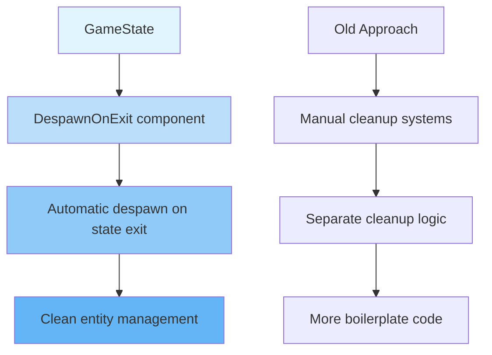

+++
title = "#20916 Use DespawnOnExit instead of generic cleanup system"
date = "2025-09-07T00:00:00"
draft = false
template = "pull_request_page.html"
in_search_index = false

[extra]
current_language = "zh-cn"
available_languages = {"en" = { name = "English", url = "/pull_request/bevy/2025-09/pr-20916-en-20250907" }, "zh-cn" = { name = "中文", url = "/pull_request/bevy/2025-09/pr-20916-zh-cn-20250907" }}
labels = ["C-Examples"]
+++

# Title
使用 DespawnOnExit 替代通用清理系统

## Basic Information
- **Title**: Use DespawnOnExit instead of generic cleanup system
- **PR Link**: https://github.com/bevyengine/bevy/pull/20916
- **Author**: Fodesu
- **Status**: MERGED
- **Labels**: C-Examples, S-Ready-For-Final-Review
- **Created**: 2025-09-07T05:51:28Z
- **Merged**: 2025-09-07T16:54:06Z
- **Merged By**: alice-i-cecile

## Description Translation
# 目标

修复 #20900

## 解决方案
在预期会被销毁的实体上添加 DespawnOnExit 组件。

## 测试
我在 Linux 系统中进行了测试。
我收到了 #[allow(clippy::uninlined_format_args)] clippy 错误，这是我的疏忽吗？

## The Story of This Pull Request

这个PR的核心问题是解决游戏状态切换时的实体清理方式。在Bevy引擎中，当游戏在不同状态间切换时（如从菜单切换到游戏场景），需要清理不再需要的实体以避免内存泄漏和性能问题。

**问题根源**：原来的实现使用了一个通用的清理系统 `despawn_screen`，这个系统通过查询特定组件的实体来进行批量清理。虽然功能上可行，但这种方式存在几个问题：

1. **样板代码过多**：每个状态退出时都需要手动注册清理系统
2. **容易出错**：开发者可能会忘记添加清理系统
3. **不够直观**：清理逻辑与实体创建逻辑分离

**解决方案**：PR作者采用了Bevy提供的 `DespawnOnExit` 组件，这是一个更声明式、更直观的解决方案。通过在实体创建时直接添加这个组件，明确指定当退出某个状态时自动销毁该实体。

从技术实现来看，这个改动体现了从"命令式"到"声明式"编程风格的转变。原来的方式需要显式地调用清理系统，而新的方式只需要在实体上添加一个组件标签，让引擎自动处理清理逻辑。

**具体改动**：主要修改集中在 `examples/games/game_menu.rs` 文件中：
- 移除了通用的 `despawn_screen` 系统和相关导入
- 在每个需要状态相关清理的实体生成时添加 `DespawnOnExit` 组件
- 简化了状态插件的设置，不再需要为每个状态注册退出时的清理系统

**技术优势**：
1. **代码更简洁**：减少了29行代码，增加了12行，净减少17行
2. **更易于维护**：清理逻辑与实体创建逻辑放在一起，更容易理解
3. **更符合ECS模式**：使用组件来定义行为，而不是外部系统

**潜在考虑**：虽然这个改动总体上很积极，但在某些情况下，通用的清理系统可能仍有其价值，比如当需要跨多个状态进行复杂清理时。但对于这个示例场景，`DespawnOnExit` 显然是更合适的选择。

## Visual Representation



## Key Files Changed

### `examples/games/game_menu.rs` (+12/-29)

这个文件是主要的修改对象，包含了游戏菜单示例的完整实现。改动主要集中在状态管理和实体清理方式上。

**主要变更：**
1. 移除了通用的清理系统和相关导入
2. 在每个需要状态相关清理的实体上添加 `DespawnOnExit` 组件
3. 简化了状态插件的配置

**代码对比：**

```rust
// 之前：需要显式注册清理系统
.add_systems(OnExit(GameState::Splash), despawn_screen::<OnSplashScreen>)

// 之后：只需要在实体上添加组件
commands.spawn((
    DespawnOnExit(GameState::Splash),
    // ... 其他组件
))
```

```rust
// 之前：需要定义通用的清理系统
fn despawn_screen<T: Component>(to_despawn: Query<Entity, With<T>>, mut commands: Commands) {
    for entity in &to_despawn {
        commands.entity(entity).despawn();
    }
}

// 之后：完全移除这个系统，使用内置的 DespawnOnExit
```

这些改动使得代码更加简洁和直观，清理逻辑现在与实体创建逻辑紧密耦合，减少了出错的可能性。

## Further Reading

对于想要深入了解相关概念的开发者，建议阅读以下资源：

1. **Bevy States and Transitions**: [官方文档](https://bevyengine.org/learn/book/getting-started/states/)关于状态管理的详细说明
2. **ECS Pattern**: 了解实体组件系统架构的基本原理
3. **Declarative vs Imperative Programming**: 理解声明式编程的优势和应用场景
4. **Bevy Component Documentation**: [DespawnOnExit 组件文档](https://docs.rs/bevy/latest/bevy/prelude/struct.DespawnOnExit.html)

# Full Code Diff
```diff
diff --git a/examples/games/game_menu.rs b/examples/games/game_menu.rs
index e8f58bfca91a0..ac2a834908cf8 100644
--- a/examples/games/game_menu.rs
+++ b/examples/games/game_menu.rs
@@ -3,7 +3,6 @@
 //! settings for 5 seconds before going back to the menu.
 
 use bevy::prelude::*;
-
 const TEXT_COLOR: Color = Color::srgb(0.9, 0.9, 0.9);
 
 // Enum that will be used as a global state for the game
@@ -48,7 +47,7 @@ fn setup(mut commands: Commands) {
 mod splash {
     use bevy::prelude::*;
 
-    use super::{despawn_screen, GameState};
+    use super::GameState;
 
     // This plugin will display a splash screen with Bevy logo for 1 second before switching to the menu
     pub fn splash_plugin(app: &mut App) {
@@ -57,9 +56,7 @@ mod splash {
             // When entering the state, spawn everything needed for this screen
             .add_systems(OnEnter(GameState::Splash), splash_setup)
             // While in this state, run the `countdown` system
-            .add_systems(Update, countdown.run_if(in_state(GameState::Splash)))
-            // When exiting the state, despawn everything that was spawned for this screen
-            .add_systems(OnExit(GameState::Splash), despawn_screen::<OnSplashScreen>);
+            .add_systems(Update, countdown.run_if(in_state(GameState::Splash)));
     }
 
     // Tag component used to tag entities added on the splash screen
@@ -74,6 +71,8 @@ mod splash {
         let icon = asset_server.load("branding/icon.png");
         // Display the logo
         commands.spawn((
+            // This entity will be despawned when exiting the state
+            DespawnOnExit(GameState::Splash),
             Node {
                 align_items: AlignItems::Center,
                 justify_content: JustifyContent::Center,
@@ -113,14 +112,13 @@ mod game {
         prelude::*,
     };
 
-    use super::{despawn_screen, DisplayQuality, GameState, Volume, TEXT_COLOR};
+    use super::{DisplayQuality, GameState, Volume, TEXT_COLOR};
 
     // This plugin will contain the game. In this case, it's just be a screen that will
     // display the current settings for 5 seconds before returning to the menu
     pub fn game_plugin(app: &mut App) {
         app.add_systems(OnEnter(GameState::Game), game_setup)
-            .add_systems(Update, game.run_if(in_state(GameState::Game)))
-            .add_systems(OnExit(GameState::Game), despawn_screen::<OnGameScreen>);
+            .add_systems(Update, game.run_if(in_state(GameState::Game)));
     }
 
     // Tag component used to tag entities added on the game screen
@@ -136,6 +134,7 @@ mod game {
         volume: Res<Volume>,
     ) {
         commands.spawn((
+            DespawnOnExit(GameState::Game),
             Node {
                 width: percent(100),
                 height: percent(100),
@@ -229,7 +228,7 @@ mod menu {
         prelude::*,
     };
 
-    use super::{despawn_screen, DisplayQuality, GameState, Volume, TEXT_COLOR};
+    use super::{DisplayQuality, GameState, Volume, TEXT_COLOR};
 
     // This plugin manages the menu, with 5 different screens:
     // - a main menu with "New Game", "Settings", "Quit"
@@ -244,13 +243,8 @@ mod menu {
             .add_systems(OnEnter(GameState::Menu), menu_setup)
             // Systems to handle the main menu screen
             .add_systems(OnEnter(MenuState::Main), main_menu_setup)
-            .add_systems(OnExit(MenuState::Main), despawn_screen::<OnMainMenuScreen>)
             // Systems to handle the settings menu screen
             .add_systems(OnEnter(MenuState::Settings), settings_menu_setup)
-            .add_systems(
-                OnExit(MenuState::Settings),
-                despawn_screen::<OnSettingsMenuScreen>,
-            )
             // Systems to handle the display settings screen
             .add_systems(
                 OnEnter(MenuState::SettingsDisplay),
@@ -260,20 +254,12 @@ mod menu {
                 Update,
                 (setting_button::<DisplayQuality>.run_if(in_state(MenuState::SettingsDisplay)),),
             )
-            .add_systems(
-                OnExit(MenuState::SettingsDisplay),
-                despawn_screen::<OnDisplaySettingsMenuScreen>,
-            )
             // Systems to handle the sound settings screen
             .add_systems(OnEnter(MenuState::SettingsSound), sound_settings_menu_setup)
             .add_systems(
                 Update,
                 setting_button::<Volume>.run_if(in_state(MenuState::SettingsSound)),
             )
-            .add_systems(
-                OnExit(MenuState::SettingsSound),
-                despawn_screen::<OnSoundSettingsMenuScreen>,
-            )
             // Common systems to all screens that handles buttons behavior
             .add_systems(
                 Update,
@@ -397,6 +383,7 @@ mod menu {
         let exit_icon = asset_server.load("textures/Game Icons/exitRight.png");
 
         commands.spawn((
+            DespawnOnExit(MenuState::Main),
             Node {
                 width: percent(100),
                 height: percent(100),
@@ -492,6 +479,7 @@ mod menu {
         );
 
         commands.spawn((
+            DespawnOnExit(MenuState::Settings),
             Node {
                 width: percent(100),
                 height: percent(100),
@@ -551,6 +539,7 @@ mod menu {
 
         let display_quality = *display_quality;
         commands.spawn((
+            DespawnOnExit(MenuState::SettingsDisplay),
             Node {
                 width: percent(100),
                 height: percent(100),
@@ -638,6 +627,7 @@ mod menu {
         let volume = *volume;
         let button_node_clone = button_node.clone();
         commands.spawn((
+            DespawnOnExit(MenuState::SettingsSound),
             Node {
                 width: percent(100),
                 height: percent(100),
@@ -728,10 +718,3 @@ mod menu {
         }
     }
 }
-
-// Generic system that takes a component as a parameter, and will despawn all entities with that component
-fn despawn_screen<T: Component>(to_despawn: Query<Entity, With<T>>, mut commands: Commands) {
-    for entity in &to_despawn {
-        commands.entity(entity).despawn();
-    }
-}
```