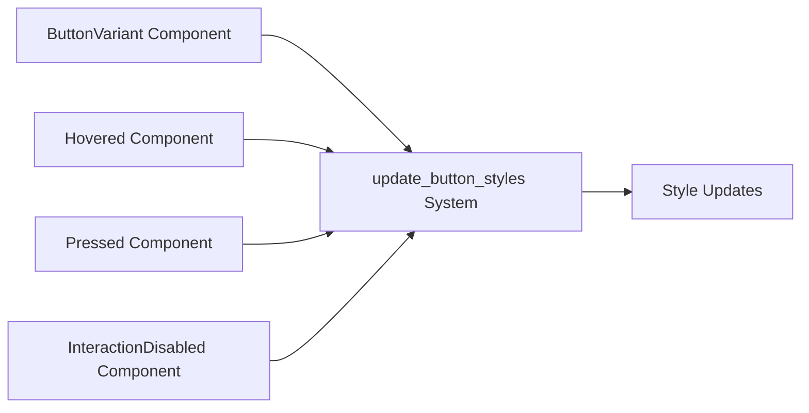

+++
title = "#20920 feathers: ensure buttons can change variant dynamically"
date = "2025-09-07T00:00:00"
draft = false
template = "pull_request_page.html"
in_search_index = true

[taxonomies]
list_display = ["show"]

[extra]
current_language = "en"
available_languages = {"en" = { name = "English", url = "/pull_request/bevy/2025-09/pr-20920-en-20250907" }, "zh-cn" = { name = "中文", url = "/pull_request/bevy/2025-09/pr-20920-zh-cn-20250907" }}
labels = ["C-Bug", "A-UI"]
+++

# feathers: ensure buttons can change variant dynamically

## Basic Information
- **Title**: feathers: ensure buttons can change variant dynamically
- **PR Link**: https://github.com/bevyengine/bevy/pull/20920
- **Author**: torsteingrindvik
- **Status**: MERGED
- **Labels**: C-Bug, A-UI, S-Ready-For-Final-Review
- **Created**: 2025-09-07T14:51:32Z
- **Merged**: 2025-09-07T16:54:06Z
- **Merged By**: alice-i-cecile

## Description Translation
Problem: `ButtonVariant` changes do not trigger an update to the button style:

https://github.com/user-attachments/assets/b3eb93bf-c3f9-4f5d-ba76-fdde24d45358

The above video shows that hover is necessary.

As a small bonus add some derives which make `ButtonVariant` more dev friendly (`Debug`) and allow doing variant comparisons.

## Solution

Add `Changed<ButtonVariant>` to the system which updates button styles.

Also add some derives to allow debug printing button variants as well as comparing them for equality.

## Testing

Tested in my local project, works well.

## The Story of This Pull Request

This PR addresses a reactivity issue in Bevy's UI button system where changing a button's variant didn't automatically trigger a visual style update. The problem was rooted in how the system monitored component changes - it only responded to hover state changes, press events, and interaction state changes, but not to changes in the `ButtonVariant` component itself.

The core issue was in the `update_button_styles` system's query filter. The system used an `Or` filter that included `Changed<Hovered>`, `Added<Pressed>`, and `Added<InteractionDisabled>`, but omitted `Changed<ButtonVariant>`. This meant that when a button's variant changed programmatically (not through user interaction), the system wouldn't detect the change and wouldn't update the button's appearance.

The fix was straightforward: add `Changed<ButtonVariant>` to the query filter. This ensures that any changes to the button variant component will trigger a style recalculation, making the UI responsive to programmatic changes.

Additionally, the PR included quality-of-life improvements by adding `Debug`, `PartialEq`, and `Eq` derives to the `ButtonVariant` enum. These derives enable developers to:
- Print button variants for debugging purposes
- Compare variants for equality in logic operations
- Use variants in data structures that require these traits

The implementation maintains backward compatibility while fixing the reactivity issue. The changes are minimal and focused, addressing exactly the problem described without introducing unnecessary complexity or side effects.

## Visual Representation



## Key Files Changed

### `crates/bevy_feathers/src/controls/button.rs` (+7/-2)

**Changes:**
1. Added `Debug`, `PartialEq`, and `Eq` derives to `ButtonVariant` enum
2. Added `Changed<ButtonVariant>` to the query filter in `update_button_styles` system

**Code snippets:**

```rust
// Before:
#[derive(Component, Default, Clone, Reflect)]
#[reflect(Component, Clone, Default)]
pub enum ButtonVariant {
    // variants...
}

// After:
#[derive(Component, Default, Clone, Reflect, Debug, PartialEq, Eq)]
#[reflect(Component, Clone, Default)]
pub enum ButtonVariant {
    // variants...
}
```

```rust
// Before:
Or<(Changed<Hovered>, Added<Pressed>, Added<InteractionDisabled>)>,

// After:
Or<(
    Changed<Hovered>,
    Changed<ButtonVariant>,
    Added<Pressed>,
    Added<InteractionDisabled>,
)>,
```

These changes ensure that button styles update immediately when the variant changes, without requiring user interaction like hovering. The additional derives improve developer experience when working with button variants.

## Further Reading

- [Bevy ECS Query Filters Documentation](https://docs.rs/bevy/latest/bevy/ecs/system/struct.Query.html#query-filters)
- [Rust Derive Macros](https://doc.rust-lang.org/rust-by-example/trait/derive.html)
- [Bevy Component System](https://bevy-cheatbook.github.io/programming/components.html)