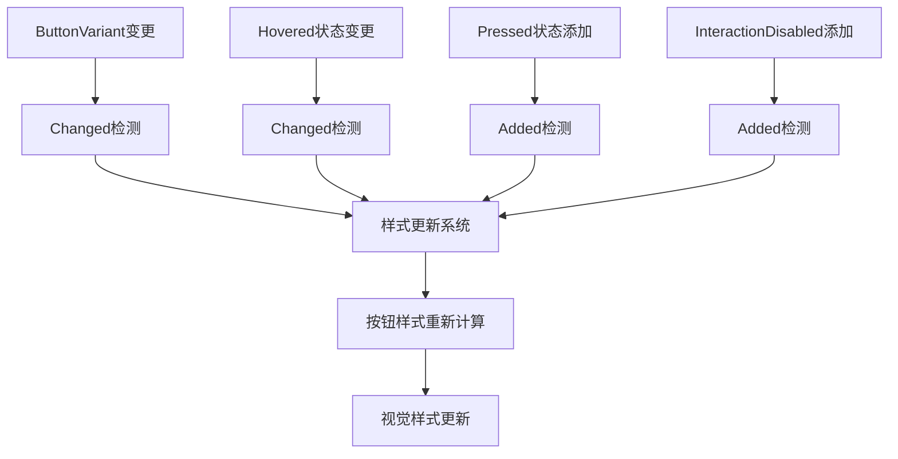

+++
title = "#20920 feathers: ensure buttons can change variant dynamically"
date = "2025-09-07T00:00:00"
draft = false
template = "pull_request_page.html"
in_search_index = false

[extra]
current_language = "zh-cn"
available_languages = {"en" = { name = "English", url = "/pull_request/bevy/2025-09/pr-20920-en-20250907" }, "zh-cn" = { name = "中文", url = "/pull_request/bevy/2025-09/pr-20920-zh-cn-20250907" }}
+++

# feathers: ensure buttons can change variant dynamically

## 基本信息
- **标题**: feathers: ensure buttons can change variant dynamically
- **PR链接**: https://github.com/bevyengine/bevy/pull/20920
- **作者**: torsteingrindvik
- **状态**: 已合并
- **标签**: C-Bug, A-UI, S-Ready-For-Final-Review
- **创建时间**: 2025-09-07T14:51:32Z
- **合并时间**: 2025-09-07T16:54:06Z
- **合并者**: alice-i-cecile

## 描述翻译
问题：`ButtonVariant` 的更改不会触发按钮样式的更新：

https://github.com/user-attachments/assets/b3eb93bf-c3f9-4f5d-ba76-fdde24d45358

上面的视频显示需要悬停才能更新。

作为一个小福利，添加了一些派生特性，使 `ButtonVariant` 对开发者更友好（`Debug`）并允许进行变体比较。

## 解决方案
在更新按钮样式的系统中添加 `Changed<ButtonVariant>`。

同时添加一些派生特性以允许调试打印按钮变体以及比较它们是否相等。

## 测试
在我的本地项目中进行了测试，效果良好。

## 本次PR的技术分析

### 问题与背景
这个PR解决了一个Bevy引擎UI模块中的具体问题：当按钮的变体（ButtonVariant）在运行时动态改变时，按钮的视觉样式不会立即更新。开发者需要通过悬停操作（hover）才能触发样式的刷新，这在用户体验和开发效率上都存在问题。

这个问题属于UI系统的响应式更新机制缺陷。在Bevy的ECS架构中，组件变化需要通过明确的系统查询条件来检测和响应。原有的按钮样式更新系统只监听Hovered、Pressed和InteractionDisabled状态的变化，但没有包含ButtonVariant的变化检测。

### 解决方案与实现
解决方案直接且有效：在按钮样式更新系统的查询条件中添加对ButtonVariant变化的检测。这是一个最小化的修改，完全符合Bevy的设计模式。

具体实现包括两个部分：

1. **增强ButtonVariant的可用性**：为ButtonVariant枚举添加了Debug、PartialEq和Eq派生特性，这使得开发者可以更方便地调试和比较按钮变体。

2. **扩展样式更新条件**：在update_button_styles系统的查询过滤器中添加Changed<ButtonVariant>条件，确保当按钮变体发生变化时触发样式重新计算。

### 技术细节
关键的技术修改在crates/bevy_feathers/src/controls/button.rs文件中：

```rust
// 修改前：
#[derive(Component, Default, Clone, Reflect)]
// 修改后：
#[derive(Component, Default, Clone, Reflect, Debug, PartialEq, Eq)]
```

这个改动为ButtonVariant添加了标准的Rust trait派生，提高了开发体验。

```rust
// 修改前：
Or<(Changed<Hovered>, Added<Pressed>, Added<InteractionDisabled>)>,

// 修改后：
Or<(
    Changed<Hovered>,
    Changed<ButtonVariant>,
    Added<Pressed>,
    Added<InteractionDisabled>,
)>,
```

这是核心的功能性修改，通过添加Changed<ButtonVariant>到查询过滤器中，系统现在能够正确响应按钮变体的动态变化。

### 影响与价值
这个修改虽然代码量很小，但对UI开发的体验改善很明显：

1. **修复了功能缺陷**：按钮变体现在可以实时更新，无需依赖悬停操作
2. **提高了开发效率**：Debug和比较特性的添加使调试更便捷
3. **保持了代码一致性**：修改完全遵循Bevy现有的ECS模式和设计理念

这是一个典型的质量改进PR：小范围修改，明确的问题定位，直接的解决方案，以及明显的用户体验提升。

## 可视化表示



## 关键文件变更

- `crates/bevy_feathers/src/controls/button.rs` (+7/-2)

### 具体修改说明

这个文件包含了按钮控件的核心实现。修改主要集中在两个部分：

1. **ButtonVariant枚举的增强**：
```rust
// 修改前：
#[derive(Component, Default, Clone, Reflect)]

// 修改后：  
#[derive(Component, Default, Clone, Reflect, Debug, PartialEq, Eq)]
```

这个修改为按钮变体添加了调试和比较能力，使开发更方便。

2. **样式更新系统的查询条件扩展**：
```rust
// 修改前：
Or<(Changed<Hovered>, Added<Pressed>, Added<InteractionDisabled>)>,

// 修改后：
Or<(
    Changed<Hovered>,
    Changed<ButtonVariant>,  // 新增的检测条件
    Added<Pressed>,
    Added<InteractionDisabled>,
)>,
```

这个修改确保了当ButtonVariant组件发生变化时，按钮样式会及时更新。

## 延伸阅读

对于想深入了解相关技术的开发者，建议阅读：

1. [Bevy ECS查询系统文档](https://bevyengine.org/learn/books/0.13/programming/ecs/queries) - 理解Bevy的查询和过滤机制
2. [Bevy UI系统指南](https://bevyengine.org/learn/books/0.13/programming/ui) - 掌握Bevy UI组件的工作原理
3. [Rust派生宏指南](https://doc.rust-lang.org/rust-by-example/trait/derive.html) - 学习如何使用Rust的派生特性

## 完整代码差异

```diff
diff --git a/crates/bevy_feathers/src/controls/button.rs b/crates/bevy_feathers/src/controls/button.rs
index 4ae7d7062c8e4..851408db27214 100644
--- a/crates/bevy_feathers/src/controls/button.rs
+++ b/crates/bevy_feathers/src/controls/button.rs
@@ -29,7 +29,7 @@ use crate::{
 
 /// Color variants for buttons. This also functions as a component used by the dynamic styling
 /// system to identify which entities are buttons.
-#[derive(Component, Default, Clone, Reflect)]
+#[derive(Component, Default, Clone, Reflect, Debug, PartialEq, Eq)]
 #[reflect(Component, Clone, Default)]
 pub enum ButtonVariant {
     /// The standard button appearance
@@ -101,7 +101,12 @@ fn update_button_styles(
             &ThemeBackgroundColor,
             &ThemeFontColor,
         ),
-        Or<(Changed<Hovered>, Added<Pressed>, Added<InteractionDisabled>)>,
+        Or<(
+            Changed<Hovered>,
+            Changed<ButtonVariant>,
+            Added<Pressed>,
+            Added<InteractionDisabled>,
+        )>,
     >,
     mut commands: Commands,
 ) {
```