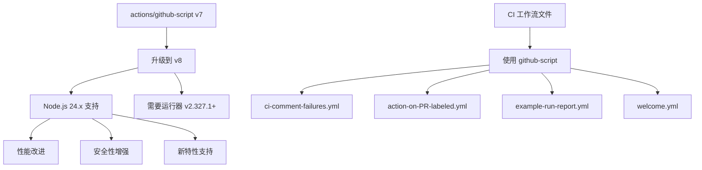

+++
title = "#20926 Bump actions/github-script from 7 to 8"
date = "2025-09-08T00:00:00"
draft = false
template = "pull_request_page.html"
in_search_index = false

[extra]
current_language = "zh-cn"
available_languages = {"en" = { name = "English", url = "/pull_request/bevy/2025-09/pr-20926-en-20250908" }, "zh-cn" = { name = "中文", url = "/pull_request/bevy/2025-09/pr-20926-zh-cn-20250908" }}
+++

# Bump actions/github-script from 7 to 8

## 基本信息
- **标题**: Bump actions/github-script from 7 to 8
- **PR链接**: https://github.com/bevyengine/bevy/pull/20926
- **作者**: app/dependabot
- **状态**: 已合并
- **标签**: C-Dependencies
- **创建时间**: 2025-09-08T06:01:20Z
- **合并时间**: 2025-09-08T08:50:31Z
- **合并者**: james7132

## 描述翻译
将 [actions/github-script](https://github.com/actions/github-script) 从版本 7 升级到 8。
<details>
<summary>发行说明</summary>
<p><em>源自 <a href="https://github.com/actions/github-script/releases">actions/github-script 的发行版</a>。</em></p>
<blockquote>
<h2>v8.0.0</h2>
<h2>更新内容</h2>
<ul>
<li>通过 <a href="https://github.com/salmanmkc"><code>@​salmanmkc</code></a> 在 <a href="https://redirect.github.com/actions/github-script/pull/637">actions/github-script#637</a> 中将 Node.js 版本支持更新至 24.x</li>
<li>通过 <a href="https://github.com/sneha-krip"><code>@​sneha-krip</code></a> 在 <a href="https://redirect.github.com/actions/github-script/pull/653">actions/github-script#653</a> 中为从 v7 更新到 v8 添加 README</li>
</ul>
<h2>⚠️ 最低兼容运行器版本</h2>
<p><strong>v2.327.1</strong><br />
<a href="https://github.com/actions/runner/releases/tag/v2.327.1">发行说明</a></p>
<p>请确保您的运行器已更新到此版本或更高版本以使用此发行版。</p>
<h2>新贡献者</h2>
<ul>
<li><a href="https://github.com/salmanmkc"><code>@​salmanmkc</code></a> 在 <a href="https://redirect.github.com/actions/github-script/pull/637">actions/github-script#637</a> 中做出了首次贡献</li>
<li><a href="https://github.com/sneha-krip"><code>@​sneha-krip</code></a> 在 <a href="https://redirect.github.com/actions/github-script/pull/653">actions/github-script#653</a> 中做出了首次贡献</li>
</ul>
<p><strong>完整变更日志</strong>: <a href="https://github.com/actions/github-script/compare/v7.1.0...v8.0.0">https://github.com/actions/github-script/compare/v7.1.0...v8.0.0</a></p>
<h2>v7.1.0</h2>
<h2>更新内容</h2>
<ul>
<li>通过 <a href="https://github.com/benelan"><code>@​benelan</code></a> 在 <a href="https://redirect.github.com/actions/github-script/pull/482">actions/github-script#482</a> 中将 husky 升级至 v9</li>
<li>通过 <a href="https://github.com/Jcambass"><code>@​Jcambass</code></a> 在 <a href="https://redirect.github.com/actions/github-script/pull/485">actions/github-script#485</a> 中添加用于发布版本到不可变操作包的工作流文件</li>
<li>通过 <a href="https://github.com/Jcambass"><code>@​Jcambass</code></a> 在 <a href="https://redirect.github.com/actions/github-script/pull/486">actions/github-script#486</a> 中升级 IA 发布</li>
<li>通过 <a href="https://github.com/joshmgross"><code>@​joshmgross</code></a> 在 <a href="https://redirect.github.com/actions/github-script/pull/497">actions/github-script#497</a> 中修复工作流状态徽章</li>
<li>通过 <a href="https://github.com/joshmgross"><code>@​joshmgross</code></a> 在 <a href="https://redirect.github.com/actions/github-script/pull/512">actions/github-script#512</a> 中更新 <code>actions/upload-artifact</code> 的使用</li>
<li>通过 <a href="https://github.com/joshmgross"><code>@​joshmgross</code></a> 在 <a href="https://redirect.github.com/actions/github-script/pull/514">actions/github-script#514</a> 中澄清包名混淆</li>
<li>通过 <a href="https://github.com/joshmgross"><code>@​joshmgross</code></a> 在 <a href="https://redirect.github.com/actions/github-script/pull/515">actions/github-script#515</a> 中使用 <code>npm audit fix</code> 更新依赖项</li>
<li>通过 <a href="https://github.com/timotk"><code>@​timotk</code></a> 在 <a href="https://redirect.github.com/actions/github-script/pull/478">actions/github-script#478</a> 中指定使用的脚本为 JavaScript</li>
<li>通过 <a href="https://github.com/nschonni"><code>@​nschonni</code></a> 在 <a href="https://redirect.github.com/actions/github-script/pull/472">actions/github-script#472</a> 中为 NPM 和 Actions 添加 Dependabot</li>
<li>通过 <a href="https://github.com/joshmgross"><code>@​joshmgross</code></a> 在 <a href="https://redirect.github.com/actions/github-script/pull/531">actions/github-script#531</a> 中在工作流中定义 <code>permissions</code> 并更新操作</li>
<li>通过 <a href="https://github.com/nschonni"><code>@​nschonni</code></a> 在 <a href="https://redirect.github.com/actions/github-script/pull/532">actions/github-script#532</a> 中为 .github/actions/install-dependencies 添加 Dependabot</li>
<li>通过 <a href="github.com/nschonni"><code>@​nschonni</code></a> 在 <a href="https://redirect.github.com/actions/github-script/pull/533">actions/github-script#533</a> 中移除 .vscode 设置</li>
<li>通过 <a href="https://github.com/nschonni"><code>@​nschonni</code></a> 在 <a href="https://redirect.github.com/actions/github-script/pull/473">actions/github-script#473</a> 中使用 github/setup-licensed</li>
<li>通过 <a href="https://github.com/iamstarkov"><code>@​iamstarkov</code></a> 在 <a href="https://redirect.github.com/actions/github-script/pull/508">actions/github-script#508</a> 中使 octokit 实例在 github 之上也可作为 octokit 使用，以便更轻松地无缝复制 GitHub rest api 或 octokit 文档中的示例</li>
<li>通过 <a href="https://github.com/joshmgross"><code>@​joshmgross</code></a> 在 <a href="https://redirect.github.com/actions/github-script/pull/557">actions/github-script#557</a> 中移除 v7 的 <code>octokit</code> README 更新</li>
<li>通过 <a href="https://github.com/neilime"><code>@​neilime</code></a> 在 <a href="https://redirect.github.com/actions/github-script/pull/546">actions/github-script#546</a> 中添加 "exec" 使用示例文档</li>
<li>通过 <a href="https://github.com/dependabot"><code>@​dependabot</code></a>[bot] 在 <a href="https://redirect.github.com/actions/github-script/pull/563">actions/github-script#563</a> 中将 ruby/setup-ruby 从 1.213.0 升级到 1.222.0</li>
<li>通过 <a href="https://github.com/dependabot"><code>@​dependabot</code></a>[bot] 在 <a href="https://redirect.github.com/actions/github-script/pull/575">actions/github-script#575</a> 中将 ruby/setup-ruby 从 1.222.0 升级到 1.229.0</li>
<li>通过 <a href="https://github.com/joshmgross"><code>@​joshmgross</code></a> 在 <a href="https://redirect.github.com/actions/github-script/pull/603">actions/github-script#603</a> 中明确记录将输入传递给 <code>script</code></li>
<li>通过 <a href="https://github.com/nebuk89"><code>@​nebuk89</code></a> 在 <a href="https://redirect.github.com/actions/github-script/pull/610">actions/github-script#610</a> 中更新 README.md</li>
</ul>
<h2>新贡献者</h2>
<ul>
<li><a href="https://github.com/benelan"><code>@​benelan</code></a> 在 <a href="https://redirect.github.com/actions/github-script/pull/482">actions/github-script#482</a> 中做出了首次贡献</li>
<li><a href="https://github.com/Jcambass"><code>@​Jcambass</code></a> 在 <a href="https://redirect.github.com/actions/github-script/pull/485">actions/github-script#485</a> 中做出了首次贡献</li>
<li><a href="https://github.com/timotk"><code>@​timotk</code></a> 在 <a href="https://redirect.github.com/actions/github-script/pull/478">actions/github-script#478</a> 中做出了首次贡献</li>
<li><a href="https://github.com/iamstarkov"><code>@​iamstarkov</code></a> 在 <a href="https://redirect.github.com/actions/github-script/pull/508">actions/github-script#508</a> 中做出了首次贡献</li>
<li><a href="https://github.com/neilime"><code>@​neilime</code></a> 在 <a href="https://redirect.github.com/actions/github-script/pull/546">actions/github-script#546</a> 中做出了首次贡献</li>
<li><a href="https://github.com/nebuk89"><code>@​nebuk89</code></a> 在 <a href="https://redirect.github.com/actions/github-script/pull/610">actions/github-script#610</a> 中做出了首次贡献</li>
</ul>
<p><strong>完整变更日志</strong>: <a href="https://github.com/actions/github-script/compare/v7...v7.1.0">https://github.com/actions/github-script/compare/v7...v7.1.0</a></p>
<!-- 原始 HTML 省略 -->
</blockquote>
<p>... (截断)</p>
</details>
<details>
<summary>提交</summary>
<ul>
<li><a href="https://github.com/actions/github-script/commit/ed597411d8f924073f98dfc5c65a23a2325f34cd"><code>ed59741</code></a> 合并拉取请求 <a href="https://redirect.github.com/actions/github-script/issues/653">#653</a> 来自 actions/sneha-krip/readme-for-v8</li>
<li><a href="https://github.com/actions/github-script/commit/2dc352e4baefd91bec0d06f6ae2f1045d1687ca3"><code>2dc352e</code></a> 在 README 中加粗最低 Actions 运行器版本</li>
<li><a href="https://github.com/actions/github-script/commit/01e118c8d0d22115597e46514b5794e7bc3d56f1"><code>01e118c</code></a> 更新 Node 24 运行时要求的 README</li>
<li><a href="https://github.com/actions/github-script/commit/8b222ac82eda86dcad7795c9d49b839f7bf5b18b"><code>8b222ac</code></a> 应用来自 <a href="https://github.com/salmanmkc"><code>@​salmanmkc</code></a> 的建议</li>
<li><a href="https://github.com/actions/github-script/commit/adc0eeac992408a7b276994ca87edde1c8ce4d25"><code>adc0eea</code></a> 从 v7 更新到 v8 的 actions/github-script README</li>
<li><a href="https://github.com/actions/github-script/commit/20fe497b3fe0c7be8aae5c9df711ac716dc9c425"><code>20fe497</code></a> 合并拉取请求 <a href="https://redirect.github.com/actions/github-script/issues/637">#637</a> 来自 actions/node24</li>
<li><a href="https://github.com/actions/github-script/commit/e7b7f222b11a03e8b695c4c7afba89a02ea20164"><code>e7b7f22</code></a> 更新许可证</li>
<li><a href="https://github.com/actions/github-script/commit/2c81ba05f308415d095291e6eeffe983d822345b"><code>2c81ba0</code></a> 将 Node.js 版本支持更新至 24.x</li>
<li>查看完整差异 <a href="https://github.com/actions/github-script/compare/v7...v8">比较视图</a></li>
</ul>
</details>
<br />


[](https://docs.github.com/en/github/managing-security-vulnerabilities/about-dependabot-security-updates#about-compatibility-scores)

只要您不自行修改，Dependabot 将解决与此 PR 的任何冲突。您也可以通过评论 `@dependabot rebase` 手动触发变基。

[//]: # (dependabot-automerge-start)
[//]: # (dependabot-automerge-end)

---

<details>
<summary>Dependabot 命令和选项</summary>
<br />

您可以通过评论此 PR 来触发 Dependabot 操作：
- `@dependabot rebase` 将变基此 PR
- `@dependabot recreate` 将重新创建此 PR，覆盖已对其进行的任何编辑
- `@dependabot merge` 将在 CI 通过后合并此 PR
- `@dependabot squash and merge` 将在 CI 通过后压缩并合并此 PR
- `@dependabot cancel merge` 将取消先前请求的合并并阻止自动合并
- `@dependabot reopen` 将重新打开此 PR（如果已关闭）
- `@dependabot close` 将关闭此 PR 并停止 Dependabot 重新创建它。您可以通过手动关闭它来实现相同的结果
- `@dependabot show <dependency name> ignore conditions` 将显示指定依赖项的所有忽略条件
- `@dependabot ignore this major version` 将关闭此 PR 并停止 Dependabot 为此主要版本创建更多版本（除非您重新打开 PR 或自行升级）
- `@dependabot ignore this minor version` 将关闭此 PR 并停止 Dependabot 为此次要版本创建更多版本（除非您重新打开 PR 或自行升级）
- `@dependabot ignore this dependency` 将关闭此 PR 并停止 Dependabot 为此依赖项创建更多版本（除非您重新打开 PR 或自行升级）


</details>

## 这个拉取请求的故事

这是一个由 Dependabot 自动生成的依赖项升级 PR，目的是将 Bevy 项目中的 GitHub Actions 工作流使用的 `actions/github-script` 从版本 7 升级到版本 8。

### 问题背景和上下文

在软件开发中，保持依赖项的最新状态是维护项目健康和安全的重要实践。GitHub Actions 是 Bevy 项目持续集成/持续部署 (CI/CD) 流程的核心组成部分，而 `actions/github-script` 是一个关键的操作，它允许在工作流中直接执行 JavaScript 代码来与 GitHub API 交互。

版本 7 到版本 8 的主要变化是 Node.js 运行时从之前的版本升级到了 Node.js 24.x。这个升级带来了几个重要影响：

1. **性能改进**：Node.js 24.x 包含了 V8 引擎的更新版本，提供了更好的性能和内存管理
2. **安全性增强**：新版本包含了安全补丁和漏洞修复
3. **新特性支持**：支持最新的 JavaScript 语言特性和 API
4. **兼容性要求**：需要 GitHub Actions 运行器版本至少为 v2.327.1

### 解决方案方法

这个 PR 采用了最直接和安全的依赖升级方法：简单地更新所有工作流文件中对 `actions/github-script` 的引用，从 `@v7` 改为 `@v8`。这种方法是：

1. **最小化变更**：只修改版本号，不改变任何功能逻辑
2. **向后兼容**：v8 设计为与 v7 API 兼容
3. **低风险**：由于是自动化工具生成的变更，减少了人为错误

### 具体实现

PR 修改了四个 GitHub Actions 工作流文件，每个文件都包含了对 `actions/github-script` 的引用。变更模式完全一致：将 `uses: actions/github-script@v7` 替换为 `uses: actions/github-script@v8`。

这些工作流文件负责不同的自动化任务：
- CI 失败评论通知
- PR 标签触发操作
- 示例运行报告
- 新贡献者欢迎消息

### 技术洞察

从技术角度看，这个升级体现了几个重要的软件工程实践：

1. **依赖管理自动化**：Dependabot 自动检测到新版本并创建升级 PR
2. **语义化版本控制**：从 v7 到 v8 表示这是一个主要版本升级，可能包含破坏性变更
3. **持续集成流水线的维护**：保持 CI/CD 工具链的更新是确保交付 pipeline 可靠性的关键

虽然这个升级本身看似简单，但它确保了 Bevy 项目的自动化工作流能够利用最新的 Node.js 运行时特性，同时获得安全性和性能改进。

### 影响评估

这个变更对 Bevy 项目的影响包括：

1. **正面影响**：
   - 获得 Node.js 24.x 的性能和安全改进
   - 保持与 GitHub Actions 生态系统的兼容性
   - 减少潜在的安全漏洞

2. **潜在考虑**：
   - 需要确保所有 GitHub Actions 运行器满足最低版本要求 (v2.327.1+)
   - 虽然 API 保持兼容，但仍需验证所有现有脚本在新环境下正常工作

3. **维护性提升**：
   - 使用更新的依赖版本减少了技术债务
   - 为未来可能的特性利用奠定了基础

这个升级是一个典型的维护性任务，虽然不引入新功能，但对于项目的长期健康至关重要。

## 可视化表示



## 关键文件变更

以下是此 PR 中修改的最重要文件：

### 1. `.github/workflows/ci-comment-failures.yml` (+6/-6)
**变更描述**：更新 CI 失败评论工作流中的 github-script 版本
```yaml
# 变更前：
uses: actions/github-script@v7

# 变更后：
uses: actions/github-script@v8
```

### 2. `.github/workflows/action-on-PR-labeled.yml` (+2/-2)
**变更描述**：更新 PR 标签操作工作流中的 github-script 版本
```yaml
# 变更前：
uses: actions/github-script@v7

# 变更后：
uses: actions/github-script@v8
```

### 3. `.github/workflows/example-run-report.yml` (+1/-1)
**变更描述**：更新示例运行报告工作流中的 github-script 版本
```yaml
# 变更前：
uses: actions/github-script@v7

# 变更后：
uses: actions/github-script@v8
```

### 4. `.github/workflows/welcome.yml` (+1/-1)
**变更描述**：更新欢迎工作流中的 github-script 版本
```yaml
# 变更前：
uses: actions/github-script@v7

# 变更后：
uses: actions/github-script@v8
```

所有这些变更都遵循相同的模式：将 `actions/github-script` 的版本引用从 v7 更新到 v8，确保使用最新版本的操作。

## 扩展阅读

对于想要了解更多相关概念的读者，建议参考以下资源：

1. [GitHub Actions 官方文档](https://docs.github.com/en/actions)
2. [actions/github-script 仓库](https://github.com/actions/github-script)
3. [Node.js 24.x 发布说明](https://nodejs.org/en/blog/release/v24.0.0)
4. [Dependabot 文档](https://docs.github.com/en/code-security/dependabot)
5. [语义化版本控制规范](https://semver.org/)

# 完整代码差异
```diff
diff --git a/.github/workflows/action-on-PR-labeled.yml b/.github/workflows/action-on-PR-labeled.yml
index 536977d752d1b..1d477101c65a7 100644
--- a/.github/workflows/action-on-PR-labeled.yml
+++ b/.github/workflows/action-on-PR-labeled.yml
@@ -30,7 +30,7 @@ jobs:
         env:
           BASE_SHA: ${{ github.event.pull_request.base.sha }}
           HEAD_SHA: ${{ github.event.pull_request.head.sha }}
-      - uses: actions/github-script@v7
+      - uses: actions/github-script@v8
         if: steps.get_changes.outputs.found_changes == '0'
         with:
           script: |
@@ -60,7 +60,7 @@ jobs:
         env:
           BASE_SHA: ${{ github.event.pull_request.base.sha }}
           HEAD_SHA: ${{ github.event.pull_request.head.sha }}
-      - uses: actions/github-script@v7
+      - uses: actions/github-script@v8
         if: steps.get_changes.outputs.found_changes == '0'
         with:
           script: |
diff --git a/.github/workflows/ci-comment-failures.yml b/.github/workflows/ci-comment-failures.yml
index f1fb5a54be563..9abb1a8a593c8 100644
--- a/.github/workflows/ci-comment-failures.yml
+++ b/.github/workflows/ci-comment-failures.yml
@@ -23,7 +23,7 @@ jobs:
     steps:
       - name: 'Download artifact'
         id: find-artifact
-        uses: actions/github-script@v7
+        uses: actions/github-script@v8
         with:
           result-encoding: string
           script: |
@@ -63,7 +63,7 @@ jobs:
           fi
       - name: "Comment on PR"
         if: ${{ steps.find-artifact.outputs.result == 'true' && steps.check-last-comment.outputs.result == 'false' }}
-        uses: actions/github-script@v7
+        uses: actions/github-script@v8
         with:
           github-token: ${{ secrets.GITHUB_TOKEN }}
           script: |
@@ -94,7 +94,7 @@ jobs:
     steps:
       - name: 'Download artifact'
         id: find-artifact
-        uses: actions/github-script@v7
+        uses: actions/github-script@v8
         with:
           result-encoding: string
           script: |
@@ -134,7 +134,7 @@ jobs:
           fi
       - name: "Comment on PR"
         if: ${{ steps.find-artifact.outputs.result == 'true' && steps.check-last-comment.outputs.result == 'false' }}
-        uses: actions/github-script@v7
+        uses: actions/github-script@v8
         with:
           github-token: ${{ secrets.GITHUB_TOKEN }}
           script: |
@@ -165,7 +165,7 @@ jobs:
     steps:
       - name: 'Download artifact'
         id: find-artifact
-        uses: actions/github-script@v7
+        uses: actions/github-script@v8
         with:
           result-encoding: string
           script: |
@@ -205,7 +205,7 @@ jobs:
           fi
       - name: "Comment on PR"
         if: ${{ steps.find-artifact.outputs.result == 'true' && steps.check-last-comment.outputs.result == 'false' }}
-        uses: actions/github-script@v7
+        uses: actions/github-script@v8
         with:
           github-token: ${{ secrets.GITHUB_TOKEN }}
           script: |
diff --git a/.github/workflows/example-run-report.yml b/.github/workflows/example-run-report.yml
index 32696670704f7..4e8a7ed6f075e 100644
--- a/.github/workflows/example-run-report.yml
+++ b/.github/workflows/example-run-report.yml
@@ -25,7 +25,7 @@ jobs:
     steps:
       - name: "Download artifact"
         id: find-artifact
-        uses: actions/github-script@v7
+        uses: actions/github-script@v8
         with:
           result-encoding: string
           script: |
diff --git a/.github/workflows/welcome.yml b/.github/workflows/welcome.yml
index 87df34b932b69..cf1f49cf4b51e 100644
--- a/.github/workflows/welcome.yml
+++ b/.github/workflows/welcome.yml
@@ -14,7 +14,7 @@ jobs:
     permissions:
       pull-requests: write
     steps:
-      - uses: actions/github-script@v7
+      - uses: actions/github-script@v8
         with:
           script: |
             // Get a list of all issues created by the PR opener
```