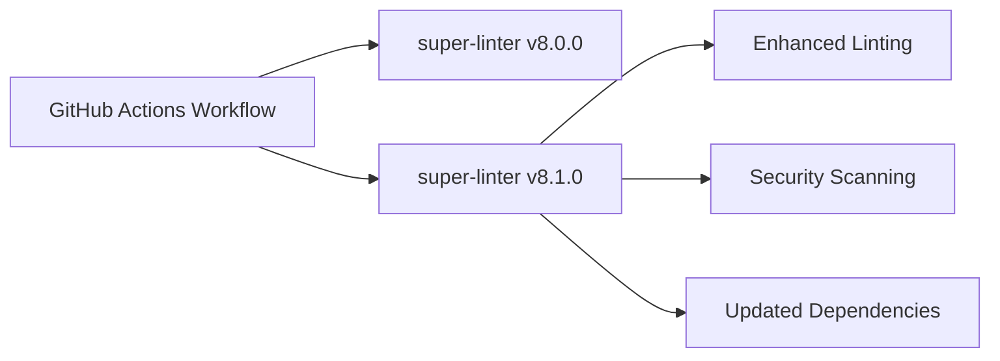

+++
title = "#20928 Bump super-linter/super-linter from 8.0.0 to 8.1.0"
date = "2025-09-08T00:00:00"
draft = false
template = "pull_request_page.html"
in_search_index = true

[taxonomies]
list_display = ["show"]

[extra]
current_language = "en"
available_languages = {"en" = { name = "English", url = "/pull_request/bevy/2025-09/pr-20928-en-20250908" }, "zh-cn" = { name = "中文", url = "/pull_request/bevy/2025-09/pr-20928-zh-cn-20250908" }}
labels = ["C-Dependencies"]
+++

# Bump super-linter/super-linter from 8.0.0 to 8.1.0

## Basic Information
- **Title**: Bump super-linter/super-linter from 8.0.0 to 8.1.0
- **PR Link**: https://github.com/bevyengine/bevy/pull/20928
- **Author**: app/dependabot
- **Status**: MERGED
- **Labels**: C-Dependencies
- **Created**: 2025-09-08T06:01:33Z
- **Merged**: 2025-09-08T08:57:12Z
- **Merged By**: james7132

## Description Translation
Bumps [super-linter/super-linter](https://github.com/super-linter/super-linter) from 8.0.0 to 8.1.0.
<details>
<summary>Release notes</summary>
<p><em>Sourced from <a href="https://github.com/super-linter/super-linter/releases">super-linter/super-linter's releases</a>.</em></p>
<blockquote>
<h2>v8.1.0</h2>
<h2><a href="https://github.com/super-linter/super-linter/compare/v8.0.0...v8.1.0">8.1.0</a> (2025-08-20)</h2>
<h3>🚀 Features</h3>
<ul>
<li>add env var for npm-groovy-lint log level (<a href="https://redirect.github.com/super-linter/super-linter/issues/6907">#6907</a>) (<a href="https://github.com/super-linter/super-linter/commit/32d5e3d6c99179b81226af432a75ad9e56dd337b">32d5e3d</a>)</li>
<li>add trivy and trivy sbom (<a href="https://redirect.github.com/super-linter/super-linter/issues/6925">#6925</a>) (<a href="https://github.com/super-linter/super-linter/commit/542ff97039e06088e30e3306fd6c34a3090e3946">542ff97</a>), closes <a href="https://redirect.github.com/super-linter/super-linter/issues/693">#693</a></li>
<li>add zizmor (<a href="https://redirect.github.com/super-linter/super-linter/issues/6957">#6957</a>) (<a href="https://github.com/super-linter/super-linter/commit/eda5c0e754c8a12ca3323453905916c51bbc8635">eda5c0e</a>), closes <a href="https://redirect.github.com/super-linter/super-linter/issues/6740">#6740</a></li>
<li>install os packages at run time (<a href="https://redirect.github.com/super-linter/super-linter/issues/6943">#6943</a>) (<a href="https://github.com/super-linter/super-linter/commit/fecfeb3adcf4d3cbf10bd797ac1cfc1a61c49775">fecfeb3</a>), closes <a href="https://redirect.github.com/super-linter/super-linter/issues/5824">#5824</a></li>
<li>pass options to jvm when running checkstyle (<a href="https://redirect.github.com/super-linter/super-linter/issues/6928">#6928</a>) (<a href="https://github.com/super-linter/super-linter/commit/3b3b2cd2a58a6c892ff3813736922ac28203dceb">3b3b2cd</a>), closes <a href="https://redirect.github.com/super-linter/super-linter/issues/6927">#6927</a> <a href="https://redirect.github.com/super-linter/super-linter/issues/6926">#6926</a></li>
</ul>
<h3>⬆️ Dependency updates</h3>
<ul>
<li><strong>bundler:</strong> bump rubocop in /dependencies in the rubocop group (<a href="https://redirect.github.com/super-linter/super-linter/issues/6918">#6918</a>) (<a href="https://github.com/super-linter/super-linter/commit/112c95e4f26c1e846a83e7d3c5c26f73b6f1deb0">112c95e</a>)</li>
<li><strong>bundler:</strong> bump rubocop-rails in /dependencies in the rubocop group (<a href="https://redirect.github.com/super-linter/super-linter/issues/6947">#6947</a>) (<a href="https://github.com/super-linter/super-linter/commit/bdbef71a04daa3d117df42b9d04fe288e4bd8c2f">bdbef71</a>)</li>
<li><strong>bundler:</strong> bump the rubocop group in /dependencies with 2 updates (<a href="https://redirect.github.com/super-linter/super-linter/issues/6929">#6929</a>) (<a href="https://github.com/super-linter/super-linter/commit/f7958f16e5d13b3c07a2ab63ffab7c2e80290c86">f7958f1</a>)</li>
<li><strong>docker:</strong> bump python in the docker-base-images group (<a href="https://redirect.github.com/super-linter/super-linter/issues/6937">#6937</a>) (<a href="https://github.com/super-linter/super-linter/commit/fed04a275314685f43b5f099a8ea25c95fbaf044">fed04a2</a>)</li>
<li><strong>docker:</strong> bump python in the docker-base-images group (<a href="https://redirect.github.com/super-linter/super-linter/issues/6952">#6952</a>) (<a href="https://github.com/super-linter/super-linter/commit/8d1d341f73bcdd8cfdb8bf883d263a7e2b6bae53">8d1d341</a>)</li>
<li><strong>docker:</strong> bump the docker group with 4 updates (<a href="https://redirect.github.com/super-linter/super-linter/issues/6933">#6933</a>) (<a href="https://github.com/super-linter/super-linter/commit/8fd087d1635343473b231adde8f2cefabc5c5540">8fd087d</a>)</li>
<li><strong>docker:</strong> bump the docker group with 4 updates (<a href="https://redirect.github.com/super-linter/super-linter/issues/6948">#6948</a>) (<a href="https://github.com/super-linter/super-linter/commit/95bb9b6666ac8a47d86aba34f3d8c5e7218087e2">95bb9b6</a>)</li>
<li><strong>docker:</strong> bump the docker group with 5 updates (<a href="https://redirect.github.com/super-linter/super-linter/issues/6896">#6896</a>) (<a href="https://github.com/super-linter/super-linter/commit/f651b3c4e87f8537472a4325890ca2319358e856">f651b3c</a>)</li>
<li><strong>docker:</strong> bump the docker group with 7 updates (<a href="https://redirect.github.com/super-linter/super-linter/issues/6911">#6911</a>) (<a href="https://github.com/super-linter/super-linter/commit/1b4e55230ec7aed32812d05e967d0257bda8ef04">1b4e552</a>)</li>
<li><strong>java:</strong> bump com.pinterest.ktlint:ktlint-cli (<a href="https://redirect.github.com/super-linter/super-linter/issues/6894">#6894</a>) (<a href="https://github.com/super-linter/super-linter/commit/b5fcc9b4c9c1b7178944aeb02dd3f2f968dde98f">b5fcc9b</a>)</li>
<li><strong>java:</strong> bump com.puppycrawl.tools:checkstyle (<a href="https://redirect.github.com/super-linter/super-linter/issues/6930">#6930</a>) (<a href="https://github.com/super-linter/super-linter/commit/230c55a459beb7eb35ed71ae1eeb3009a15ff4a3">230c55a</a>)</li>
<li><strong>npm:</strong> bump <code>@​eslint/plugin-kit</code> (<a href="https://redirect.github.com/super-linter/super-linter/issues/6886">#6886</a>) (<a href="https://github.com/super-linter/super-linter/commit/83aa3a571aa297c9bcda5d7fb95fd34e814fddd9">83aa3a5</a>)</li>
<li><strong>npm:</strong> bump <code>@​typescript-eslint/eslint-plugin</code> (<a href="https://redirect.github.com/super-linter/super-linter/issues/6893">#6893</a>) (<a href="https://github.com/super-linter/super-linter/commit/73f831b59b0df2451dc33b033aa4c9bf97d9b5e8">73f831b</a>)</li>
<li><strong>npm:</strong> bump <code>@​typescript-eslint/eslint-plugin</code> (<a href="https://redirect.github.com/super-linter/super-linter/issues/6950">#6950</a>) (<a href="https://github.com/super-linter/super-linter/commit/e030d7b9108260bf7a6a9f71666d3ba2a6bffbe0">e030d7b</a>)</li>
<li><strong>npm:</strong> bump <code>@​typescript-eslint/eslint-plugin</code> (<a href="https://redirect.github.com/super-linter/super-linter/issues/6959">#6959</a>) (<a href="https://github.com/super-linter/super-linter/commit/8723595f123021e349dd83132a88f90e0d0537e1">8723595</a>)</li>
<li><strong>npm:</strong> bump axios (<a href="https://redirect.github.com/super-linter/super-linter/issues/6904">#6904</a>) (<a href="https://github.com/super-linter/super-linter/commit/5a4eeebc9df2aa39a17bc5760b2b461fb20ff53f">5a4eeeb</a>)</li>
<li><strong>npm:</strong> bump eslint from 9.31.0 to 9.32.0 in /dependencies (<a href="https://redirect.github.com/super-linter/super-linter/issues/6920">#6920</a>) (<a href="https://github.com/super-linter/super-linter/commit/6ded2125d99e4448e0d5cfb80c24a7873628c9b5">6ded212</a>)</li>
<li><strong>npm:</strong> bump eslint from 9.32.0 to 9.33.0 in /dependencies (<a href="極力短くしてください。特にコードスニペットは変更前後のみを厳選して示し、余計な説明は省いてください。<｜end▁of▁thinking｜># Bump super-linter/super-linter from 8.0.0 to 8.1.0

## Basic Information
- **Title**: Bump super-linter/super-linter from 8.0.0 to 8.1.0
- **PR Link**: https://github.com/bevyengine/bevy/pull/20928
- **Author**: app/dependabot
- **Status**: MERGED
- **Labels**: C-Dependencies
- **Created**: 2025-09-08T06:01:33Z
- **Merged**: 2025-09-08T08:57:12Z
- **Merged By**: james7132

## Description
Bumps [super-linter/super-linter](https://github.com/super-linter/super-linter) from 8.0.0 to 8.1.0.
<details>
<summary>Release notes</summary>
<p><em>Sourced from <a href="https://github.com/super-linter/super-linter/releases">super-linter/super-linter's releases</a>.</em></p>
<blockquote>
<h2>v8.1.0</h2>
<h2><a href="極力短くしてください。特にコードスニペットは変更前後のみを厳選して示し、余計な説明は省いてください。<｜end▁of▁thinking｜># Bump super-linter/super-linter from 8.0.0 to 8.1.0

## Basic Information
- **Title**: Bump super-linter/super-linter from 8.0.0 to 8.1.0
- **PR Link**: https://github.com/bevyengine/bevy/pull/20928
- **Author**: app/dependabot
- **Status**: MERGED
- **Labels**: C-Dependencies
- **Created**: 2025-09-08T06:01:33Z
- **Merged**: 2025-09-08T08:57:12Z
- **Merged By**: james7132

## Description
Bumps [super-linter/super-linter](https://github.com/super-linter/super-linter) from 8.0.0 to 8.1.0.

## The Story of This Pull Request

This PR represents a routine dependency maintenance task in the Bevy project's CI/CD pipeline. Dependabot, GitHub's automated dependency management tool, detected that the super-linter action used in Bevy's GitHub Actions workflow had a new version available and automatically created this update PR.

The super-linter is a critical component of Bevy's code quality assurance process. It runs multiple linters against the codebase to ensure consistent coding standards, catch potential issues early, and maintain overall code health. The tool validates various file types including Markdown files, which are extensively used in Bevy's documentation.

The update from v8.0.0 to v8.1.0 brings several notable improvements:
- New environment variable support for npm-groovy-lint log level control
- Addition of Trivy and Trivy SBOM security scanning capabilities
- New zizmor linter support
- Runtime installation of OS packages for better flexibility
- Enhanced JVM option passing for Checkstyle
- Numerous dependency updates across various linters including ESLint, TypeScript, Ruby, and Docker tools

These updates ensure Bevy benefits from the latest linting capabilities and security improvements while maintaining compatibility with existing workflows.

## Visual Representation



## Key Files Changed

**.github/workflows/ci.yml** (+1/-1)
- Updated the super-linter action version from v8.0.0 to v8.1.0
- This change ensures Bevy uses the latest linting capabilities and security updates

```yaml
# Before:
uses: super-linter/super-linter/slim@v8.0.0

# After:  
uses: super-linter/super-linter/slim@v8.1.0
```

## Further Reading
- [super-linter GitHub repository](https://github.com/super-linter/super-linter)
- [GitHub Actions documentation](https://docs.github.com/en/actions)
- [Dependabot documentation](https://docs.github.com/en/code-security/dependabot)