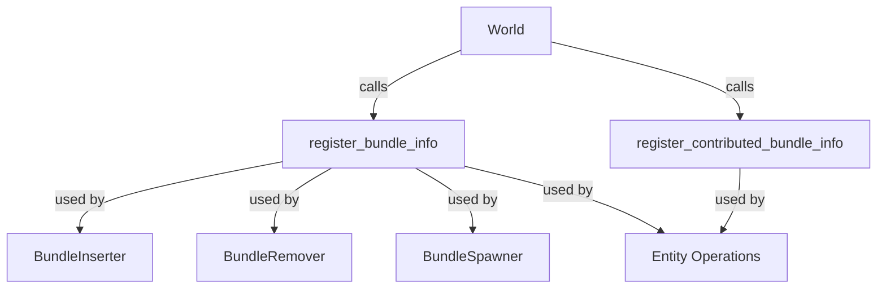

+++
title = "#20932 add helper functions for registering bundles to world"
date = "2025-09-09T00:00:00"
draft = false
template = "pull_request_page.html"
in_search_index = true

[taxonomies]
list_display = ["show"]

[extra]
current_language = "en"
available_languages = {"en" = { name = "English", url = "/pull_request/bevy/2025-09/pr-20932-en-20250909" }, "zh-cn" = { name = "中文", url = "/pull_request/bevy/2025-09/pr-20932-zh-cn-20250909" }}
labels = ["A-ECS", "C-Code-Quality", "D-Straightforward", "D-Unsafe"]
+++

# add helper functions for registering bundles to world

## Basic Information
- **Title**: add helper functions for registering bundles to world
- **PR Link**: https://github.com/bevyengine/bevy/pull/20932
- **Author**: janis-bhm
- **Status**: MERGED
- **Labels**: A-ECS, C-Code-Quality, S-Ready-For-Final-Review, X-Uncontroversial, D-Straightforward, D-Unsafe
- **Created**: 2025-09-08T11:55:54Z
- **Merged**: 2025-09-09T22:51:37Z
- **Merged By**: alice-i-cecile

## Description Translation
This avoids having to create a `ComponentRegistrator` and passing it to Bundles::register_info everywhere it's called, reducing unsafe blocks. There aren't any calls to `register_info` and related functions that don't have access to a `&mut World` where it wouldn't be possible to do this.

(part 2 to #20790),  #20739

# Objective
calling `Bundles::register_info` involves creating a `ComponentRegistrator` from world `components` and `component_ids`, requiring a `&mut World` and a safety comment ensuring the `ComponentRegistrator` belongs to the same world as the `Bundles`.

## Solution
create a helper function to the world that calls `register_info` with the correct `ComponentRegistrator`, removing the need for unsafe blocks.

## The Story of This Pull Request

This PR addresses a recurring pattern in Bevy's ECS system where bundle registration required manual creation of `ComponentRegistrator` instances and unsafe code blocks. The problem stemmed from the need to register bundle information across multiple systems - bundle insertion, removal, spawning, and entity operations - each duplicating the same unsafe initialization code.

The core issue was that registering a bundle required:
1. Creating a `ComponentRegistrator` from world components and component IDs
2. Ensuring safety by verifying all components belonged to the same world
3. Calling `register_info` with the correct parameters

This pattern was repeated in 5 different locations with nearly identical unsafe code blocks and safety comments. Each instance required careful manual verification that the `ComponentRegistrator` was properly constructed from the same world's components.

The solution introduced two new helper methods on the `World` struct:
- `register_bundle_info<B: Bundle>() -> BundleId`
- `register_contributed_bundle_info<B: Bundle>() -> BundleId`

These methods encapsulate the unsafe operations of creating the `ComponentRegistrator` and calling the appropriate registration methods on the world's bundles. The implementation ensures that all components and registrators are properly associated with the same world, maintaining the necessary safety guarantees while eliminating code duplication.

The changes affected multiple systems that work with bundles:
- **Bundle insertion**: When adding components to entities
- **Bundle removal**: When removing components from entities  
- **Bundle spawning**: When creating new entities with component sets
- **Entity operations**: When modifying entity component compositions

By centralizing the bundle registration logic, the PR reduces the cognitive load on developers working with these systems. Instead of manually managing unsafe blocks and safety comments, developers can now call a single safe method that handles the complexity internally.

The implementation maintains the same performance characteristics as the original code since it simply moves the existing logic into reusable methods. The safety guarantees remain intact because the helper methods still perform the same validation, just in a centralized location.

This change follows good software engineering practices by reducing code duplication, encapsulating unsafe operations, and providing a cleaner API for bundle registration. It makes the codebase more maintainable and less error-prone by minimizing the surface area where unsafe operations are performed.

## Visual Representation



## Key Files Changed

### `crates/bevy_ecs/src/world/mod.rs` (+28/-27)
Added helper methods for bundle registration and refactored existing code to use them.

**Key changes:**
```rust
// Added methods:
pub(crate) fn register_bundle_info<B: Bundle>(&mut self) -> BundleId {
    // SAFETY: These come from the same world. `Self.components_registrator` can't be used since we borrow other fields too.
    let mut registrator =
        unsafe { ComponentsRegistrator::new(&mut self.components, &mut self.component_ids) };

    // SAFETY: `registrator`, `self.storages` and `self.bundles` all come from this world.
    unsafe {
        self.bundles
            .register_info::<B>(&mut registrator, &mut self.storages)
    }
}

pub(crate) fn register_contributed_bundle_info<B: Bundle>(&mut self) -> BundleId {
    // SAFETY: These come from the same world. `Self.components_registrator` can't be used since we borrow other fields too.
    let mut registrator =
        unsafe { ComponentsRegistrator::new(&mut self.components, &mut self.component_ids) };

    // SAFETY: `registrator`, `self.bundles` and `self.storages` are all from this world.
    unsafe {
        self.bundles
            .register_contributed_bundle_info::<B>(&mut registrator, &mut self.storages)
    }
}

// Refactored existing method to use helper:
pub fn register_bundle<B: Bundle>(&mut self) -> &BundleInfo {
    let id = self.register_bundle_info::<B>();  // Now uses helper method

    // SAFETY: We just initialized the bundle so its id should definitely be valid.
    unsafe { self.bundles.get(id).debug_checked_unwrap() }
}
```

### `crates/bevy_ecs/src/bundle/insert.rs` (+3/-11)
Refactored bundle insertion to use the new helper method.

**Key changes:**
```rust
// Before:
// SAFETY: These come from the same world. `world.components_registrator` can't be used since we borrow other fields too.
let mut registrator =
    unsafe { ComponentsRegistrator::new(&mut world.components, &mut world.component_ids) };

// SAFETY: `registrator`, `world.bundles`, and `world.storages` all come from the same world
let bundle_id = unsafe {
    world
        .bundles
        .register_info::<T>(&mut registrator, &mut world.storages)
};

// After:
let bundle_id = world.register_bundle_info::<T>();
```

### `crates/bevy_ecs/src/bundle/remove.rs` (+3/-11)
Refactored bundle removal to use the new helper method.

**Key changes:**
```rust
// Before:
// SAFETY: These come from the same world. `world.components_registrator` can't be used since we borrow other fields too.
let mut registrator =
    unsafe { ComponentsRegistrator::new(&mut world.components, &mut world.component_ids) };

// SAFETY: `registrator`, `world.storages`, and `world.bundles` all come from the same world.
let bundle_id = unsafe {
    world
        .bundles
        .register_info::<T>(&mut registrator, &mut world.storages)
};

// After:
let bundle_id = world.register_bundle_info::<T>();
```

### `crates/bevy_ecs/src/bundle/spawner.rs` (+2/-10)
Refactored bundle spawning to use the new helper method.

**Key changes:**
```rust
// Before:
// SAFETY: These come from the same world. `world.components_registrator` can't be used since we borrow other fields too.
let mut registrator =
    unsafe { ComponentsRegistrator::new(&mut world.components, &mut world.component_ids) };

// SAFETY: `registrator`, `world.bundles`, and `world.storages` all come from the same world.
let bundle_id = unsafe {
    world
        .bundles
        .register_info::<T>(&mut registrator, &mut world.storages)
};

// After:
let bundle_id = world.register_bundle_info::<T>();
```

### `crates/bevy_ecs/src/world/entity_ref.rs` (+9/-31)
Refactored entity operations to use the new helper methods.

**Key changes:**
```rust
// Before multiple instances of:
// SAFETY: These come from the same world.
let mut registrator = unsafe {
    ComponentsRegistrator::new(&mut self.world.components, &mut self.world.component_ids)
};

// SAFETY: `storages`, `bundles` and `registrator` come from the same world.
let bundle_id =
    unsafe { bundles.register_contributed_bundle_info::<T>(&mut registrator, storages) };

// After:
let bundle_id = self.world.register_contributed_bundle_info::<T>();
```

## Further Reading

- [Bevy ECS Documentation](https://docs.rs/bevy_ecs/latest/bevy_ecs/)
- [Rust Unsafe Code Guidelines](https://rust-lang.github.io/unsafe-code-guidelines/)
- [Component Registration in Bevy](https://bevyengine.org/learn/quick-start/ecs/#components)
- [Related PR #20790](https://github.com/bevyengine/bevy/pull/20790)
- [Related PR #20739](https://github.com/bevyengine/bevy/pull/20739)