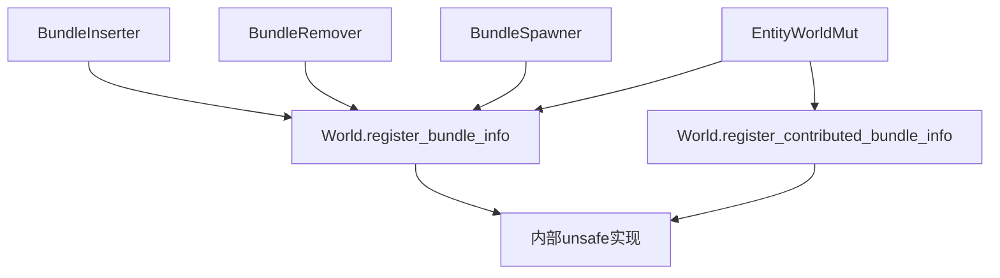

+++
title = "#20932 add helper functions for registering bundles to world"
date = "2025-09-09T00:00:00"
draft = false
template = "pull_request_page.html"
in_search_index = false

[extra]
current_language = "zh-cn"
available_languages = {"en" = { name = "English", url = "/pull_request/bevy/2025-09/pr-20932-en-20250909" }, "zh-cn" = { name = "中文", url = "/pull_request/bevy/2025-09/pr-20932-zh-cn-20250909" }}
+++

# add helper functions for registering bundles to world

## 基本信息
- **标题**: add helper functions for registering bundles to world
- **PR链接**: https://github.com/bevyengine/bevy/pull/20932
- **作者**: janis-bhm
- **状态**: 已合并
- **标签**: A-ECS, C-Code-Quality, S-Ready-For-Final-Review, X-Uncontroversial, D-Straightforward, D-Unsafe
- **创建时间**: 2025-09-08T11:55:54Z
- **合并时间**: 2025-09-09T22:51:37Z
- **合并者**: alice-i-cecile

## 描述翻译
此PR添加了用于向world注册bundle的辅助函数，避免了必须创建`ComponentRegistrator`并将其传递给`Bundles::register_info`的情况，从而减少了unsafe代码块。目前没有任何调用`register_info`及相关函数的地方无法访问`&mut World`，因此这种改进是可行的。

（这是#20790的第二部分），#20739

# 目标
调用`Bundles::register_info`需要从world的`components`和`component_ids`创建`ComponentRegistrator`，这需要`&mut World`和一个确保`ComponentRegistrator`与`Bundles`属于同一个world的安全注释。

## 解决方案
创建一个world的辅助函数，使用正确的`ComponentRegistrator`调用`register_info`，消除了对unsafe代码块的需求。

## 这个Pull Request的故事

这个PR解决了一个在Bevy ECS中重复出现的代码模式和安全性问题。在多个需要注册bundle信息的地方，开发人员不得不重复编写相同的unsafe代码来创建`ComponentRegistrator`并调用`register_info`方法。

问题的核心在于，每次注册bundle时都需要手动确保`ComponentRegistrator`、`Bundles`和`Storages`都来自同一个world，这导致了代码重复和潜在的维护问题。虽然这些unsafe块有适当的安全注释，但它们增加了代码复杂性和认知负担。

开发者采取的解决方案很直接：在`World`结构上添加辅助方法来封装这个常见的模式。通过创建`register_bundle_info`和`register_contributed_bundle_info`这两个方法，将unsafe代码集中到一处，让调用方代码更加简洁和安全。

实现上，这个PR主要做了两件事：

1. 在`world/mod.rs`中添加了两个新的辅助方法
2. 在四个不同的模块中使用这些新方法来替换重复的unsafe代码块

这种重构遵循了DRY（Don't Repeat Yourself）原则，将重复的逻辑提取到单一位置。从技术角度来看，这是一个典型的重构案例，通过引入辅助方法来简化接口并减少代码重复。

这些改变带来的直接影响是代码质量的提升：减少了unsafe代码块的数量，提高了代码的可读性和可维护性。由于unsafe代码现在被封装在well-tested的方法中，也降低了潜在的安全风险。

从架构角度看，这个变化使得bundle注册的接口更加清晰，调用方不再需要了解`ComponentRegistrator`的内部细节，只需要调用world上的简单方法即可。

## 可视化表示



## 关键文件更改

### `crates/bevy_ecs/src/world/mod.rs` (+28/-27)
这是主要的修改文件，添加了bundle注册的辅助方法。

**关键修改：**
```rust
// 添加的新方法
pub(crate) fn register_bundle_info<B: Bundle>(&mut self) -> BundleId {
    // SAFETY: These come from the same world. `Self.components_registrator` can't be used since we borrow other fields too.
    let mut registrator =
        unsafe { ComponentsRegistrator::new(&mut self.components, &mut self.component_ids) };

    // SAFETY: `registrator`, `self.storages` and `self.bundles` all come from this world.
    unsafe {
        self.bundles
            .register_info::<B>(&mut registrator, &mut self.storages)
    }
}

pub(crate) fn register_contributed_bundle_info<B: Bundle>(&mut self) -> BundleId {
    // SAFETY: These come from the same world. `Self.components_registrator` can't be used since we borrow other fields too.
    let mut registrator =
        unsafe { ComponentsRegistrator::new(&mut self.components, &mut self.component_ids) };

    // SAFETY: `registrator`, `self.bundles` and `self.storages` are all from this world.
    unsafe {
        self.bundles
            .register_contributed_bundle_info::<B>(&mut registrator, &mut self.storages)
    }
}
```

### `crates/bevy_ecs/src/bundle/insert.rs` (+3/-11)
简化了BundleInserter的初始化代码。

**修改前：**
```rust
// SAFETY: These come from the same world. `world.components_registrator` can't be used since we borrow other fields too.
let mut registrator =
    unsafe { ComponentsRegistrator::new(&mut world.components, &mut world.component_ids) };

// SAFETY: `registrator`, `world.bundles`, and `world.storages` all come from the same world
let bundle_id = unsafe {
    world
        .bundles
        .register_info::<T>(&mut registrator, &mut world.storages)
};
```

**修改后：**
```rust
let bundle_id = world.register_bundle_info::<T>();
```

### `crates/bevy_ecs/src/bundle/remove.rs` (+3/-11)
类似地简化了BundleRemover的初始化。

### `crates/bevy_ecs/src/bundle/spawner.rs` (+2/-10)
简化了BundleSpawner的初始化代码。

### `crates/bevy_ecs/src/world/entity_ref.rs` (+9/-31)
简化了EntityWorldMut中的bundle注册逻辑，使用了新的辅助方法。

## 扩展阅读

- [Bevy ECS 文档](https://bevyengine.org/learn/books/ecs/)
- [Rust Unsafe Code Guidelines](https://rust-lang.github.io/unsafe-code-guidelines/)
- [DRY Principle](https://en.wikipedia.org/wiki/Don%27t_repeat_yourself)
- [Previous PR #20790](https://github.com/bevyengine/bevy/pull/20790) - 这个PR的第一部分

# 完整代码差异
由于代码差异较长，此处仅显示关键部分。完整差异请查看PR链接。

```diff
diff --git a/crates/bevy_ecs/src/world/mod.rs b/crates/bevy_ecs/src/world/mod.rs
index 7632e30159f7a..8f438479533fb 100644
--- a/crates/bevy_ecs/src/world/mod.rs
+++ b/crates/bevy_ecs/src/world/mod.rs
@@ -3075,18 +3060,34 @@ impl World {
     /// component in the bundle.
     #[inline]
     pub fn register_bundle<B: Bundle>(&mut self) -> &BundleInfo {
+        let id = self.register_bundle_info::<B>();
+
+        // SAFETY: We just initialized the bundle so its id should definitely be valid.
+        unsafe { self.bundles.get(id).debug_checked_unwrap() }
+    }
+
+    pub(crate) fn register_bundle_info<B: Bundle>(&mut self) -> BundleId {
         // SAFETY: These come from the same world. `Self.components_registrator` can't be used since we borrow other fields too.
         let mut registrator =
             unsafe { ComponentsRegistrator::new(&mut self.components, &mut self.component_ids) };
 
         // SAFETY: `registrator`, `self.storages` and `self.bundles` all come from this world.
-        let id = unsafe {
+        unsafe {
             self.bundles
                 .register_info::<B>(&mut registrator, &mut self.storages)
-        };
+        }
+    }
 
-        // SAFETY: We just initialized the bundle so its id should definitely be valid.
-        unsafe { self.bundles.get(id).debug_checked_unwrap() }
+    pub(crate) fn register_contributed_bundle_info<B: Bundle>(&mut self) -> BundleId {
+        // SAFETY: These come from the same world. `Self.components_registrator` can't be used since we borrow other fields too.
+        let mut registrator =
+            unsafe { ComponentsRegistrator::new(&mut self.components, &mut self.component_ids) };
+
+        // SAFETY: `registrator`, `self.bundles` and `self.storages` are all from this world.
+        unsafe {
+            self.bundles
+                .register_contributed_bundle_info::<B>(&mut registrator, &mut self.storages)
+        }
     }
 
     /// Registers the given [`ComponentId`]s as a dynamic bundle and returns both the required component ids and the bundle id.
```

其他文件的修改模式类似，都是用新的辅助方法替换了重复的unsafe代码块。