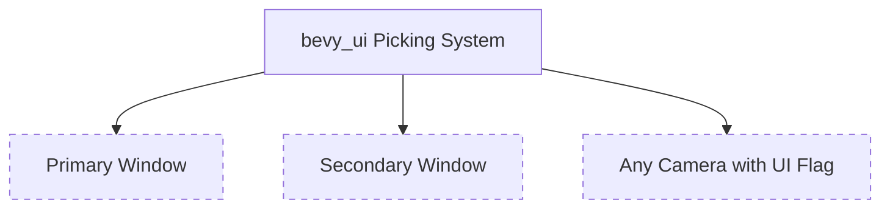

+++
title = "#20935 Remove incorrect doc comment"
date = "2025-09-09T00:00:00"
draft = false
template = "pull_request_page.html"
in_search_index = true

[taxonomies]
list_display = ["show"]

[extra]
current_language = "en"
available_languages = {"en" = { name = "English", url = "/pull_request/bevy/2025-09/pr-20935-en-20250909" }, "zh-cn" = { name = "中文", url = "/pull_request/bevy/2025-09/pr-20935-zh-cn-20250909" }}
labels = ["C-Docs", "A-UI", "A-Picking"]
+++

# Remove incorrect doc comment

## Basic Information
- **Title**: Remove incorrect doc comment
- **PR Link**: https://github.com/bevyengine/bevy/pull/20935
- **Author**: ickshonpe
- **Status**: MERGED
- **Labels**: C-Docs, A-UI, S-Ready-For-Final-Review, A-Picking
- **Created**: 2025-09-08T21:01:31Z
- **Merged**: 2025-09-09T21:46:52Z
- **Merged By**: alice-i-cecile

## Description Translation
# Objective

Remove untrue doc comment from picking_backend module: "`bevy_ui` can only render to the primary window".

## The Story of This Pull Request

This PR addresses a documentation issue in Bevy's UI system. The problem was straightforward: a doc comment in the `picking_backend` module contained incorrect information stating that "`bevy_ui` can only render to the primary window." This statement was outdated and no longer reflected the actual capabilities of the Bevy UI system.

The context here is important for understanding why this correction matters. Bevy's UI system has evolved to support rendering to multiple windows, not just the primary window. This capability is crucial for applications that require multi-window setups, such as editor interfaces, dashboard applications, or games with secondary displays. The incorrect documentation could mislead developers into thinking they were constrained to single-window UI rendering when in fact multi-window UI support was available.

The solution approach was simple but important: remove the inaccurate documentation line. This type of documentation maintenance is critical in large codebases like Bevy where accurate documentation helps developers understand system capabilities and avoid unnecessary workarounds.

From an implementation perspective, this change required no code modifications - only the removal of a single misleading comment line. The change was made in the module-level documentation for `bevy_ui::picking_backend`, which contains important implementation notes about how UI picking works in the engine.

The technical insight here is about the importance of maintaining accurate documentation in complex systems. While the change itself is minor, inaccurate documentation can cause significant confusion and lead developers down incorrect paths. The Bevy UI system's ability to render to any camera with the appropriate flag, rather than being tied to a specific window or camera, is an important capability that developers should understand.

The impact of this change is primarily on developer experience and code comprehension. By removing the incorrect statement, developers reading the documentation will have a more accurate understanding of the UI system's capabilities. This prevents potential misunderstandings and ensures that developers can properly utilize Bevy's multi-window UI support when building their applications.

## Visual Representation



This diagram illustrates that Bevy's UI picking system can work with multiple windows and cameras, contrary to the previously documented limitation.

## Key Files Changed

- `crates/bevy_ui/src/picking_backend.rs` (+0/-1)

This file contains the implementation details for Bevy UI's picking backend system. The change removed an incorrect documentation comment that falsely claimed UI could only render to the primary window.

```rust
// File: crates/bevy_ui/src/picking_backend.rs
// Before:
//!
//! ## Implementation Notes
//!
//! - `bevy_ui` can only render to the primary window
//! - `bevy_ui` can render on any camera with a flag, it is special, and is not tied to a particular
//!   camera.
//! - To correctly sort picks, the order of `bevy_ui` is set to be the camera order plus 0.5.

// After:
//!
//! ## Implementation Notes
//!
//! - `bevy_ui` can render on any camera with a flag, it is special, and is not tied to a particular
//!   camera.
//! - To correctly sort picks, the order of `bevy_ui` is set to be the camera order plus 0.5.
```

The removal of the inaccurate line ensures that developers reading the documentation won't be misled about the UI system's capabilities.

## Further Reading

- [Bevy UI Documentation](https://docs.rs/bevy_ui/latest/bevy_ui/)
- [Bevy Window Management](https://bevyengine.org/learn/books/introduction/11-window/)
- [Bevy Camera System](https://bevyengine.org/learn/books/introduction/12-camera/)
- [Rust Documentation Comments](https://doc.rust-lang.org/rustdoc/how-to-write-documentation.html)

## Full Code Diff

```diff
diff --git a/crates/bevy_ui/src/picking_backend.rs b/crates/bevy_ui/src/picking_backend.rs
index bd94b9d82bed5..59867bd480a8d 100644
--- a/crates/bevy_ui/src/picking_backend.rs
+++ b/crates/bevy_ui/src/picking_backend.rs
@@ -14,7 +14,6 @@
 //!
 //! ## Implementation Notes
 //!
-//! - `bevy_ui` can only render to the primary window
 //! - `bevy_ui` can render on any camera with a flag, it is special, and is not tied to a particular
 //!   camera.
 //! - To correctly sort picks, the order of `bevy_ui` is set to be the camera order plus 0.5.
```