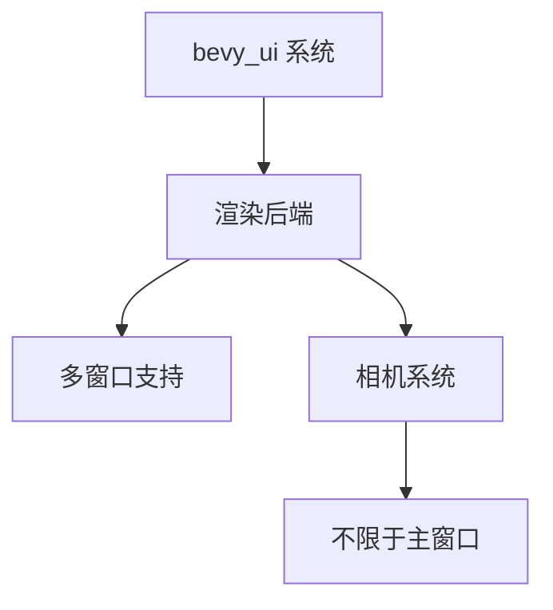

+++
title = "#20935 Remove incorrect doc comment"
date = "2025-09-09T00:00:00"
draft = false
template = "pull_request_page.html"
in_search_index = false

[extra]
current_language = "zh-cn"
available_languages = {"en" = { name = "English", url = "/pull_request/bevy/2025-09/pr-20935-en-20250909" }, "zh-cn" = { name = "中文", url = "/pull_request/bevy/2025-09/pr-20935-zh-cn-20250909" }}
+++

# Remove incorrect doc comment

## 基本信息
- **标题**: Remove incorrect doc comment
- **PR链接**: https://github.com/bevyengine/bevy/pull/20935
- **作者**: ickshonpe
- **状态**: 已合并
- **标签**: C-Docs, A-UI, S-Ready-For-Final-Review, A-Picking
- **创建时间**: 2025-09-08T21:01:31Z
- **合并时间**: 2025-09-08T21:46:52Z
- **合并人**: alice-i-cecile

## 描述翻译
# Objective

移除 picking_backend 模块中不正确的文档注释："`bevy_ui` can only render to the primary window"（`bevy_ui` 只能渲染到主窗口）。

## PR 分析

这个 PR 解决了一个文档准确性问题。在 Bevy 引擎的 UI 模块中，`picking_backend.rs` 文件包含了一条不正确的技术文档注释，声称 `bevy_ui` 只能渲染到主窗口（primary window）。这实际上是一个过时或不准确的陈述。

问题的核心在于这条注释与 Bevy UI 系统的实际能力不符。随着 Bevy 引擎的发展，UI 系统已经具备了在多窗口环境中渲染的能力，不再局限于只能渲染到主窗口。保留这样的错误文档会给开发者带来误导，可能让他们错误地认为 UI 系统有多窗口渲染的限制。

从技术实现角度来看，Bevy 的 UI 渲染系统通过相机（camera）组件进行控制，而不是与特定窗口绑定。正如文件中其他注释正确指出的："`bevy_ui` can render on any camera with a flag, it is special, and is not tied to a particular camera"（`bevy_ui` 可以在任何带有标志的相机上渲染，它是特殊的，不绑定到特定相机）。

这个修改虽然简单，但对于维护代码库的准确性很重要。错误的文档注释会导致开发者对系统能力的误解，可能影响他们的架构决策和实现方式。在游戏引擎这类基础软件中，准确的文档对于开发者正确使用 API 至关重要。

修改的方式很直接：直接删除不准确的注释行。这种处理方式是合适的，因为：
1. 注释内容本身是不正确的
2. 没有需要替代的正确表述
3. 其他相关注释已经提供了足够的上下文信息

这个变更反映了开源项目中常见的文档维护工作——随着代码功能的演进，及时更新相关的文档和注释以确保准确性。虽然这类修改看似简单，但它们对于保持项目的健康度和可用性非常重要。

## 可视化表示



## 关键文件变更

**crates/bevy_ui/src/picking_backend.rs** (+0/-1)

这个文件是 Bevy UI 系统的点选（picking）后端实现。主要的变更是删除了一行不正确的文档注释。

变更前：
```rust
//!
//! ## Implementation Notes
//!
//! - `bevy_ui` can only render to the primary window
//! - `bevy_ui` can render on any camera with a flag, it is special, and is not tied to a particular
//!   camera.
//! - To correctly sort picks, the order of `bevy_ui` is set to be the camera order plus 0.5.
```

变更后：
```rust
//!
//! ## Implementation Notes
//!
//! - `bevy_ui` can render on any camera with a flag, it is special, and is not tied to a particular
//!   camera.
//! - To correctly sort picks, the order of `bevy_ui` is set to be the camera order plus 0.5.
```

这个修改移除了关于 UI 只能渲染到主窗口的不正确陈述，使文档与代码实际功能保持一致。

## 扩展阅读

- [Bevy 官方文档 - UI 系统](https://bevyengine.org/learn/books/introduction/ ui)
- [Bevy 多窗口示例](https://github.com/bevyengine/bevy/blob/main/examples/window/multiple_windows.rs)
- [Bevy 相机系统文档](https://docs.rs/bevy/latest/bevy/render/camera/struct.Camera.html)

# 完整代码差异

```diff
diff --git a/crates/bevy_ui/src/picking_backend.rs b/crates/bevy_ui/src/picking_backend.rs
index bd94b9d82bed5..59867bd480a8d 100644
--- a/crates/bevy_ui/src/picking_backend.rs
+++ b/crates/bevy_ui/src/picking_backend.rs
@@ -14,7 +14,6 @@
 //!
 //! ## Implementation Notes
 //!
-//! - `bevy_ui` can only render to the primary window
 //! - `bevy_ui` can render on any camera with a flag, it is special, and is not tied to a particular
 //!   camera.
 //! - To correctly sort picks, the order of `bevy_ui` is set to be the camera order plus 0.5.
```