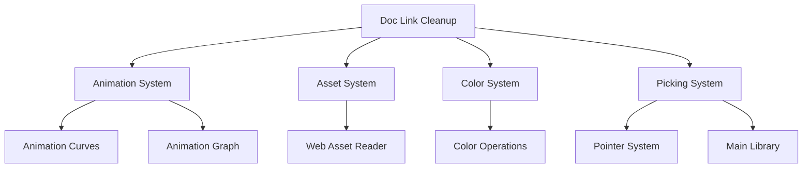

+++
title = "#20936 Hide some full paths in doc links"
date = "2025-09-09T00:00:00"
draft = false
template = "pull_request_page.html"
in_search_index = true

[taxonomies]
list_display = ["show"]

[extra]
current_language = "en"
available_languages = {"en" = { name = "English", url = "/pull_request/bevy/2025-09/pr-20936-en-20250909" }, "zh-cn" = { name = "中文", url = "/pull_request/bevy/2025-09/pr-20936-zh-cn-20250909" }}
labels = ["C-Docs", "D-Trivial"]
+++

# Hide some full paths in doc links

## Basic Information
- **Title**: Hide some full paths in doc links
- **PR Link**: https://github.com/bevyengine/bevy/pull/20936
- **Author**: ickshonpe
- **Status**: MERGED
- **Labels**: C-Docs, D-Trivial, S-Ready-For-Final-Review
- **Created**: 2025-09-08T21:46:44Z
- **Merged**: 2025-09-08T22:39:35Z
- **Merged By**: mockersf

## Description Translation
# Objective

Clean up some more doc links.

## The Story of This Pull Request

This PR addresses a common documentation readability issue in Rust projects: overly verbose path references in doc comments. When generating documentation, Rust's `rustdoc` tool creates links to referenced types, but these can become excessively long when they include full module paths, making the documentation harder to read.

The developer identified several instances where documentation links used the full crate path syntax (`[crate::some::module::Type]`) and replaced them with the more concise display text format (`[DisplayText](link)`). This approach maintains the same functionality - the links still work correctly in the generated documentation - while significantly improving readability.

The changes follow a consistent pattern across multiple crates in the Bevy engine, demonstrating systematic attention to documentation quality. Each modification replaces verbose path references with cleaner alternatives that hide the full path while preserving the link functionality.

The implementation required careful attention to Rust's documentation syntax. The developer used the format `[DisplayText](link_path)` where:
- `DisplayText` is the visible text in the documentation
- `link_path` is the actual path that rustdoc will resolve

This approach follows Rust's standard documentation conventions and doesn't introduce any new dependencies or architectural changes. It's purely a documentation cleanup effort that improves the developer experience when reading through the codebase or generated docs.

The changes affect several core systems including animation, asset management, color operations, and picking functionality. Despite touching multiple areas of the codebase, the modifications are isolated to documentation comments and don't impact runtime behavior or API contracts.

## Visual Representation



## Key Files Changed

### `crates/bevy_animation/src/animation_curves.rs` (+2/-2)
**Change**: Improved documentation links for better readability
```rust
// Before:
/// A low-level trait for use in [`crate::VariableCurve`] that provides fine

// After:
/// A low-level trait for use in [`VariableCurve`](`crate::VariableCurve`) that provides fine
```

```rust
// Before:
/// evaluating the [`crate::graph::AnimationGraph`], while the blend register

// After:
/// evaluating the [`AnimationGraph`](`crate::graph::AnimationGraph`), while the blend register
```

### `crates/bevy_animation/src/graph.rs` (+1/-1)
**Change**: Cleaned up animation curve evaluator reference
```rust
// Before:
/// [`crate::animation_curves::AnimationCurveEvaluator`] uses a stack for

// After:
/// [`AnimationCurveEvaluator`](`crate::animation_curves::AnimationCurveEvaluator`) uses a stack for
```

### `crates/bevy_asset/src/io/web.rs` (+1/-1)
**Change**: Simplified reference to meta path function
```rust
// Before:
/// See [`crate::io::get_meta_path`]

// After:
/// See [`io::get_meta_path`](`crate::io::get_meta_path`)
```

### `crates/bevy_color/src/color_ops.rs` (+1/-1)
**Change**: Clarified Hsla color space reference
```rust
// Before:
/// the operations are performed in [`crate::Hsla`].

// After:
/// the operations are performed in [`Hsla`](`crate::Hsla`).
```

### `crates/bevy_picking/src/lib.rs` (+1/-1)
**Change**: Improved pointer hits documentation reference
```rust
// Before:
/// into a [`crate::backend::PointerHits`]

// After:
/// into a [`PointerHits`](`crate::backend::PointerHits`)
```

### `crates/bevy_picking/src/pointer.rs` (+1/-1)
**Change**: Cleaned up input module reference
```rust
// Before:
/// and touch input is provided under [`crate::input`], but you can also implement

// After:
/// and touch input is provided under [`input`](`crate::input`), but you can also implement
```

## Further Reading

- [Rust Documentation Guidelines](https://rust-lang.github.io/rfcs/1574-more-api-documentation-conventions.html)
- [Rustdoc Link Syntax](https://doc.rust-lang.org/rustdoc/linking-to-items-by-name.html)
- [Bevy Engine Documentation](https://bevyengine.org/learn/)


# Full Code Diff
<details>
<summary>Click to expand</summary>

```diff
diff --git a/crates/bevy_animation/src/animation_curves.rs b/crates/bevy_animation/src/animation_curves.rs
index 0e1d5866df41b..ba77ec4b5ec56 100644
--- a/crates/bevy_animation/src/animation_curves.rs
+++ b/crates/bevy_animation/src/animation_curves.rs
@@ -817,7 +817,7 @@ pub enum EvaluatorId<'a> {
     Type(TypeId),
 }
 
-/// A low-level trait for use in [`crate::VariableCurve`] that provides fine
+/// A low-level trait for use in [`VariableCurve`](`crate::VariableCurve`) that provides fine
 /// control over how animations are evaluated.
 ///
 /// You can implement this trait when the generic [`AnimatableCurveEvaluator`]
@@ -834,7 +834,7 @@ pub enum EvaluatorId<'a> {
 /// either a (value, weight) pair or empty. *Value* here refers to an instance
 /// of the value being animated: for example, [`Vec3`] in the case of
 /// translation keyframes.  The stack stores intermediate values generated while
-/// evaluating the [`crate::graph::AnimationGraph`], while the blend register
+/// evaluating the [`AnimationGraph`](`crate::graph::AnimationGraph`), while the blend register
 /// stores the result of a blend operation.
 ///
 /// [`Vec3`]: bevy_math::Vec3
diff --git a/crates/bevy_animation/src/graph.rs b/crates/bevy_animation/src/graph.rs
index adb4a7c7ac541..916e11b9056da 100644
--- a/crates/bevy_animation/src/graph.rs
+++ b/crates/bevy_animation/src/graph.rs
@@ -299,7 +299,7 @@ pub struct ThreadedAnimationGraph {
     ///
     /// The node indices here are stored in postorder. Siblings are stored in
     /// descending order. This is because the
-    /// [`crate::animation_curves::AnimationCurveEvaluator`] uses a stack for
+    /// [`AnimationCurveEvaluator`](`crate::animation_curves::AnimationCurveEvaluator`) uses a stack for
     /// evaluation. Consider this graph:
     ///
     /// ```text
diff --git a/crates/bevy_asset/src/io/web.rs b/crates/bevy_asset/src/io/web.rs
index b0b297126bce6..50a261c8ce959 100644
--- a/crates/bevy_asset/src/io/web.rs
+++ b/crates/bevy_asset/src/io/web.rs
@@ -104,7 +104,7 @@ impl WebAssetReader {
         PathBuf::from(prefix).join(path)
     }
 
-    /// See [`crate::io::get_meta_path`]
+    /// See [`io::get_meta_path`](`crate::io::get_meta_path`)
     fn make_meta_uri(&self, path: &Path) -> PathBuf {
         let meta_path = crate::io::get_meta_path(path);
         self.make_uri(&meta_path)
diff --git a/crates/bevy_color/src/color_ops.rs b/crates/bevy_color/src/color_ops.rs
index a3266ba2d6911..5229a8d70bb98 100644
--- a/crates/bevy_color/src/color_ops.rs
+++ b/crates/bevy_color/src/color_ops.rs
@@ -112,7 +112,7 @@ pub trait Hue: Sized {
 /// Trait for manipulating the saturation of a color.
 ///
 /// When working with color spaces that do not have native saturation components
-/// the operations are performed in [`crate::Hsla`].
+/// the operations are performed in [`Hsla`](`crate::Hsla`).
 pub trait Saturation: Sized {
     /// Return a new version of this color with the saturation channel set to the given value.
     fn with_saturation(&self, saturation: f32) -> Self;
diff --git a/crates/bevy_picking/src/lib.rs b/crates/bevy_picking/src/lib.rs
index 266c0971822f9..58d2e96410329 100644
--- a/crates/bevy_picking/src/lib.rs
+++ b/crates/bevy_picking/src/lib.rs
@@ -283,7 +283,7 @@ pub type PickSet = PickingSystems;
 /// and the [`InteractionPlugin`], this is probably the plugin that will be most used.
 ///
 /// Note: for any of these plugins to work, they require a picking backend to be active,
-/// The picking backend is responsible to turn an input, into a [`crate::backend::PointerHits`]
+/// The picking backend is responsible to turn an input, into a [`PointerHits`](`crate::backend::PointerHits`)
 /// that [`PickingPlugin`] and [`InteractionPlugin`] will refine into [`bevy_ecs::observer::On`]s.
 #[derive(Default)]
 pub struct DefaultPickingPlugins;
diff --git a/crates/bevy_picking/src/pointer.rs b/crates/bevy_picking/src/pointer.rs
index 86af877362270..efbcb1c4260a6 100644
--- a/crates/bevy_picking/src/pointer.rs
+++ b/crates/bevy_picking/src/pointer.rs
@@ -2,7 +2,7 @@
 //!
 //! The picking system is built around the concept of a 'Pointer', which is an
 //! abstract representation of a user input with a specific screen location. The cursor
-//! and touch input is provided under [`crate::input`], but you can also implement
+//! and touch input is provided under [`input`](`crate::input`), but you can also implement
 //! your own custom pointers by supplying a unique ID.
 //!
 //! The purpose of this module is primarily to provide a common interface that can be
```
</details>