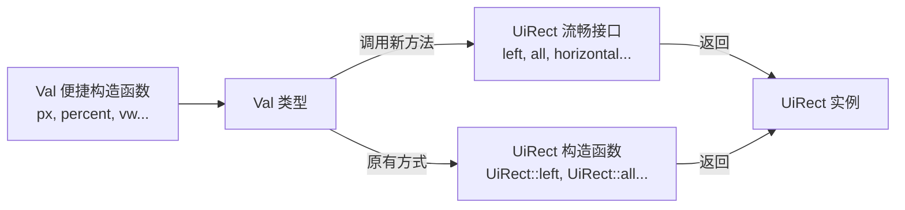

+++
title = "#20937 Add `UiRect` constructor functions to `Val"
date = "2025-09-10T00:00:00"
draft = false
template = "pull_request_page.html"
in_search_index = false

[extra]
current_language = "zh-cn"
available_languages = {"en" = { name = "English", url = "/pull_request/bevy/2025-09/pr-20937-en-20250910" }, "zh-cn" = { name = "中文", url = "/pull_request/bevy/2025-09/pr-20937-zh-cn-20250910" }}
+++

# Title
为 `Val` 添加 `UiRect` 构造函数

## 基本信息
- **标题**: Add `UiRect` constructor functions to `Val`
- **PR链接**: https://github.com/bevyengine/bevy/pull/20937
- **作者**: ickshonpe
- **状态**: 已合并
- **标签**: A-UI, C-Usability, S-Ready-For-Final-Review, X-Contentious
- **创建时间**: 2025-09-09T13:46:58Z
- **合并时间**: 2025-09-10T00:19:42Z
- **合并者**: alice-i-cecile

## 描述翻译
### 目标 (Objective)
尽管有了新的 `Val` 构造函数，创建 `UiRect` 仍然相当繁琐。

Bevy 16 风格的声明：
```rust
    Node {
        width: Val::Px(16.),
        height: Val::Px(16.),
        border: UiRect::all(Val::Px(2.)),
        padding: UiRect::horizontal(Val::Percent(20.)).with_bottom(Val::Px(10.)),
        margin: UiRect::left(Val::Vw(10.)),
        ..default()
    }
```

使用了在 #20518 中添加的 `Val` 构造函数后：
```rust
    Node {
        width: px(16),
        height: px(16),
        border: UiRect::all(px(2)),  // 这里也可以使用 `px(2).into()`。
        padding: UiRect::horizontal(percent(20)).with_top(px(10.)),
        margin: UiRect::left(vw(10)),
        ..default()
    }
```

### 解决方案 (Solution)
为从 `Val` 构建 `UiRect` 添加一个流畅的接口 (fluent interface)：
```rust
    Node {
        width: px(16),
        height: px(16),
        border: px(2).all(),  // 这里也可以使用 `px(2).into()`。
        padding: percent(20).horizontal().with_top(px(10.)),
        margin: vw(10).left(),
        ..default()
    }
```

这个 PR 为 `Val` 添加了 `left`, `right`, `top`, `bottom`, `all`, `horizontal` 和 `vertical` 函数。
每个函数都用 `self` 调用相应的 `UiRect` 构造函数，即 `fn left(self) -> UiRect { UiRect::left(self) }`。

## 这个 Pull Request 的故事

这个 PR 的故事始于对 Bevy UI 代码 ergonomics（人体工学，即易用性）的持续改进。在之前的 PR #20518 和 #20551 中，社区已经为 `Val` 枚举类型（代表诸如像素、百分比等 UI 值）添加了一组便捷的构造函数（如 `px()`, `percent()`），显著简化了单个值的创建。

然而，UI 布局通常涉及设置矩形区域的各个边（如 `border`, `padding`, `margin`），这些区域在 Bevy 中用 `UiRect` 结构体表示。尽管有了便捷的 `Val` 构造函数，创建 `UiRect` 实例仍然需要显式调用 `UiRect::left()`, `UiRect::all()` 等构造函数，代码看起来仍然不够简洁和流畅。

**开发者面临的问题**是：即使使用了新的 `Val` 构造函数，`UiRect` 的创建语法仍然显得冗长和"嘈杂"（noisy），这影响了代码的可读性和编写体验。目标是为常用的 `UiRect` 创建模式提供一个更流畅、更符合人体工学的 API。

**解决方案**采用了**流畅接口（Fluent Interface）**的设计模式。其核心思想是：在 `Val` 类型上定义一系列方法（如 `left()`, `all()`），这些方法 consume（消耗）`self`（即取得所有权）并返回一个配置好的 `UiRect` 实例。这种模式允许开发者链式调用方法，形成更易读的代码流。

从技术实现角度看，这是一个低风险、高收益的更改：
1.  **无破坏性变更**：新添加的方法不会影响任何现有代码。
2.  **轻量级实现**：每个方法只是对现有 `UiRect` 构造函数的简单封装，例如 `pub fn left(self) -> UiRect { UiRect::left(self) }`。逻辑非常简单，几乎没有引入新的复杂性。
3.  **与现有 API 完美融合**：新的流畅接口可以与之前添加的 `Val` 构造函数（`px`, `percent` 等）无缝结合使用，共同提升代码的简洁性。

**工程决策**体现在选择添加哪些方法上。PR 覆盖了 `UiRect` 所有主要的构造函数：
-   单边设置：`left()`, `right()`, `top()`, `bottom()`
-   全边设置：`all()`
-   对边设置：`horizontal()`, `vertical()`

这为开发者提供了构建 `UiRect` 所需的所有基本工具。选择在 `Val` 上而不是其他地方添加这些方法，确保了 API 的连贯性和发现性——开发者在一个地方（`Val`）就能找到所有构建最终值的方法。

**最终的影响**是显著改善了 Bevy UI 代码的编写体验。对比 PR 描述中的代码示例，新语法更加简洁、意图更清晰，减少了样板代码。这使得 UI 定义更接近于声明式风格，提高了代码的可读性和可维护性。这是一个典型的通过提供精心设计的便捷 API 来提升开发者体验的案例。

## 视觉表示



该图展示了数据流和 API 关系：已有的 `Val` 便捷构造函数创建 `Val` 实例，后者现在既可以通过原有的 `UiRect` 构造函数，也可以通过本次新增的流畅接口方法来最终创建出 `UiRect` 实例。

## 关键文件变更

### `crates/bevy_ui/src/geometry.rs` (+136/-0)
这是实现变化的核心文件。在 `Val` 类型的 `impl` 块中新增了 7 个方法，每个方法对应一种创建 `UiRect` 的方式。

**新增代码片段**:
```rust
impl Val {
    // ... 其他已有代码 ...

    /// Returns a [`UiRect`] with its `left` equal to this value,
    /// and all other fields set to `Val::ZERO`.
    ///
    ///
    /// # Example
    ///
    /// ```
    /// # use bevy_ui::{UiRect, Val};
    /// #
    /// let ui_rect = Val::Px(1.).left();
    ///
    /// assert_eq!(ui_rect.left, Val::Px(1.));
    /// assert_eq!(ui_rect.right, Val::ZERO);
    /// assert_eq!(ui_rect.top, Val::ZERO);
    /// assert_eq!(ui_rect.bottom, Val::ZERO);
    /// ```
    pub fn left(self) -> UiRect {
        UiRect::left(self)
    }

    // 其他方法 right(), top(), bottom(), all(), horizontal(), vertical() 的结构类似...
    // 它们都遵循相同的模式：详细的文档注释、示例代码，以及调用对应的 UiRect 构造函数。

    /// Returns a [`UiRect`] with all its fields equal to this value.
    ///
    /// # Example
    ///
    /// ```
    /// # use bevy_ui::{UiRect, Val};
    /// #
    /// let ui_rect = Val::Px(1.).all();
    ///
    /// assert_eq!(ui_rect.left, Val::Px(1.));
    /// assert_eq!(ui_rect.right, Val::Px(1.));
    /// assert_eq!(ui_rect.top, Val::Px(1.));
    /// assert_eq!(ui_rect.bottom, Val::Px(1.));
    /// ```
    pub fn all(self) -> UiRect {
        UiRect::all(self)
    }

    // ... 其他方法 ...
}
```
**变更说明**: 此变更为 `Val` 类型添加了构建 `UiRect` 的流畅接口。每个方法都包含完整的文档注释和示例，说明了其行为和使用方法。实现本身非常简单，仅仅是委托给现有的 `UiRect` 构造函数。这是 PR 的主要功能实现。

### `release-content/release-notes/constructor_functions_for_val_variants.md` (+15/-1)
这是发布说明文档，更新它以反映本次新增的功能。

**变更前**:
```markdown
---
title: "`Val` helper functions"
authors: ["@Ickshonpe", "@TheBlckbird"]
pull_requests: [20518, 20551]
---

To make `Val`s easier to construct the following helper functions have been added: `px`, `percent`, `vw`, `vh`, `vmin` and `vmax`. Each function takes any integer type and returns the value wrapped by its corresponding `Val` variant. There is also an `auto` helper function that maps to `Val::Auto`.
```

**变更后**:
```markdown
---
title: "`Val` helper functions"
authors: ["@Ickshonpe", "@TheBlckbird"]
pull_requests: [20518, 20551, 20937] // 添加了本 PR 的编号
---

To make `Val`s easier to construct the following helper functions have been added: `px`, `percent`, `vw`, `vh`, `vmin` and `vmax`. Each function takes any integer type and returns the value wrapped by its corresponding `Val` variant. There is also an `auto` helper function that maps to `Val::Auto`.

Also included with this release is a fluent interface for constructing `UiRect`s from `Val`s:

```rust
Node {
    border: px(2).all(), 
    padding: percent(20).horizontal().with_top(px(10.)),
    margin: vw(10).left(),
    ..default()
}
```

The available functions are `left`, `right`, `top`, `bottom`, `all`, `horizontal` and `vertical`.
Each function calls the corresponding `UiRect` constructor on `self`, i.e. `fn left(self) -> UiRect { UiRect::left(self) }`.
```
**变更说明**: 此更新将本次 PR 的功能添加到了发布说明中。它添加了新的 PR 编号到列表，并新增了一段来描述新的流畅接口，包括一个代码示例来展示用法。这确保了用户在阅读发布日志时能了解到这个新特性。

## 延伸阅读

对于希望了解更多相关概念的读者，可以参考以下资源：

1.  **Fluent Interface 设计模式**:
    *   [维基百科 - Fluent Interface](https://en.wikipedia.org/wiki/Fluent_interface)
    *   [Martin Fowler 的博客 - FluentInterface](https://martinfowler.com/bliki/FluentInterface.html) (英文)
    *   这种模式旨在通过方法链创建可读性更强的代码，常见于构建器（Builder）模式或查询 API 中。

2.  **Bevy UI 系统**:
    *   [Bevy 官方文档 - UI](https://bevyengine.org/learn/books/introduction/ui) (英文)
    *   了解 `Val`, `UiRect`, `Node` 等如何在 Bevy 的 ECS 和布局系统中协同工作。

3.  **相关的 PR**:
    *   [PR #20518](https://github.com/bevyengine/bevy/pull/20518): 最初添加 `Val` 便捷构造函数（`px`, `percent` 等）的 PR。
    *   [PR #20551](https://github.com/bevyengine/bevy/pull/20551): 另一个相关的 PR，可能包含了对 `Val` 构造函数的补充或修改。

4.  **Rust 方法语法和所有权**:
    *   [Rust 语言圣经 - 方法 Method](https://course.rs/basic/method.html) (中文)
    *   理解 `self`（尤其是取得所有权的 `self`）在方法中的使用，这是本 PR 中流畅接口实现的基础。