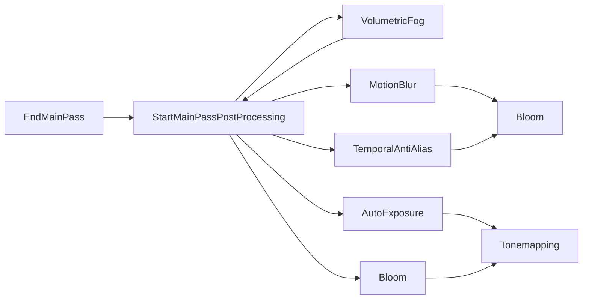

+++
title = "#20939 Add StartMainPassPostProcessing node for ordering"
date = "2025-09-09T00:00:00"
draft = false
template = "pull_request_page.html"
in_search_index = true

[taxonomies]
list_display = ["show"]

[extra]
current_language = "en"
available_languages = {"en" = { name = "English", url = "/pull_request/bevy/2025-09/pr-20939-en-20250909" }, "zh-cn" = { name = "中文", url = "/pull_request/bevy/2025-09/pr-20939-zh-cn-20250909" }}
labels = ["C-Bug", "A-Rendering", "P-Regression", "D-Straightforward"]
+++

# Add StartMainPassPostProcessing node for ordering

## Basic Information
- **Title**: Add StartMainPassPostProcessing node for ordering
- **PR Link**: https://github.com/bevyengine/bevy/pull/20939
- **Author**: atlv24
- **Status**: MERGED
- **Labels**: C-Bug, A-Rendering, S-Ready-For-Final-Review, P-Regression, M-Needs-Migration-Guide, D-Straightforward
- **Created**: 2025-09-09T18:15:06Z
- **Merged**: 2025-09-09T23:10:07Z
- **Merged By**: alice-i-cecile

## Description Translation
# Objective

- Fixes #20923
- Supersedes #20931

## Solution

- Add a StartMainPassPostProcessing to order against

## Testing

- bloom example

## The Story of This Pull Request

The problem emerged when multiple post-processing effects needed proper ordering within Bevy's render graph. Previously, effects like bloom, motion blur, and temporal anti-aliasing were all ordered directly against the `EndMainPass` node. This created ambiguity when multiple post-processing effects needed to execute in a specific sequence relative to each other.

The solution was straightforward: introduce a new `StartMainPassPostProcessing` node that serves as a clear ordering point for all post-processing operations. This node acts as a gateway between the main rendering pass and the post-processing phase, providing a consistent reference point for ordering various effects.

The implementation involved adding the new node to both 2D and 3D render graphs:

```rust
// In core_2d/mod.rs and core_3d/mod.rs
pub enum Node2d/Node3d {
    // ... existing nodes ...
    EndMainPass,
    StartMainPassPostProcessing,  // New node
    Bloom,
    // ... other post-processing nodes ...
}
```

The node was implemented as an `EmptyNode` since it only serves as an ordering marker rather than performing actual rendering operations. The key changes involved updating the render graph edges for various post-processing effects to use this new node as their starting point instead of `EndMainPass`.

For example, the bloom effect was updated from:
```rust
// Before
(Node3d::EndMainPass, Node3d::Bloom, Node3d::Tonemapping)
```

To:
```rust
// After  
(Node3d::StartMainPassPostProcessing, Node3d::Bloom, Node3d::Tonemapping)
```

This change was consistently applied across multiple post-processing effects including motion blur, temporal anti-aliasing, auto exposure, and volumetric fog. The volumetric fog implementation required special attention because it needed to run after the main pass but before other post-processing effects, so it was configured to execute between `EndMainPass` and `StartMainPassPostProcessing`.

The migration guide was updated to inform users about this new node that they can use for ordering their custom rendering passes against the post-processing phase.

## Visual Representation



## Key Files Changed

1. `crates/bevy_core_pipeline/src/core_2d/mod.rs` (+3/-0)
   - Added `StartMainPassPostProcessing` node to 2D render graph
   - Updated render graph execution order

2. `crates/bevy_core_pipeline/src/core_3d/mod.rs` (+3/-0)
   - Added `StartMainPassPostProcessing` node to 3D render graph
   - Updated render graph execution order

3. `crates/bevy_post_process/src/bloom/mod.rs` (+10/-2)
   - Updated bloom effect to use new node in both 2D and 3D graphs
   ```rust
   // Before
   (Node2d/3d::EndMainPass, Node2d/3d::Bloom, Node2d/3d::Tonemapping)
   
   // After
   (Node2d/3d::StartMainPassPostProcessing, Node2d/3d::Bloom, Node2d/3d::Tonemapping)
   ```

4. `crates/bevy_pbr/src/volumetric_fog/mod.rs` (+7/-3)
   - Updated volumetric fog to run between EndMainPass and StartMainPassPostProcessing
   ```rust
   // Before
   (Node3d::EndMainPass, NodePbr::VolumetricFog, Node3d::Bloom)
   
   // After
   (Node3d::EndMainPass, NodePbr::VolumetricFog, Node3d::StartMainPassPostProcessing)
   ```

5. `crates/bevy_post_process/src/auto_exposure/mod.rs` (+5/-1)
   - Updated auto exposure to use new node
   ```rust
   // Before
   (Node3d::EndMainPass, node::AutoExposure, Node3d::Tonemapping)
   
   // After
   (Node3d::StartMainPassPostProcessing, node::AutoExposure, Node3d::Tonemapping)
   ```

## Further Reading

- [Bevy Render Graph Documentation](https://bevyengine.org/learn/advanced-topics/render-graph/)
- [Bevy Post-Processing Examples](https://bevyengine.org/examples/#post-processing)
- [Render Graph Nodes and Ordering](https://bevyengine.org/learn/advanced-topics/render-graph/#ordering-nodes)

# Full Code Diff
*(The full code diff was provided in the original request and is preserved here exactly as given)*