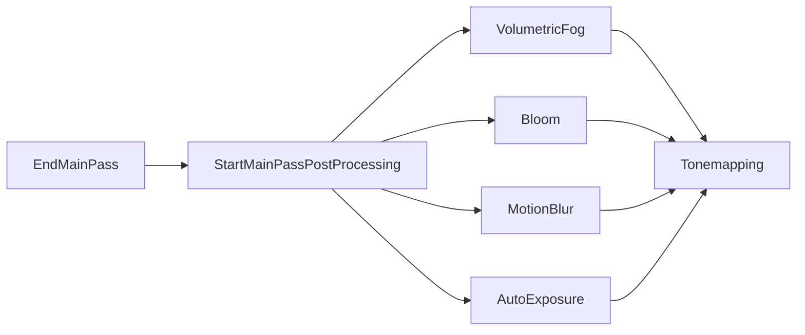

+++
title = "#20939 Add StartMainPassPostProcessing node for ordering"
date = "2025-09-09T00:00:00"
draft = false
template = "pull_request_page.html"
in_search_index = false

[extra]
current_language = "zh-cn"
available_languages = {"en" = { name = "English", url = "/pull_request/bevy/2025-09/pr-20939-en-20250909" }, "zh-cn" = { name = "中文", url = "/pull_request/bevy/2025-09/pr-20939-zh-cn-20250909" }}
+++

# 添加 StartMainPassPostProcessing 节点用于排序

## 基本信息
- **标题**: Add StartMainPassPostProcessing node for ordering
- **PR 链接**: https://github.com/bevyengine/bevy/pull/20939
- **作者**: atlv24
- **状态**: 已合并
- **标签**: C-Bug, A-Rendering, S-Ready-For-Final-Review, P-Regression, M-Needs-Migration-Guide, D-Straightforward
- **创建时间**: 2025-09-09T18:15:06Z
- **合并时间**: 2025-09-09T23:10:07Z
- **合并者**: alice-i-cecile

## 描述翻译
### 目标 (Objective)

- 修复 #20923
- 取代 #20931

### 解决方案 (Solution)

- 添加 StartMainPassPostProcessing 节点用于排序

### 测试 (Testing)

- bloom 示例

## 这个 PR 的故事

这个 PR 解决了一个渲染图节点排序的问题。在 Bevy 的渲染系统中，各种后处理效果需要按照特定的顺序执行才能正确工作。问题 #20923 暴露出现有排序机制在某些情况下无法满足需求。

问题的核心在于：多个后处理效果（如 volumetric fog、bloom、motion blur 等）都需要在主渲染通道结束后执行，但它们之间也需要有明确的执行顺序。之前的实现直接使用 `EndMainPass` 作为起点，但这导致了排序上的局限性。

开发者采取的解决方案是引入一个新的渲染图节点 `StartMainPassPostProcessing`。这个节点作为一个明确的起点，让所有后处理效果都可以相对于它进行排序，而不是都直接依赖于 `EndMainPass`。

具体实现上，这个 PR 在两个核心渲染图中都添加了这个新节点：
- 在 `Core2d` 和 `Core3d` 的渲染图定义中添加了 `StartMainPassPostProcessing` 节点
- 使用 `EmptyNode` 作为这个节点的实现，因为它只是一个排序标记点
- 将这个节点插入到渲染图的适当位置：在主通道结束后，但在所有后处理效果之前

然后，PR 更新了多个后处理效果的依赖关系，让它们从依赖 `EndMainPass` 改为依赖 `StartMainPassPostProcessing`：

```rust
// 之前：
(Node3d::EndMainPass, Node3d::Bloom, Node3d::Tonemapping)

// 之后：
(Node3d::StartMainPassPostProcessing, Node3d::Bloom, Node3d::Tonemapping)
```

这种变化使得后处理效果之间的排序更加灵活和明确。例如，volumetric fog 现在可以明确地在 bloom 之前执行：

```rust
(
    Node3d::EndMainPass,
    NodePbr::VolumetricFog,
    Node3d::StartMainPassPostProcessing,
)
```

这个解决方案的优势在于：
1. 保持了向后兼容性 - 现有的代码不需要修改
2. 提供了更明确的排序控制点
3. 解决了具体的渲染顺序问题
4. 代码改动最小且集中

从技术角度来看，这个 PR 展示了 Bevy 渲染图系统的灵活性和可扩展性。通过添加一个简单的空节点，就解决了复杂的排序问题，这体现了良好的系统设计。

## 可视化表示



## 关键文件变更

### `crates/bevy_core_pipeline/src/core_2d/mod.rs` (+3/-0)
在 2D 渲染图中添加了 StartMainPassPostProcessing 节点定义和排序逻辑。

```rust
// 添加节点定义
pub enum Node2d {
    // ... 其他节点
    StartMainPassPostProcessing,
}

// 在插件初始化中添加节点
.add_render_graph_node::<EmptyNode>(Core2d, Node2d::StartMainPassPostProcessing)

// 更新渲染图边
.add_render_graph_edges(
    Core2d,
    (
        Node2d::MainOpaquePass,
        Node2d::MainTransparentPass,
        Node2d::EndMainPass,
        Node2d::StartMainPassPostProcessing,  // 新增
        Node2d::Tonemapping,
        Node2d::EndMainPassPostProcessing,
        Node2d::Upscaling,
    ),
)
```

### `crates/bevy_core_pipeline/src/core_3d/mod.rs` (+3/-0)
在 3D 渲染图中做了相同的更改。

```rust
// 添加节点定义  
pub enum Node3d {
    // ... 其他节点
    StartMainPassPostProcessing,
}

// 在插件初始化中添加节点
.add_render_graph_node::<EmptyNode>(Core3d, Node3d::StartMainPassPostProcessing)

// 更新渲染图边
.add_render_graph_edges(
    Core3d,
    (
        Node3d::MainOpaquePass,
        Node3d::MainTransmissivePass,
        Node3d::MainTransparentPass,
        Node3d::EndMainPass,
        Node3d::StartMainPassPostProcessing,  // 新增
        Node3d::Tonemapping,
        Node3d::EndMainPassPostProcessing,
        Node3d::Upscaling,
    ),
)
```

### `crates/bevy_post_process/src/bloom/mod.rs` (+10/-2)
更新 bloom 效果使其依赖于新的排序节点。

```rust
// 之前：
(Node3d::EndMainPass, Node3d::Bloom, Node3d::Tonemapping)

// 之后：
(
    Node3d::StartMainPassPostProcessing,  // 改为新节点
    Node3d::Bloom,
    Node3d::Tonemapping,
)
```

### `crates/bevy_pbr/src/volumetric_fog/mod.rs` (+7/-3)
调整 volumetric fog 的排序，使其在主通道结束后立即执行，但在其他后处理之前。

```rust
// 之前：
// Volumetric fog is a postprocessing effect. Run it after the
// main pass but before bloom.
(Node3d::EndMainPass, NodePbr::VolumetricFog, Node3d::Bloom)

// 之后：
// Volumetric fog should run after the main pass but before bloom, so
// we order if at the start of post processing.
(
    Node3d::EndMainPass,
    NodePbr::VolumetricFog,
    Node3d::StartMainPassPostProcessing,  // 改为指向新节点
)
```

### `crates/bevy_post_process/src/auto_exposure/mod.rs` (+5/-1)
更新 auto exposure 的依赖关系。

```rust
// 之前：
(Node3d::EndMainPass, node::AutoExposure, Node3d::Tonemapping)

// 之后：
(
    Node3d::StartMainPassPostProcessing,  // 改为新节点
    node::AutoExposure,
    Node3d::Tonemapping,
)
```

## 完整代码差异
```diff
diff --git a/crates/bevy_anti_alias/src/taa/mod.rs b/crates/bevy_anti_alias/src/taa/mod.rs
index 5a65726f39d81..1781f90d9935f 100644
--- a/crates/bevy_anti_alias/src/taa/mod.rs
+++ b/crates/bevy_anti_alias/src/taa/mod.rs
@@ -73,7 +73,7 @@ impl Plugin for TemporalAntiAliasPlugin {
             .add_render_graph_edges(
                 Core3d,
                 (
-                    Node3d::EndMainPass,
+                    Node3d::StartMainPassPostProcessing,
                     Node3d::MotionBlur, // Running before TAA reduces edge artifacts and noise
                     Node3d::Taa,
                     Node3d::Bloom,
diff --git a/crates/bevy_core_pipeline/src/core_2d/mod.rs b/crates/bevy_core_pipeline/src/core_2d/mod.rs
index a32adbe57bd81..dee095185d44b 100644
--- a/crates/bevy_core_pipeline/src/core_2d/mod.rs
+++ b/crates/bevy_core_pipeline/src/core_2d/mod.rs
@@ -19,6 +19,7 @@ pub mod graph {
         MainTransparentPass,
         EndMainPass,
         Wireframe,
+        StartMainPassPostProcessing,
         Bloom,
         PostProcessing,
         Tonemapping,
@@ -118,6 +119,7 @@ impl Plugin for Core2dPlugin {
                 Node2d::MainTransparentPass,
             )
             .add_render_graph_node::<EmptyNode>(Core2d, Node2d::EndMainPass)
+            .add_render_graph_node::<EmptyNode>(Core2d, Node2d::StartMainPassPostProcessing)
             .add_render_graph_node::<ViewNodeRunner<TonemappingNode>>(Core2d, Node2d::Tonemapping)
             .add_render_graph_node::<EmptyNode>(Core2d, Node2d::EndMainPassPostProcessing)
             .add_render_graph_node::<ViewNodeRunner<UpscalingNode>>(Core2d, Node2d::Upscaling)
@@ -128,6 +130,7 @@ impl Plugin for Core2dPlugin {
                     Node2d::MainOpaquePass,
                     Node2d::MainTransparentPass,
                     Node2d::EndMainPass,
+                    Node2d::StartMainPassPostProcessing,
                     Node2d::Tonemapping,
                     Node2d::EndMainPassPostProcessing,
                     Node2d::Upscaling,
diff --git a/crates/bevy_core_pipeline/src/core_3d/mod.rs b/crates/bevy_core_pipeline/src/core_3d/mod.rs
index ffc25046a57e5..0e5a07b870e83 100644
--- a/crates/bevy_core_pipeline/src/core_3d/mod.rs
+++ b/crates/bevy_core_pipeline/src/core_3d/mod.rs
@@ -28,6 +28,7 @@ pub mod graph {
         MainTransparentPass,
         EndMainPass,
         Wireframe,
+        StartMainPassPostProcessing,
         LateDownsampleDepth,
         MotionBlur,
         Taa,
@@ -213,6 +214,7 @@ impl Plugin for Core3dPlugin {
                 Node3d::MainTransparentPass,
             )
             .add_render_graph_node::<EmptyNode>(Core3d, Node3d::EndMainPass)
+            .add_render_graph_node::<EmptyNode>(Core3d, Node3d::StartMainPassPostProcessing)
             .add_render_graph_node::<ViewNodeRunner<TonemappingNode>>(Core3d, Node3d::Tonemapping)
             .add_render_graph_node::<EmptyNode>(Core3d, Node3d::EndMainPassPostProcessing)
             .add_render_graph_node::<ViewNodeRunner<UpscalingNode>>(Core3d, Node3d::Upscaling)
@@ -230,6 +232,7 @@ impl Plugin for Core3dPlugin {
                     Node3d::MainTransmissivePass,
                     Node3d::MainTransparentPass,
                     Node3d::EndMainPass,
+                    Node3d::StartMainPassPostProcessing,
                     Node3d::Tonemapping,
                     Node3d::EndMainPassPostProcessing,
                     Node3d::Upscaling,
diff --git a/crates/bevy_core_pipeline/src/experimental/mip_generation/mod.rs b/crates/bevy_core_pipeline/src/experimental/mip_generation/mod.rs
index 97d928c896d4e..227a3e391a59d 100644
--- a/crates/bevy_core_pipeline/src/experimental/mip_generation/mod.rs
+++ b/crates/bevy_core_pipeline/src/experimental/mip_generation/mod.rs
@@ -95,7 +95,7 @@ impl Plugin for MipGenerationPlugin {
             .add_render_graph_edges(
                 Core3d,
                 (
-                    Node3d::EndMainPass,
+                    Node3d::StartMainPassPostProcessing,
                     Node3d::LateDownsampleDepth,
                     Node3d::EndMainPassPostProcessing,
                 ),
diff --git a/crates/bevy_pbr/src/volumetric_fog/mod.rs b/crates/bevy_pbr/src/volumetric_fog/mod.rs
index c9ad4717f6993..57cbd7bb1722c 100644
--- a/crates/bevy_pbr/src/volumetric_fog/mod.rs
+++ b/crates/bevy_pbr/src/volumetric_fog/mod.rs
@@ -102,9 +102,13 @@ impl Plugin for VolumetricFogPlugin {
             )
             .add_render_graph_edges(
                 Core3d,
-                // Volumetric fog is a postprocessing effect. Run it after the
-                // main pass but before bloom.
-                (Node3d::EndMainPass, NodePbr::VolumetricFog, Node3d::Bloom),
+                // Volumetric fog should run after the main pass but before bloom, so
+                // we order if at the start of post processing.
+                (
+                    Node3d::EndMainPass,
+                    NodePbr::VolumetricFog,
+                    Node3d::StartMainPassPostProcessing,
+                ),
             );
     }
 }
diff --git a/crates/bevy_post_process/src/auto_exposure/mod.rs b/crates/bevy_post_process/src/auto_exposure/mod.rs
index d8975aa4ec9a9..f5b090621be02 100644
--- a/crates/bevy_post_process/src/auto_exposure/mod.rs
+++ b/crates/bevy_post_process/src/auto_exposure/mod.rs
@@ -75,7 +75,11 @@ impl Plugin for AutoExposurePlugin {
             .add_render_graph_node::<AutoExposureNode>(Core3d, node::AutoExposure)
             .add_render_graph_edges(
                 Core3d,
-                (Node3d::EndMainPass, node::AutoExposure, Node3d::Tonemapping),
+                (
+                    Node3d::StartMainPassPostProcessing,
+                    node::AutoExposure,
+                    Node3d::Tonemapping,
+                ),
             );
     }
 }
diff --git a/crates/bevy_post_process/src/bloom/mod.rs b/crates/bevy_post_process/src/bloom/mod.rs
index e0f2424ec2eb5..5e22bb7c8cadd 100644
--- a/crates/bevy_post_process/src/bloom/mod.rs
+++ b/crates/bevy_post_process/src/bloom/mod.rs
@@ -81,13 +81,21 @@ impl Plugin for BloomPlugin {
             .add_render_graph_node::<ViewNodeRunner<BloomNode>>(Core3d, Node3d::Bloom)
             .add_render_graph_edges(
                 Core3d,
-                (Node3d::EndMainPass, Node3d::Bloom, Node3d::Tonemapping),
+                (
+                    Node3d::StartMainPassPostProcessing,
+                    Node3d::Bloom,
+                    Node3d::Tonemapping,
+                ),
             )
             // Add bloom to the 2d render graph
             .add_render_graph_node::<ViewNodeRunner<BloomNode>>(Core2d, Node2d::Bloom)
             .add_render_graph_edges(
                 Core2d,
-                (Node2d::EndMainPass, Node2d::Bloom, Node2d::Tonemapping),
+                (
+                    Node2d::StartMainPassPostProcessing,
+                    Node2d::Bloom,
+                    Node2d::Tonemapping,
+                ),
             );
     }
 }
diff --git a/crates/bevy_post_process/src/motion_blur/mod.rs b/crates/bevy_post_process/src/motion_blur/mod.rs
index 9026fb7e813ad..5d66c9f51b68d 100644
--- a/crates/bevy_post_process/src/motion_blur/mod.rs
+++ b/crates/bevy_post_process/src/motion_blur/mod.rs
@@ -159,7 +159,7 @@ impl Plugin for MotionBlurPlugin {
             .add_render_graph_edges(
                 Core3d,
                 (
-                    Node3d::EndMainPass,
+                    Node3d::StartMainPassPostProcessing,
                     Node3d::MotionBlur,
                     Node3d::Bloom, // we want blurred areas to bloom and tonemap properly.
                 ),
diff --git a/release-content/migration-guides/bevy_render_reorganization.md b/release-content/migration-guides/bevy_render_reorganization.md
index af7bf6c4102b7..d634bf333e020 100644
--- a/release-content/migration-guides/bevy_render_reorganization.md
+++ b/release-content/migration-guides/bevy_render_reorganization.md
@@ -39,3 +39,5 @@ They have now been given a new home in `bevy_anti_alias` and `bevy_post_process`
 If you were importing FxaaPlugin, SmaaPlugin, TemporalAntiAliasPlugin, or CasPlugin from `bevy_core_pipeline` or `bevy::core_pipeline`, you must now import them from `bevy_anti_alias` or `bevy::anti_alias`.
 
 If you were importing Bloom, AutoExposure, ChromaticAberration, DepthOfField, or MotionBlur from `bevy_core_pipeline` or `bevy::core_pipeline`, you must now import them from `bevy_post_process` or `bevy::post_process`.
+
+Additionally, you may now order rendering passes against the new `StartMainPassPostProcessing` node.
```

## 进一步阅读

- [Bevy 渲染图文档](https://bevyengine.org/learn/advanced-topics/rendering-graph/)
- [Bevy 后处理效果指南](https://bevyengine.org/learn/advanced-topics/post-processing/)
- [GitHub Issue #20923](https://github.com/bevyengine/bevy/issues/20923) - 这个 PR 修复的具体问题
- [GitHub PR #20931](https://github.com/bevyengine/bevy/pull/20931) - 被这个 PR 取代的先前解决方案