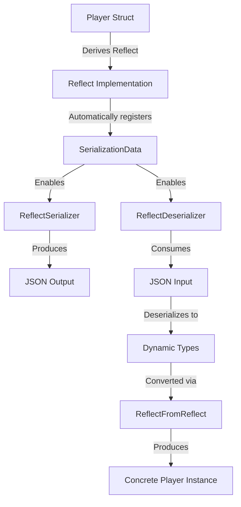

+++
title = "#20940 add reflection serialization example"
date = "2025-09-09T00:00:00"
draft = false
template = "pull_request_page.html"
in_search_index = false

[extra]
current_language = "zh-cn"
available_languages = {"en" = { name = "English", url = "/pull_request/bevy/2025-09/pr-20940-en-20250909" }, "zh-cn" = { name = "中文", url = "/pull_request/bevy/2025-09/pr-20940-zh-cn-20250909" }}
labels = ["C-Examples", "A-Reflection"]
+++

# add reflection serialization example

## Basic Information
- **Title**: add reflection serialization example
- **PR Link**: https://github.com/bevyengine/bevy/pull/20940
- **Author**: ChristopherBiscardi
- **Status**: MERGED
- **Labels**: C-Examples, S-Ready-For-Final-Review, A-Reflection
- **Created**: 2025-09-09T19:09:21Z
- **Merged**: 2025-09-09T22:51:37Z
- **Merged By**: alice-i-cecile

## Description Translation
# 目标

这是一个非常普遍[0]的误解，认为反射的（反）序列化需要 serde 的 Serialize/Deserialize 派生。这并不正确，并且可能导致意外地改变序列化行为，而这种改变不会通过反射信息暴露出来。提供一个示例可以作为讨论此问题时的一个有用资源。

[0]: 这就是为什么 Avian 在所有类型（包括标记类型）上都实现了 Serialize/Deserialize；这也出现在新 BRP 功能的 PR 中。

## 解决方案

实现一个示例，展示仅实现 `Reflect` 而未实现 serde 的 `Serialize` 或 `Deserialize` 的类型的反序列化和序列化。

## 测试

```
cargo run --example serialization
2025-09-09T19:08:28.258523Z  INFO serialization: reflect_value=DynamicStruct(serialization::Player { health: 50, name: "BevyPlayerOne" })
2025-09-09T19:08:28.258770Z  INFO serialization: player=serialization::Player { name: "BevyPlayerOne", health: 50 }
2025-09-09T19:08:28.259382Z  INFO serialization: json="{\"serialization::Player\":{\"name\":\"BevyPlayerSerialize\",\"health\":80}}"
```

## The Story of This Pull Request

这个 PR 解决了一个在 Bevy 社区中普遍存在的误解：许多开发者错误地认为必须为类型实现 serde 的 Serialize/Deserialize trait 才能进行反射序列化。实际上，Bevy 的反射系统提供了自己的序列化机制，只需要实现 `Reflect` trait 即可。

开发者 ChristopherBiscardi 注意到这个误解在多个项目中反复出现，包括 Avian 项目和在新的 BRP 功能相关的 PR 中。这种误解可能导致开发者不必要地为类型添加 serde 派生，甚至意外改变序列化行为而不自知。

解决方案是创建一个清晰的示例，展示如何仅使用 `Reflect` trait 实现完整的序列化和反序列化流程。示例代码演示了：

1. 定义一个只实现 `Reflect` 的简单结构体
2. 使用 `ReflectDeserializer` 从 JSON 字符串反序列化到反射类型
3. 使用 `ReflectFromReflect` 将反射类型转换回具体类型
4. 使用 `ReflectSerializer` 将具体类型序列化回 JSON

这个示例的关键技术点在于展示了 Bevy 反射系统内置的序列化能力。通过 `Reflect` derive 宏自动注册的 `SerializationData`，类型可以获得完整的序列化支持，无需依赖 serde 的 trait。

从实现角度看，这个示例展示了几个重要组件：
- `ReflectDeserializer`: 用于将序列化数据反序列化为反射类型
- `ReflectSerializer`: 用于将反射类型序列化为各种格式
- `ReflectFromReflect`: 用于从反射类型重建具体类型实例

这个示例的添加对 Bevy 生态系统有重要意义，它提供了一个权威参考，帮助开发者正确理解和使用反射序列化功能，避免不必要的 serde 依赖和潜在的行为不一致问题。

## Visual Representation



## Key Files Changed

### `examples/reflection/serialization.rs` (+75/-0)
新增的示例文件，展示反射序列化的完整流程：

```rust
//! Illustrates how "reflection" serialization works in Bevy.
//!
//! Deriving `Reflect` will also register `SerializationData`,
//! which powers reflect (de)serialization.
//! Serializing reflected data *does not* require deriving serde's
//! Serialize and Deserialize implementations.

use bevy::{
    prelude::*,
    reflect::serde::{ReflectDeserializer, ReflectSerializer},
};
use serde::de::DeserializeSeed;

fn main() {
    App::new()
        .add_plugins(DefaultPlugins)
        .add_systems(Startup, (deserialize, serialize).chain())
        .run();
}

/// Deriving `Reflect` includes reflecting `SerializationData`
#[derive(Reflect)]
pub struct Player {
    name: String,
    health: u32,
}

const PLAYER_JSON: &str = r#"{
    "serialization::Player": {
        "name": "BevyPlayerOne",
        "health": 50
    }
}"#;

fn deserialize(type_registry: Res<AppTypeRegistry>) {
    let type_registry = type_registry.read();

    // a serde_json::Value that might have come from an API
    let value: serde_json::Value = serde_json::from_str(PLAYER_JSON).unwrap();

    // alternatively, `TypedReflectDeserializer` can be used if the type
    // is known.
    let deserializer = ReflectDeserializer::new(&type_registry);
    // deserialize
    let reflect_value = deserializer.deserialize(value).unwrap();
    // If Player implemented additional functionality, like Component,
    // this reflect_value could be used with commands.insert_reflect
    info!(?reflect_value);

    // `FromReflect` and `ReflectFromReflect` can yield a concrete value.
    let type_id = reflect_value.get_represented_type_info().unwrap().type_id();
    let reflect_from_reflect = type_registry
        .get_type_data::<ReflectFromReflect>(type_id)
        .unwrap();
    let player: Box<dyn Reflect> = reflect_from_reflect
        .from_reflect(reflect_value.as_partial_reflect())
        .unwrap();
    info!(?player);
}

fn serialize(type_registry: Res<AppTypeRegistry>) {
    let type_registry = type_registry.read();

    // a concrete value
    let value = Player {
        name: "BevyPlayerSerialize".to_string(),
        health: 80,
    };

    // By default, all derived `Reflect` types can be serialized using serde. No need to derive
    // Serialize!
    let serializer = ReflectSerializer::new(&value, &type_registry);
    let json = serde_json::to_string(&serializer).unwrap();
    info!(?json);
}
```

### `Cargo.toml` (+11/-0)
添加示例配置到项目清单：

```toml
[[example]]
name = "serialization"
path = "examples/reflection/serialization.rs"
doc-scrape-examples = true

[package.metadata.example.serialization]
name = "Serialization"
description = "Demonstrates serialization and deserialization using reflection without serde's Serialize/Deserialize traits"
category = "Reflection"
wasm = false
```

### `examples/README.md` (+1/-0)
在示例列表中新增序列化示例：

```markdown
[Serialization](../examples/reflection/serialization.rs) | Demonstrates serialization and deserialization using reflection without serde's Serialize/Deserialize traits
```

## Further Reading

- [Bevy Reflection Documentation](https://docs.rs/bevy/latest/bevy/reflect/index.html)
- [Serde Integration in Bevy Reflection](https://docs.rs/bevy/latest/bevy/reflect/serde/index.html)
- [Using Reflection for Dynamic Data](https://bevy-cheatbook.github.io/programming/reflection.html)