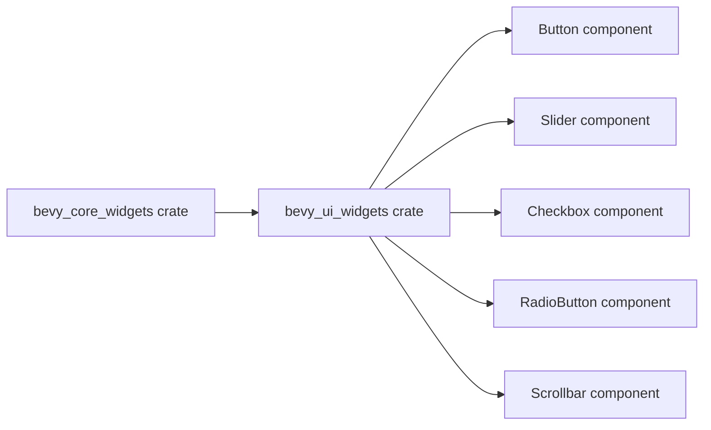

+++
title = "#20944 Renamed `bevy_core_widgets` to `bevy_ui_widgets`."
date = "2025-09-10T00:00:00"
draft = false
template = "pull_request_page.html"
in_search_index = true

[taxonomies]
list_display = ["show"]

[extra]
current_language = "en"
available_languages = {"en" = { name = "English", url = "/pull_request/bevy/2025-09/pr-20944-en-20250910" }, "zh-cn" = { name = "中文", url = "/pull_request/bevy/2025-09/pr-20944-zh-cn-20250910" }}
labels = ["D-Trivial", "A-UI", "X-Blessed"]
+++

# Title
Renamed `bevy_core_widgets` to `bevy_ui_widgets`

## Basic Information
- **Title**: Renamed `bevy_core_widgets` to `bevy_ui_widgets`.
- **PR Link**: https://github.com/bevyengine/bevy/pull/20944
- **Author**: viridia
- **Status**: MERGED
- **Labels**: D-Trivial, A-UI, S-Ready-For-Final-Review, X-Blessed
- **Created**: 2025-09-10T00:46:25Z
- **Merged**: 2025-09-10T23:44:08Z
- **Merged By**: alice-i-cecile

## Description Translation
Renamed `CoreXXX` components to `XXXBehavior`.
Fixes: #20664

@alice-i-cecile @cart 

## The Story of This Pull Request

This PR addresses a naming inconsistency in Bevy's UI widget system. The original naming scheme used `Core` as a prefix for headless widget components (e.g., `CoreButton`, `CoreSlider`), but this created confusion about whether these were core engine components or just unstyled widgets. The solution was to rename the crate from `bevy_core_widgets` to `bevy_ui_widgets` and remove the `Core` prefix from all component names.

The problem was straightforward: the `Core` prefix suggested these were fundamental engine components when they were actually just unstyled UI widgets. This naming mismatch could mislead developers about their purpose and importance in the architecture. The fix involved a systematic renaming across the entire codebase to align the names with their actual function.

The implementation required changes across multiple areas:
1. Renaming the crate itself and updating all dependency references
2. Renaming component structs (e.g., `CoreButton` → `Button`)
3. Updating plugin names (e.g., `CoreButtonPlugin` → `ButtonPlugin`)
4. Modifying examples and documentation to reflect the new naming
5. Updating release notes to document the change

The technical approach was methodical but mechanical - each occurrence of the old naming pattern needed to be identified and updated. The changes were mostly straightforward substitutions, but required care to ensure all references were updated consistently.

The impact of these changes is primarily improved clarity for developers. The new names more accurately reflect that these are standard UI widgets rather than core engine components. This aligns with Bevy's modular architecture where UI widgets are optional components rather than fundamental engine parts.

The changes also included renaming example files from `core_widgets` to `standard_widgets` to further emphasize that these are standard UI components rather than core engine functionality.

## Visual Representation



## Key Files Changed

### `crates/bevy_ui_widgets/src/lib.rs` (+19/-23)
This file was renamed from `bevy_core_widgets` and updated with new module names and exports.

**Before:**
```rust
mod core_button;
mod core_checkbox;
// ...

pub use core_button::*;
pub use core_checkbox::*;
// ...

pub struct CoreWidgetsPlugins;
```

**After:**
```rust
mod button;
mod checkbox;
// ...

pub use button::*;
pub use checkbox::*;
// ...

pub struct WidgetBehaviorPlugins;
```

### `crates/bevy_ui_widgets/src/button.rs` (+19/-19)
This file was renamed from `core_button.rs` and updated with the new component name.

**Before:**
```rust
pub struct CoreButton {
    pub on_activate: Callback<In<Activate>>,
}

pub struct CoreButtonPlugin;
```

**After:**
```rust
pub struct Button {
    pub on_activate: Callback<In<Activate>>,
}

pub struct ButtonPlugin;
```

### `examples/ui/standard_widgets.rs` (+17/-18)
This example file was renamed from `core_widgets.rs` and updated to use the new component names.

**Before:**
```rust
use bevy::core_widgets::{CoreButton, CoreCheckbox, CoreSlider};
// ...
commands.spawn((CoreButton::default(), /* ... */));
```

**After:**
```rust
use bevy::ui_widgets::{Button, Checkbox, Slider};
// ...
commands.spawn((Button::default(), /* ... */));
```

### `crates/bevy_ui_widgets/src/checkbox.rs` (+16/-16)
This file was renamed from `core_checkbox.rs` and updated with the new component name.

**Before:**
```rust
pub struct CoreCheckbox {
    pub on_change: Callback<In<ValueChange>>,
}

pub struct CoreCheckboxPlugin;
```

**After:**
```rust
pub struct Checkbox {
    pub on_change: Callback<In<ValueChange>>,
}

pub struct CheckboxPlugin;
```

### `crates/bevy_ui_widgets/src/radio.rs` (+15/-15)
This file was renamed from `core_radio.rs` and updated with the new component names.

**Before:**
```rust
pub struct CoreRadioGroup {
    pub on_change: Callback<In<Activate>>,
}

pub struct CoreRadio;

pub struct CoreRadioGroupPlugin;
```

**After:**
```rust
pub struct RadioGroup {
    pub on_change: Callback<In<Activate>>,
}

pub struct RadioButton;

pub struct RadioGroupPlugin;
```

## Further Reading

- [Bevy UI Documentation](https://bevyengine.org/learn/books/introduction/ui)
- [Bevy Observer System](https://bevyengine.org/news/bevy-0-13/#observers)
- [Original Issue #20664](https://github.com/bevyengine/bevy/issues/20664)
- [PR #20944 Discussion](https://github.com/bevyengine/bevy/pull/20944)