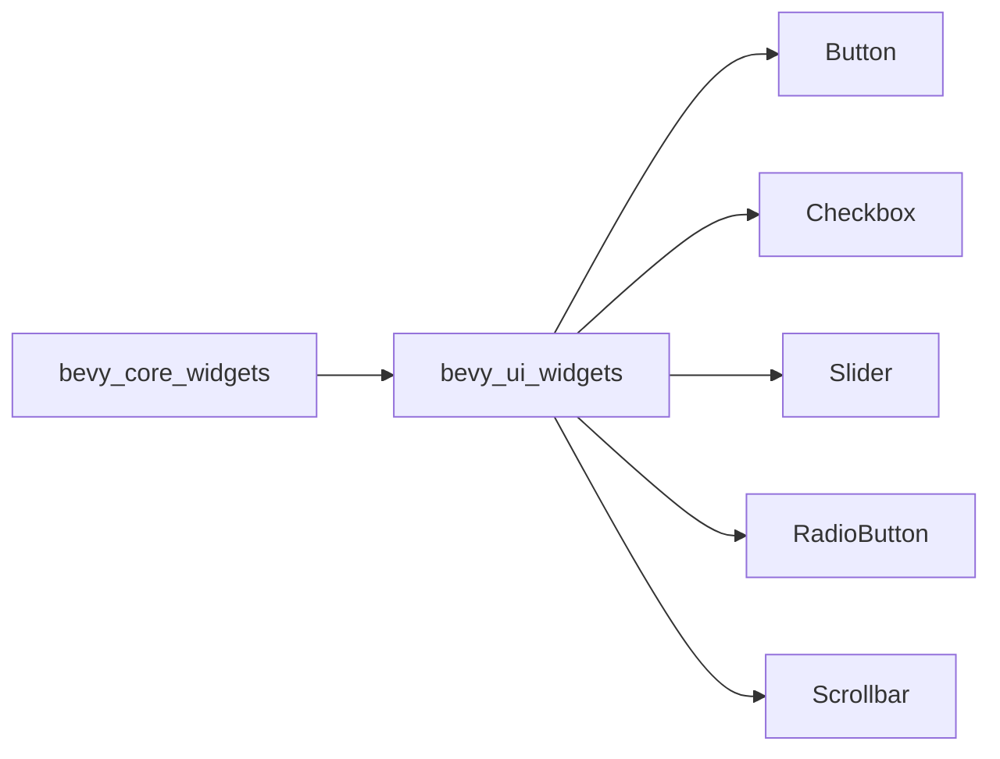

+++
title = "#20944 Renamed `bevy_core_widgets` to `bevy_ui_widgets`."
date = "2025-09-10T00:00:00"
draft = false
template = "pull_request_page.html"
in_search_index = false

[extra]
current_language = "zh-cn"
available_languages = {"en" = { name = "English", url = "/pull_request/bevy/2025-09/pr-20944-en-20250910" }, "zh-cn" = { name = "中文", url = "/pull_request/bevy/2025-09/pr-20944-zh-cn-20250910" }}
labels = ["D-Trivial", "A-UI", "X-Blessed"]
+++

# Title

## Basic Information
- **Title**: Renamed `bevy_core_widgets` to `bevy_ui_widgets`.
- **PR Link**: https://github.com/bevyengine/bevy/pull/20944
- **Author**: viridia
- **Status**: MERGED
- **Labels**: D-Trivial, A-UI, S-Ready-For-Final-Review, X-Blessed
- **Created**: 2025-09-10T00:46:25Z
- **Merged**: 2025-09-10T23:44:08Z
- **Merged By**: alice-i-cecile

## Description Translation
将 `CoreXXX` 组件重命名为 `XXXBehavior`。
修复： #20664

@alice-i-cecile @cart

## The Story of This Pull Request

这个 PR 主要解决了一个命名一致性问题。在 Bevy 的 UI 系统中，有一个提供无样式基础组件的模块，原先命名为 `bevy_core_widgets`，但其包含的组件却使用了 `CoreXXX` 的前缀（如 `CoreButton`、`CoreSlider`）。这种命名方式存在不一致性，因为模块名使用 "widgets" 而组件名使用 "Core"，这可能会给开发者带来困惑。

### 问题背景

在软件架构中，命名一致性对于代码的可维护性和可理解性至关重要。原来的命名方案存在两个问题：

1. **模块与组件命名不一致**：模块名为 `bevy_core_widgets`，但组件却命名为 `CoreButton`、`CoreCheckbox` 等
2. **语义不够清晰**："Core" 前缀不能准确表达这些组件的用途 - 它们实际上是提供无样式 widget 行为(behavior)的组件

### 解决方案

开发者采取了最直接有效的解决方案：重命名。这个方案包括两个主要部分：

1. 将 crate 名称从 `bevy_core_widgets` 改为 `bevy_ui_widgets`
2. 将组件名称从 `CoreXXX` 改为 `XXXBehavior`（如 `CoreButton` → `Button`）

### 实现细节

这个重命名操作涉及大量文件的修改，主要包括：

1. **Cargo.toml 配置更新**：更新依赖关系和示例配置
2. **组件重命名**：在所有使用这些组件的地方更新引用
3. **示例和文档更新**：确保所有示例代码和文档反映新的命名

这种大规模的重命名需要仔细处理，确保所有引用都被正确更新。从技术实现角度看，这是一个相对简单但需要高度谨慎的操作，因为任何遗漏的引用都会导致编译错误。

### 技术洞察

这个 PR 展示了良好的 API 设计原则：

1. **命名一致性**：模块名和组件名现在遵循相同的模式
2. **语义清晰性**：新的命名更能表达组件的实际用途
3. **向后兼容性**：虽然进行了重命名，但组件的功能和行为完全没有改变

从架构角度看，这个改动使得 Bevy UI 系统的结构更加清晰。`bevy_ui_widgets` 这个名称更准确地描述了该模块的职责 - 提供 UI 组件的基础行为实现。

### 影响

这个 PR 的主要影响包括：

1. **提高代码一致性**：命名更加统一和一致
2. **改善开发者体验**：更直观的命名减少了认知负担
3. **无功能变化**：所有组件的行为和功能保持不变
4. **需要更新代码**：使用旧名称的代码需要更新到新名称

对于现有的 Bevy 项目，这是一个破坏性变更，需要更新所有对旧组件名的引用。但由于这些组件相对较新，影响范围应该可控。

## Visual Representation



## Key Files Changed

### `crates/bevy_ui_widgets/src/lib.rs` (+19/-23)
这个文件进行了模块结构和导出的重命名：

```rust
// Before:
pub use core_button::*;
pub use core_checkbox::*;

// After:
pub use button::*;
pub use checkbox::*;
```

### `crates/bevy_ui_widgets/src/button.rs` (+19/-19)
按钮组件重命名：

```rust
// Before:
pub struct CoreButton {
    pub on_activate: Callback<In<Activate>>,
}

// After:
pub struct Button {
    pub on_activate: Callback<In<Activate>>,
}
```

### `examples/ui/standard_widgets.rs` (+17/-18)
示例文件更新以反映新名称：

```rust
// Before:
CoreButton {
    on_activate: on_click,
}

// After:
Button {
    on_activate: on_click,
}
```

### `crates/bevy_ui_widgets/src/checkbox.rs` (+16/-16)
复选框组件重命名：

```rust
// Before:
pub struct CoreCheckbox {
    pub on_change: Callback<In<ValueChange>>,
}

// After:
pub struct Checkbox {
    pub on_change: Callback<In<ValueChange>>,
}
```

### `crates/bevy_ui_widgets/src/radio.rs` (+15/-15)
单选框组件重命名：

```rust
// Before:
pub struct CoreRadio;

// After:
pub struct RadioButton;
```

## Further Reading

- [Bevy UI 系统文档](https://bevyengine.org/learn/books/introduction/ui)
- [Rust 命名约定](https://rust-lang.github.io/api-guidelines/naming.html)
- [语义版本控制和破坏性变更](https://semver.org/)
- [Bevy 观察者模式](https://bevyengine.org/learn/books/observer-pattern)