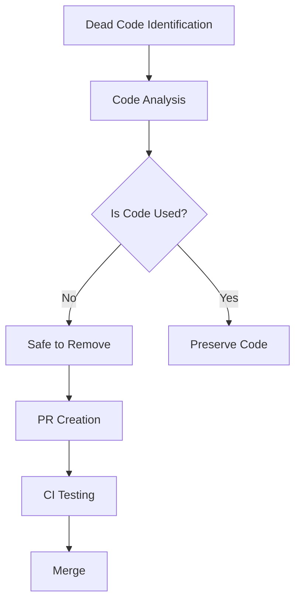

+++
title = "#20945 remove some dead code"
date = "2025-09-10T00:00:00"
draft = false
template = "pull_request_page.html"
in_search_index = true

[taxonomies]
list_display = ["show"]

[extra]
current_language = "en"
available_languages = {"en" = { name = "English", url = "/pull_request/bevy/2025-09/pr-20945-en-20250910" }, "zh-cn" = { name = "中文", url = "/pull_request/bevy/2025-09/pr-20945-zh-cn-20250910" }}
labels = ["D-Trivial", "A-Rendering"]
+++

# Remove Unused `MaterialBindGroupId` Struct

## Basic Information
- **Title**: remove some dead code
- **PR Link**: https://github.com/bevyengine/bevy/pull/20945
- **Author**: atlv24
- **Status**: MERGED
- **Labels**: D-Trivial, A-Rendering, S-Ready-For-Final-Review
- **Created**: 2025-09-10T02:10:59Z
- **Merged**: 2025-09-10T17:58:04Z
- **Merged By**: alice-i-cecile

## Description Translation
# Objective

- nothing uses it or references it and theres no docs

## Solution

- yeet

## Testing

- ci

## The Story of This Pull Request

This PR addresses a straightforward case of dead code removal in Bevy's PBR (Physically Based Rendering) module. The developer identified that the `MaterialBindGroupId` struct and its associated implementations were completely unused throughout the codebase, with no references or documentation explaining its purpose.

The problem was simple but important: maintaining unused code increases technical debt, adds unnecessary compilation overhead, and creates confusion for developers who might encounter it. In a complex rendering system like Bevy's PBR module, keeping the codebase clean and focused is crucial for maintainability.

The solution was direct and surgical: complete removal of the unused code. The developer deleted the `MaterialBindGroupId` struct and its three associated method implementations. This approach follows standard software engineering practices for dealing with dead code - when code serves no purpose and has no consumers, the safest and most efficient action is to remove it entirely.

The implementation required no complex changes or architectural adjustments. The code removal was localized to a single file and didn't affect any other systems. The changes were minimal but meaningful:

```rust
// Removed code:
#[derive(Component, Clone, Copy, Default, PartialEq, Eq, Deref, DerefMut)]
pub struct MaterialBindGroupId(pub Option<BindGroupId>);

impl MaterialBindGroupId {
    pub fn new(id: BindGroupId) -> Self {
        Self(Some(id))
    }
}

impl From<BindGroup> for MaterialBindGroupId {
    fn from(value: BindGroup) -> Self {
        Self::new(value.id())
    }
}
```

This code was likely part of an earlier implementation or experimental feature that was either abandoned or replaced with a different approach. The struct wrapped an optional `BindGroupId` and provided conversion methods, but without any actual usage in the codebase, it represented pure technical debt.

The impact of this change is positive but minimal. It reduces the compiled binary size slightly and removes cognitive overhead for developers working in this part of the codebase. The PR was properly tested through CI, ensuring that the removal didn't break any existing functionality - a crucial step even for seemingly trivial changes.

This type of cleanup is essential in large codebases like Bevy, where accumulated dead code can significantly impact maintainability over time. The quick review and merge process demonstrates the team's commitment to code quality and technical debt management.

## Visual Representation



## Key Files Changed

### `crates/bevy_pbr/src/material.rs`
This file contains PBR material-related code in Bevy's rendering system. The changes remove unused code that was likely part of an earlier material system implementation.

**Code Removed:**
```rust
#[derive(Component, Clone, Copy, Default, PartialEq, Eq, Deref, DerefMut)]
pub struct MaterialBindGroupId(pub Option<BindGroupId>);

impl MaterialBindGroupId {
    pub fn new(id: BindGroupId) -> Self {
        Self(Some(id))
    }
}

impl From<BindGroup> for MaterialBindGroupId {
    fn from(value: BindGroup) -> Self {
        Self::new(value.id())
    }
}
```

The removal of this code simplifies the material module by eliminating unused components that were not referenced anywhere else in the codebase.

## Further Reading

- [Rust Clippy's dead_code lint](https://rust-lang.github.io/rust-clippy/master/index.html#dead_code)
- [Bevy Engine Documentation](https://bevyengine.org/learn/)
- [Technical Debt Management Strategies](https://martinfowler.com/bliki/TechnicalDebt.html)

# Full Code Diff
```diff
diff --git a/crates/bevy_pbr/src/material.rs b/crates/bevy_pbr/src/material.rs
index ec46bd4f9fd16..c1d74b8b4c81e 100644
--- a/crates/bevy_pbr/src/material.rs
+++ b/crates/bevy_pbr/src/material.rs
@@ -1768,21 +1768,6 @@ where
     }
 }
 
-#[derive(Component, Clone, Copy, Default, PartialEq, Eq, Deref, DerefMut)]
-pub struct MaterialBindGroupId(pub Option<BindGroupId>);
-
-impl MaterialBindGroupId {
-    pub fn new(id: BindGroupId) -> Self {
-        Self(Some(id))
-    }
-}
-
-impl From<BindGroup> for MaterialBindGroupId {
-    fn from(value: BindGroup) -> Self {
-        Self::new(value.id())
-    }
-}
-
 /// Creates and/or recreates any bind groups that contain materials that were
 /// modified this frame.
 pub fn prepare_material_bind_groups(
```