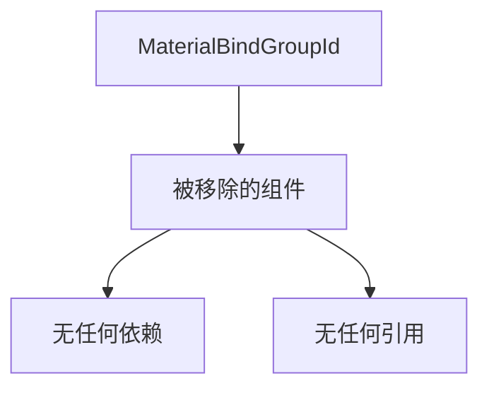

+++
title = "#20945 remove some dead code"
date = "2025-09-10T00:00:00"
draft = false
template = "pull_request_page.html"
in_search_index = false

[extra]
current_language = "zh-cn"
available_languages = {"en" = { name = "English", url = "/pull_request/bevy/2025-09/pr-20945-en-20250910" }, "zh-cn" = { name = "中文", url = "/pull_request/bevy/2025-09/pr-20945-zh-cn-20250910" }}
+++

# remove some dead code

## 基本信息
- **标题**: remove some dead code
- **PR链接**: https://github.com/bevyengine/bevy/pull/20945
- **作者**: atlv24
- **状态**: 已合并
- **标签**: D-Trivial, A-Rendering, S-Ready-For-Final-Review
- **创建时间**: 2025-09-10T02:10:59Z
- **合并时间**: 2025-09-10T17:58:04Z
- **合并者**: alice-i-cecile

## 描述翻译
# Objective

- 没有代码使用或引用它，也没有文档说明

## Solution

- 删除

## Testing

- 持续集成测试

## 本次PR的技术分析

这是一个典型的代码清理PR，专注于移除不再使用的死代码。在大型代码库如Bevy中，随着功能迭代和重构，经常会积累一些不再被使用的代码片段。这些代码虽然不会影响运行时性能，但会增加代码库的维护负担和理解难度。

本次PR的核心目标是移除`MaterialBindGroupId`结构体及其相关实现。这个结构体原本设计用于管理材质绑定组的ID，但在当前的代码架构中已经没有任何地方使用它。通过检查代码引用关系，开发者确认了这个结构体已经完全被废弃。

从技术实现来看，`MaterialBindGroupId`是一个简单的包装类型，包含一个`Option<BindGroupId>`字段。它提供了几个便利方法：
- `new`构造函数用于创建包含特定ID的实例
- `From<BindGroup>`实现允许从绑定组直接转换
- 使用了`Deref`和`DerefMut`派生宏来提供自动解引用功能

然而，这些功能在当前代码库中都没有被实际使用。保留这样的死代码只会增加代码库的复杂性和维护成本，特别是在需要阅读和理解材质系统相关代码时。

移除死代码有几个明显的好处：
1. 减少代码库大小，提高可读性
2. 降低未来开发者的认知负担
3. 避免可能因误解而错误使用废弃API的情况
4. 简化编译过程（虽然影响很小）

这个变更通过CI测试验证，确保移除操作不会破坏任何现有功能。这是一个低风险但高价值的维护性改进，体现了良好的代码库管理实践。

## 可视化表示



## 关键文件变更

**文件**: `crates/bevy_pbr/src/material.rs` (+0/-15)

这个文件是Bevy的PBR（基于物理的渲染）材质系统实现。变更内容完全集中在移除不再使用的`MaterialBindGroupId`结构体和相关实现。

**移除的代码**:
```rust
#[derive(Component, Clone, Copy, Default, PartialEq, Eq, Deref, DerefMut)]
pub struct MaterialBindGroupId(pub Option<BindGroupId>);

impl MaterialBindGroupId {
    pub fn new(id: BindGroupId) -> Self {
        Self(Some(id))
    }
}

impl From<BindGroup> for MaterialBindGroupId {
    fn from(value: BindGroup) -> Self {
        Self::new(value.id())
    }
}
```

这些代码被完整移除，因为它们在代码库中没有任何使用位置，也没有相关文档说明其用途。

## 延伸阅读

对于想要了解更多关于代码维护和死代码处理的开发者，建议阅读：

1. Martin Fowler的《重构：改善既有代码的设计》中关于"移除死代码"的章节
2. Rust官方文档中关于#[allow(dead_code)]属性的说明
3. Bevy引擎的代码质量指南和贡献规范

这些资源可以帮助理解如何在大型项目中有效管理代码质量和维护健康的代码库。