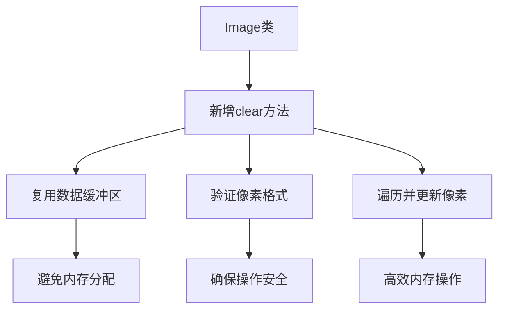

+++
title = "#20946 Add Image::clear()"
date = "2025-09-10T00:00:00"
draft = false
template = "pull_request_page.html"
in_search_index = false

[extra]
current_language = "zh-cn"
available_languages = {"en" = { name = "English", url = "/pull_request/bevy/2025-09/pr-20946-en-20250910" }, "zh-cn" = { name = "中文", url = "/pull_request/bevy/2025-09/pr-20946-zh-cn-20250910" }}
+++

# 技术分析报告：为Bevy图像处理添加清除功能

## 基本信息
- **标题**: Add Image::clear()
- **PR链接**: https://github.com/bevyengine/bevy/pull/20946
- **作者**: IceSentry
- **状态**: 已合并
- **标签**: D-Trivial, A-Rendering, C-Usability, S-Ready-For-Final-Review
- **创建时间**: 2025-09-10T04:31:31Z
- **合并时间**: 2025-09-10T16:48:10Z
- **合并者**: mockersf

## 描述翻译
### 目标
- 在进行CPU绘制时，有时需要清除整个图像。一种选择是重新创建一个新图像，但这并不是最高效的方法。

### 解决方案
- 添加一个工具函数，使用提供的像素数据清除图像。它的功能与`Image::new_fill()`填充数据缓冲区的方式完全相同。

### 测试
- 我添加了一个测试，确保清除操作使用预期数据填充图像。

## 这个PR的故事

在Bevy引擎的渲染管线中，开发人员经常需要在CPU端进行图像处理操作。一个常见的需求是清除整个图像的内容，将其重置为统一的颜色或透明值。在此之前，实现这一功能的唯一方法是创建一个全新的图像对象，这种方式虽然可行，但存在明显的性能缺陷。

每次重新创建图像都需要分配新的内存空间，这对于频繁的清除操作来说效率很低。特别是在实时渲染或游戏循环中，这种不必要的内存分配和释放会导致性能下降和内存碎片化。

开发者IceSentry识别到了这个问题，并提出了一个直接的解决方案：为Image类添加一个专门的`clear()`方法。这个方法的设计理念是复用现有的图像数据缓冲区，而不是创建新的对象，从而避免不必要的内存分配。

实现这个功能需要仔细考虑几个技术细节。首先，方法需要验证图像数据是否已经初始化，因为对未初始化的图像进行清除操作没有意义。其次，需要正确处理不同纹理格式的像素大小差异，确保清除操作适用于各种图像格式。

```rust
pub fn clear(&mut self, pixel: &[u8]) {
    if let Ok(pixel_size) = self.texture_descriptor.format.pixel_size()
        && pixel_size > 0
    {
        let byte_len = pixel_size * self.texture_descriptor.size.volume();
        debug_assert_eq!(
            pixel.len() % pixel_size,
            0,
            "Must not have incomplete pixel data (pixel size is {}B).",
            pixel_size,
        );
        debug_assert!(
            pixel.len() <= byte_len,
            "Clear data must fit within pixel buffer (expected {byte_len}B).",
        );
        if let Some(data) = self.data.as_mut() {
            for pixel_data in data.chunks_mut(pixel_size) {
                pixel_data.copy_from_slice(pixel);
            }
        }
    }
}
```

这个实现有几个值得注意的技术点。首先，它使用`pixel_size()`方法获取当前纹理格式的像素大小，确保与图像格式兼容。然后计算整个图像需要的字节长度，并进行调试断言来验证输入数据的有效性。最后，通过遍历图像的每个像素并复制提供的像素值来实现清除操作。

为了确保功能的正确性，开发者还添加了相应的测试用例：

```rust
#[test]
fn image_clear() {
    let mut image = Image::new_fill(
        Extent3d {
            width: 32,
            height: 32,
            depth_or_array_layers: 1,
        },
        TextureDimension::D2,
        &[0; 4],
        TextureFormat::Rgba8Snorm,
        RenderAssetUsages::all(),
    );

    assert!(image.data.as_ref().unwrap().iter().all(|&p| p == 0));

    image.clear(&[255; 4]);

    assert!(image.data.as_ref().unwrap().iter().all(|&p| p == 255));
}
```

这个测试创建了一个32x32的RGBA8Snorm格式图像，初始填充值为0。然后调用clear方法将其所有像素值设置为255，并验证操作是否成功。

从技术角度来看，这个实现有几个优点：
1. **内存效率**: 复用现有缓冲区，避免不必要的内存分配
2. **类型安全**: 通过纹理描述符确保操作与图像格式兼容
3. **错误处理**: 使用调试断言帮助开发者识别错误的使用方式
4. **性能优化**: 直接操作内存，避免不必要的抽象开销

这个改动虽然看似简单，但体现了良好的API设计原则。它提供了一个专门的方法来解决特定问题，而不是让开发者使用更通用但效率较低的方法。这种设计模式在游戏引擎这种对性能敏感的环境中尤为重要。

## 可视化表示



## 关键文件变更

### `crates/bevy_image/src/image.rs` (+48/-0)

这个文件是Bevy引擎图像处理的核心模块，包含了Image类的定义和实现。本次变更主要添加了一个新的公共方法和相应的测试用例。

**主要变更：**
1. 添加了`clear()`方法实现
2. 添加了测试用例验证功能正确性

**代码片段：**
```rust
// 新增的clear方法实现
pub fn clear(&mut self, pixel: &[u8]) {
    if let Ok(pixel_size) = self.texture_descriptor.format.pixel_size()
        && pixel_size > 0
    {
        let byte_len = pixel_size * self.texture_descriptor.size.volume();
        debug_assert_eq!(
            pixel.len() % pixel_size,
            0,
            "Must not have incomplete pixel data (pixel size is {}B).",
            pixel_size,
        );
        debug_assert!(
            pixel.len() <= byte_len,
            "Clear data must fit within pixel buffer (expected {byte_len}B).",
        );
        if let Some(data) = self.data.as_mut() {
            for pixel_data in data.chunks_mut(pixel_size) {
                pixel_data.copy_from_slice(pixel);
            }
        }
    }
}

// 新增的测试用例
#[test]
fn image_clear() {
    let mut image = Image::new_fill(
        Extent3d {
            width: 32,
            height: 32,
            depth_or_array_layers: 1,
        },
        TextureDimension::D2,
        &[0; 4],
        TextureFormat::Rgba8Snorm,
        RenderAssetUsages::all(),
    );

    assert!(image.data.as_ref().unwrap().iter().all(|&p| p == 0));

    image.clear(&[255; 4]);

    assert!(image.data.as_ref().unwrap().iter().all(|&p| p == 255));
}
```

这些变更直接支持了PR的主要目标：提供一个高效的方法来清除图像内容，而不需要重新创建图像对象。

## 进一步阅读

对于想要深入了解相关概念的开发者，建议参考以下资源：

1. **Bevy图像处理文档**: https://bevyengine.org/learn/books/rendering/images
2. **Rust内存管理最佳实践**: https://doc.rust-lang.org/book/ch04-01-what-is-ownership.html
3. **计算机图形学中的图像处理**: 《Real-Time Rendering》第4版，第6章
4. **性能优化技术**: 《Game Programming Patterns》中的优化模式章节

这些资源可以帮助开发者更好地理解图像处理、内存管理和性能优化的相关概念，从而在类似项目中做出更好的技术决策。