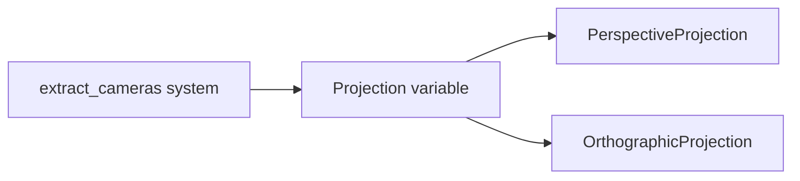

+++
title = "#20949 rename outdated variable"
date = "2025-09-10T00:00:00"
draft = false
template = "pull_request_page.html"
in_search_index = true

[taxonomies]
list_display = ["show"]

[extra]
current_language = "en"
available_languages = {"en" = { name = "English", url = "/pull_request/bevy/2025-09/pr-20949-en-20250910" }, "zh-cn" = { name = "中文", url = "/pull_request/bevy/2025-09/pr-20949-zh-cn-20250910" }}
labels = ["D-Trivial", "A-Rendering"]
+++

# Title
rename outdated variable

## Basic Information
- **Title**: rename outdated variable
- **PR Link**: https://github.com/bevyengine/bevy/pull/20949
- **Author**: atlv24
- **Status**: MERGED
- **Labels**: D-Trivial, A-Rendering, S-Ready-For-Final-Review
- **Created**: 2025-09-10T14:49:57Z
- **Merged**: 2025-09-10T16:31:28Z
- **Merged By**: mockersf

## Description Translation
# Objective

- its not for only perspective, its a projection

## Solution

- rename

## Testing

- 

## The Story of This Pull Request

This PR addresses a minor but important code clarity issue in Bevy's camera system. The problem was straightforward: a variable named `perspective` was being used to store a `Projection` component, which could represent either a perspective projection or an orthographic projection. The variable name was misleading because it suggested the value was specifically for perspective projections, when in reality it handled both projection types.

The solution was a simple rename operation. The developer changed the variable name from `perspective` to `projection` to better reflect its actual purpose and the type of data it contains. This change improves code readability and reduces potential confusion for developers working with the camera system.

The implementation involved modifying just two lines in the `camera.rs` file within the `extract_cameras` function. The change was minimal but meaningful - it replaced the specific term "perspective" with the more general term "projection" to accurately represent the variable's contents.

This type of change demonstrates good code maintenance practices. While trivial in scope, it contributes to long-term codebase health by ensuring terminology remains consistent and accurate. The fix helps prevent future developers from making incorrect assumptions about the variable's purpose or contents.

The PR was quickly reviewed and merged, indicating the change was both correct and valuable for code clarity. Such small improvements are important in large codebases like Bevy where precise terminology helps maintain understanding across many contributors.

## Visual Representation



## Key Files Changed

**File**: `crates/bevy_render/src/camera.rs`

**Changes**: Renamed a variable from `perspective` to `projection` to better reflect its purpose of storing either perspective or orthographic projection data.

**Code Diff**:
```rust
// Before:
if let Some(perspective) = projection {
    commands.insert(perspective.clone());
} else {
    commands.remove::<Projection>();
}

// After:
if let Some(projection) = projection {
    commands.insert(projection.clone());
} else {
    commands.remove::<Projection>();
}
```

The change is minimal but improves code clarity by using accurate terminology. The variable now correctly indicates it can contain any type of projection (perspective or orthographic) rather than suggesting it's specifically for perspective projections.

## Further Reading

- [Bevy Camera Projections Documentation](https://bevyengine.org/learn/books/introduction/3d-camera/#projection)
- [Rust Pattern Matching and if let Syntax](https://doc.rust-lang.org/book/ch18-03-pattern-syntax.html)
- [Code Clarity and Maintainability Best Practices](https://blog.codinghorror.com/code-smells/)