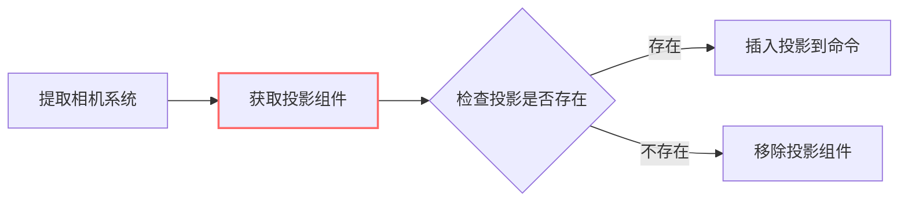

+++
title = "#20949 rename outdated variable"
date = "2025-09-10T00:00:00"
draft = false
template = "pull_request_page.html"
in_search_index = false

[extra]
current_language = "zh-cn"
available_languages = {"en" = { name = "English", url = "/pull_request/bevy/2025-09/pr-20949-en-20250910" }, "zh-cn" = { name = "中文", url = "/pull_request/bevy/2025-09/pr-20949-zh-cn-20250910" }}
+++

# 重命名过时变量：一个简单的代码清晰度改进

## 基本信息
- **标题**: rename outdated variable
- **PR链接**: https://github.com/bevyengine/bevy/pull/20949
- **作者**: atlv24
- **状态**: 已合并
- **标签**: D-Trivial, A-Rendering, S-Ready-For-Final-Review
- **创建时间**: 2025-09-10T14:49:57Z
- **合并时间**: 2025-09-10T16:31:28Z
- **合并者**: mockersf

## 描述翻译
# Objective 目标

- its not for only perspective, its a projection
- 不仅限于透视，它是投影

## Solution 解决方案

- rename
- 重命名

## Testing 测试

- 

## 这个Pull Request的故事

这个PR的故事很简单但很有启发性：它展示了即使是微小的命名问题也可能影响代码的清晰度和准确性。

问题的核心在于Bevy渲染代码中的一个变量命名不准确。在`crates/bevy_render/src/camera.rs`文件中，有一个变量名为`perspective`，但实际上它存储的是`Projection`类型的值。Projection（投影）是一个更通用的概念，包含了透视投影（perspective projection）和正交投影（orthographic projection）两种类型。

这种命名不准确可能会导致开发者的误解。当阅读代码时，看到名为`perspective`的变量，开发者可能会认为它只处理透视投影，而实际上它处理的是更通用的投影类型。

解决方案非常直接：将变量名从`perspective`改为`projection`，使其与实际存储的数据类型`Projection`保持一致。这种修改遵循了Rust和软件开发中的常见命名约定——变量名应该准确反映其内容和用途。

从技术角度来看，这个更改虽然简单，但体现了良好的代码维护实践：

1. **准确性**：变量名现在准确反映了其存储的内容
2. **一致性**：变量名与类型名保持一致，遵循了常见的命名模式
3. **可读性**：代码更加清晰，减少了误解的可能性

这个更改不会影响任何功能，因为它只是重命名了一个局部变量，不涉及任何API变更或逻辑修改。这也是为什么这个PR被标记为"D-Trivial"（琐碎修改）的原因。

从工程角度来看，这种看似微小的改进实际上很重要。清晰的命名可以减少认知负荷，使代码更易于理解和维护。特别是在像Bevy这样的复杂游戏引擎中，准确的命名对于长期维护至关重要。

## 视觉表示



## 关键文件更改

**crates/bevy_render/src/camera.rs** (+2/-2)

这个文件中的`extract_cameras`函数负责从相机实体中提取相机数据到渲染世界。修改涉及一个局部变量的重命名，使其更准确地反映其用途。

```rust
// 修改前:
if let Some(perspective) = projection {
    commands.insert(perspective.clone());
} else {
    commands.remove::<Projection>();
}

// 修改后:
if let Some(projection) = projection {
    commands.insert(projection.clone());
} else {
    commands.remove::<Projection>();
}
```

这个更改将变量名从`perspective`改为`projection`，使其与它存储的`Projection`类型和来源的`projection`变量保持一致。虽然只是一个简单的重命名，但它提高了代码的一致性和可读性。

## 进一步阅读

对于想要了解更多关于代码命名最佳实践的开发者，可以参考以下资源：

1. [Rust API Guidelines - Naming](https://rust-lang.github.io/api-guidelines/naming.html)
2. [Clean Code: A Handbook of Agile Software Craftsmanship](https://www.oreilly.com/library/view/clean-code-a/9780136083238/) - 特别是关于命名的章节
3. [Bevy Engine Documentation](https://docs.rs/bevy/latest/bevy/) - 了解Bevy的架构和设计模式

# 完整代码差异
```diff
diff --git a/crates/bevy_render/src/camera.rs b/crates/bevy_render/src/camera.rs
index 085e7733ad397..05df0b268c856 100644
--- a/crates/bevy_render/src/camera.rs
+++ b/crates/bevy_render/src/camera.rs
@@ -574,8 +574,8 @@ pub fn extract_cameras(
                 commands.remove::<RenderLayers>();
             }
 
-            if let Some(perspective) = projection {
-                commands.insert(perspective.clone());
+            if let Some(projection) = projection {
+                commands.insert(projection.clone());
             } else {
                 commands.remove::<Projection>();
             }
```