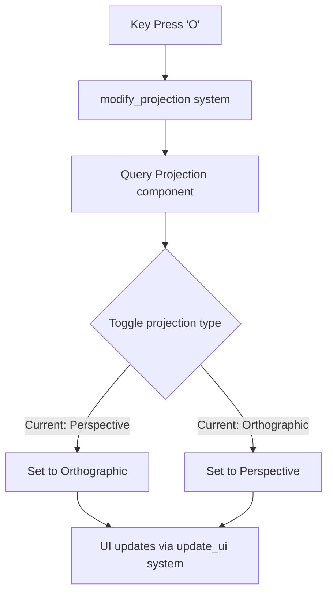

+++
title = "#20950 allow toggling projection in antialias example"
date = "2025-09-10T00:00:00"
draft = false
template = "pull_request_page.html"
in_search_index = true

[taxonomies]
list_display = ["show"]

[extra]
current_language = "en"
available_languages = {"en" = { name = "English", url = "/pull_request/bevy/2025-09/pr-20950-en-20250910" }, "zh-cn" = { name = "中文", url = "/pull_request/bevy/2025-09/pr-20950-zh-cn-20250910" }}
labels = ["A-Rendering"]
+++

# allow toggling projection in antialias example

## Basic Information
- **Title**: allow toggling projection in antialias example
- **PR Link**: https://github.com/bevyengine/bevy/pull/20950
- **Author**: atlv24
- **Status**: MERGED
- **Labels**: A-Rendering, S-Ready-For-Final-Review
- **Created**: 2025-09-10T16:00:04Z
- **Merged**: 2025-09-10T17:15:06Z
- **Merged By**: alice-i-cecile

## Description Translation
# Objective

- test ortho in aa

## Solution

- add option

## Testing

- run it

## The Story of This Pull Request

The anti-aliasing example in Bevy's 3D examples was designed to demonstrate different anti-aliasing techniques, but it only supported perspective projection. This limited its utility for testing how anti-aliasing behaves under orthographic projection, which is commonly used in technical applications, CAD software, and 2.5D games.

The developer identified this gap and implemented a straightforward solution to allow users to toggle between projection modes during runtime. The implementation follows Bevy's established patterns for input handling and component modification while maintaining the example's existing functionality.

The core technical approach involved adding a new system that listens for keyboard input (specifically the 'O' key) and toggles the camera's projection between perspective and orthographic modes. The orthographic projection was configured with a scale of 0.002 to provide a reasonable viewing area for the example scene.

The UI system was also updated to reflect the current projection mode, providing visual feedback to the user. This required modifying the query to include the Projection component and adding appropriate display logic.

The changes are minimal and focused, demonstrating good engineering practice by:
1. Adding functionality without breaking existing behavior
2. Using consistent patterns with existing systems in the example
3. Providing clear visual feedback through the UI
4. Maintaining backward compatibility

From a technical perspective, this implementation shows how to properly handle projection changes in Bevy by directly modifying the Projection component and using appropriate default values for orthographic projection. The scale value of 0.002 was chosen empirically to work well with the existing scene geometry.

## Visual Representation



## Key Files Changed

### `examples/3d/anti_aliasing.rs` (+34/-3)

This file contains the anti-aliasing example that demonstrates various anti-aliasing techniques. The changes add the ability to toggle between perspective and orthographic projections.

**Key modifications:**

1. Added the new system to the Update schedule:
```rust
// Before:
.add_systems(Update, (modify_aa, modify_sharpening, update_ui));

// After:
.add_systems(
    Update,
    (modify_aa, modify_sharpening, modify_projection, update_ui),
);
```

2. Implemented the projection toggling system:
```rust
fn modify_projection(keys: Res<ButtonInput<KeyCode>>, mut query: Query<&mut Projection>) {
    for mut projection in &mut query {
        if keys.just_pressed(KeyCode::KeyO) {
            match *projection {
                Projection::Perspective(_) => {
                    *projection = Projection::Orthographic(OrthographicProjection {
                        scale: 0.002,
                        ..OrthographicProjection::default_3d()
                    });
                }
                _ => {
                    *projection = Projection::Perspective(PerspectiveProjection::default());
                }
            }
        }
    }
}
```

3. Updated the UI system to include projection information:
```rust
// Modified query to include Projection component
#[cfg(all(feature = "dlss", not(feature = "force_disable_dlss")))]
let (projection, fxaa, smaa, taa, cas, msaa, dlss) = *camera;

// Added UI display for projection mode
ui.push_str("\n----------\n\n");
draw_selectable_menu_item(
    ui,
    "Orthographic",
    'O',
    matches!(projection, Projection::Orthographic(_)),
);
```

## Further Reading

- [Bevy Camera and Projection Documentation](https://bevyengine.org/learn/books/bevy-cheatbook/camera/projection.html)
- [Orthographic vs Perspective Projection](https://en.wikipedia.org/wiki/3D_projection#Orthographic_projection)
- [Bevy Input Handling](https://bevyengine.org/learn/books/bevy-cheatbook/input/input.html)
- [Bevy ECS Query System](https://bevyengine.org/learn/books/bevy-cheatbook/programming/ecs/query.html)