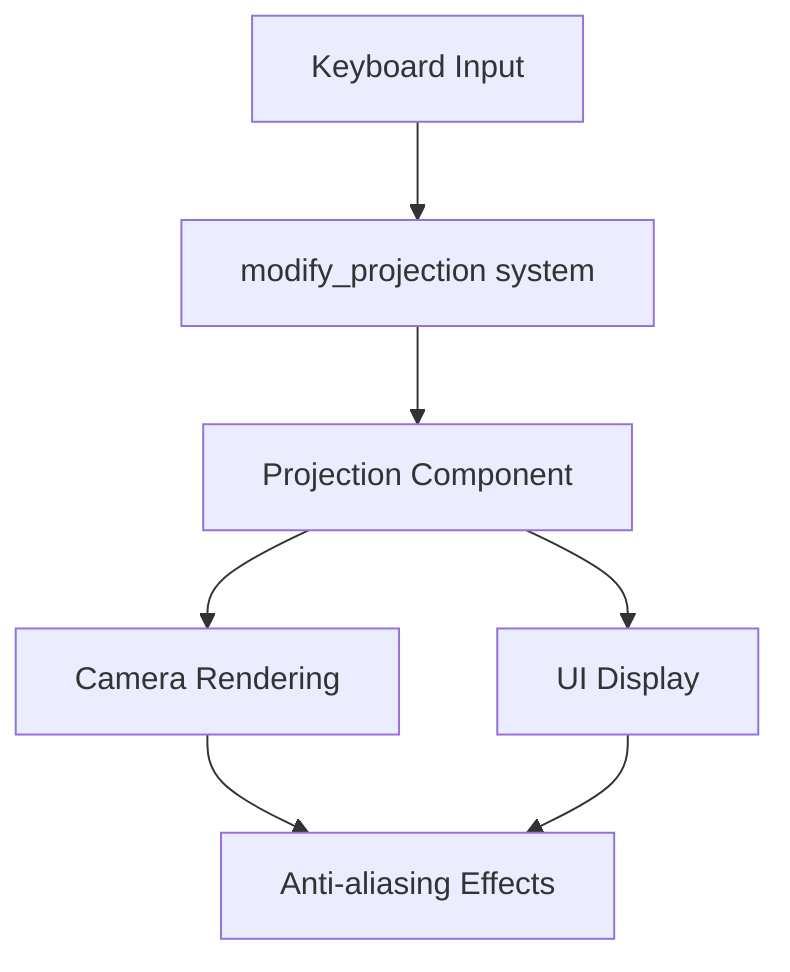

+++
title = "#20950 allow toggling projection in antialias example"
date = "2025-09-10T00:00:00"
draft = false
template = "pull_request_page.html"
in_search_index = false

[extra]
current_language = "zh-cn"
available_languages = {"en" = { name = "English", url = "/pull_request/bevy/2025-09/pr-20950-en-20250910" }, "zh-cn" = { name = "中文", url = "/pull_request/bevy/2025-09/pr-20950-zh-cn-20250910" }}
labels = ["A-Rendering"]
+++

# Title

## Basic Information
- **Title**: allow toggling projection in antialias example
- **PR Link**: https://github.com/bevyengine/bevy/pull/20950
- **Author**: atlv24
- **Status**: MERGED
- **Labels**: A-Rendering, S-Ready-For-Final-Review
- **Created**: 2025-09-10T16:00:04Z
- **Merged**: 2025-09-10T17:15:06Z
- **Merged By**: alice-i-cecile

## Description Translation
目标

- 在抗锯齿示例中测试正交投影

解决方案

- 添加切换选项

测试

- 运行示例

## The Story of This Pull Request

这个PR源于一个简单的需求：开发者需要在Bevy的抗锯齿示例中测试正交投影（orthographic projection）的效果。原有的抗锯齿示例只支持透视投影（perspective projection），这在测试不同投影方式下的抗锯齿表现时存在局限性。

问题的核心在于抗锯齿算法的效果可能会因投影方式的不同而有所差异。透视投影会产生近大远小的效果，而正交投影则保持物体大小不变，这种差异可能会影响抗锯齿算法的表现。为了全面测试各种抗锯齿技术在不同场景下的效果，需要支持两种投影方式的切换。

解决方案采用了直接而有效的方法：通过键盘快捷键实现投影方式的实时切换。开发者选择了'O'键作为切换键，这是一个直观的选择（O代表Orthographic）。实现上，在原有的Update系统中新增了`modify_projection`系统，并相应更新了UI显示逻辑。

技术实现上，关键改动包括：
1. 在系统调度中添加了新的`modify_projection`系统
2. 实现了投影切换逻辑，支持透视投影和正交投影之间的切换
3. 更新了UI显示，添加了当前投影状态的指示

```rust
// 新增的投影切换函数
fn modify_projection(keys: Res<ButtonInput<KeyCode>>, mut query: Query<&mut Projection>) {
    for mut projection in &mut query {
        if keys.just_pressed(KeyCode::KeyO) {
            match *projection {
                Projection::Perspective(_) => {
                    *projection = Projection::Orthographic(OrthographicProjection {
                        scale: 0.002,
                        ..OrthographicProjection::default_3d()
                    });
                }
                _ => {
                    *projection = Projection::Perspective(PerspectiveProjection::default());
                }
            }
        }
    }
}
```

这个实现巧妙地利用了Rust的模式匹配来安全地进行投影类型切换。当当前投影是透视投影时，切换到自定义缩放的正交投影；否则切换回默认的透视投影。

UI部分也相应更新，添加了投影状态的显示：

```rust
// UI更新部分新增投影状态显示
draw_selectable_menu_item(
    ui,
    "Orthographic",
    'O',
    matches!(projection, Projection::Orthographic(_)),
);
```

这个改动虽然不大，但具有实际价值。它使得开发者能够更方便地测试和比较不同投影方式下各种抗锯齿算法（FXAA、SMAA、TAA、CAS等）的表现。这种实时切换能力对于图形开发和质量保证特别有用，可以快速验证渲染效果在不同条件下的稳定性。

从架构角度看，这个PR遵循了Bevy的ECS模式，通过添加新系统而不是修改现有系统来实现功能，保持了代码的模块化和可维护性。

## Visual Representation



## Key Files Changed

### `examples/3d/anti_aliasing.rs` (+34/-3)

这个文件是Bevy抗锯齿示例的主要实现文件。改动包括：

1. **系统调度更新**：在Update系统中新增了`modify_projection`系统
```rust
// 修改前：
.add_systems(Update, (modify_aa, modify_sharpening, update_ui));

// 修改后：
.add_systems(
    Update,
    (modify_aa, modify_sharpening, modify_projection, update_ui),
);
```

2. **新增投影切换功能**：实现了通过'O'键切换投影类型的逻辑
```rust
fn modify_projection(keys: Res<ButtonInput<KeyCode>>, mut query: Query<&mut Projection>) {
    // 实现细节见上文
}
```

3. **UI更新**：在抗锯齿信息显示中添加了投影类型状态
```rust
// 修改了函数签名，添加了Projection参数
#[cfg(all(feature = "dlss", not(feature = "force_disable_dlss")))]
let (projection, fxaa, smaa, taa, cas, msaa, dlss) = *camera;

// 添加了投影状态显示
draw_selectable_menu_item(
    ui,
    "Orthographic",
    'O',
    matches!(projection, Projection::Orthographic(_)),
);
```

这些改动使得示例能够实时切换投影方式并显示当前状态，增强了示例的测试功能。

## Further Reading

- [Bevy Camera and Projection Documentation](https://bevyengine.org/learn/books/introduction/3d-camera/)
- [Orthographic vs Perspective Projection](https://learnopengl.com/Getting-started/Coordinate-Systems)
- [Bevy ECS System Scheduling](https://bevyengine.org/learn/books/introduction/ecs-scheduling/)
- [Anti-aliasing Techniques in Computer Graphics](https://en.wikipedia.org/wiki/Spatial_anti-aliasing)