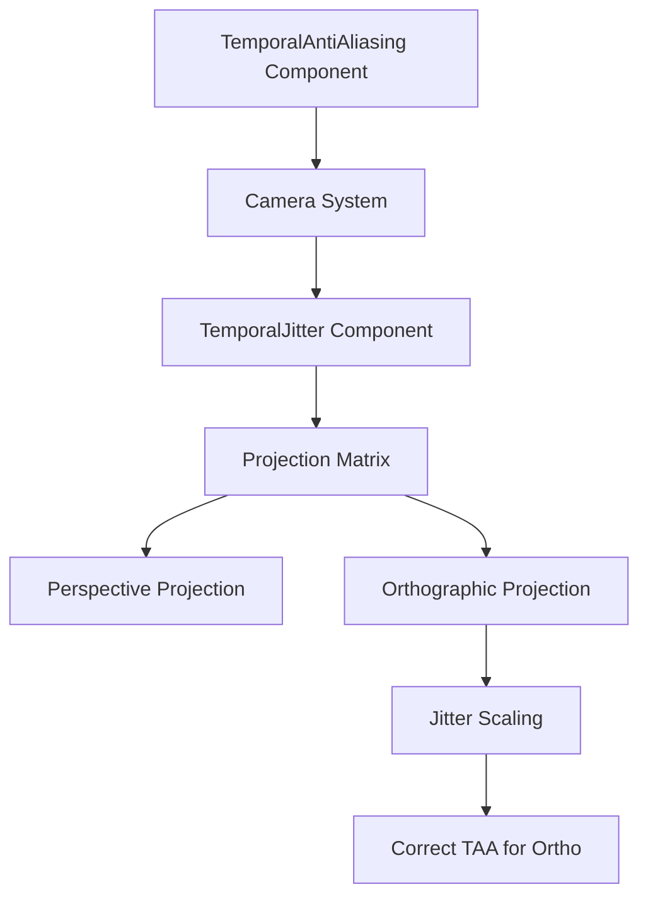

+++
title = "#20951 make taa work with ortho"
date = "2025-09-10T00:00:00"
draft = false
template = "pull_request_page.html"
in_search_index = true

[taxonomies]
list_display = ["show"]

[extra]
current_language = "en"
available_languages = {"en" = { name = "English", url = "/pull_request/bevy/2025-09/pr-20951-en-20250910" }, "zh-cn" = { name = "中文", url = "/pull_request/bevy/2025-09/pr-20951-zh-cn-20250910" }}
labels = ["C-Feature", "A-Rendering"]
+++

# Title

## Basic Information
- **Title**: make taa work with ortho
- **PR Link**: https://github.com/bevyengine/bevy/pull/20951
- **Author**: atlv24
- **Status**: MERGED
- **Labels**: C-Feature, A-Rendering, S-Ready-For-Final-Review
- **Created**: 2025-09-10T16:01:06Z
- **Merged**: 2025-09-10T17:35:11Z
- **Merged By**: alice-i-cecile

## Description Translation
# Objective

- fix temporal jitter for ortho

## Solution

- look at ortho matrix definition and derive correct pixel value range
- remove stuff saying you cant taa ortho

## Testing

- #20950

## The Story of This Pull Request

The PR addresses a specific limitation in Bevy's Temporal Anti-Aliasing (TAA) implementation where it didn't properly support orthographic projections. TAA is a rendering technique that reduces aliasing by accumulating samples across multiple frames, using camera jitter to sample different subpixel positions. However, the original implementation only worked correctly with perspective projections.

The core issue was in the `TemporalJitter::jitter_projection` method, which applied jitter incorrectly for orthographic projections. The method previously contained a hardcoded check that would warn and return early when encountering orthographic projections (identified by `clip_from_view.w_axis.w == 1.0`), effectively preventing TAA from working with orthographic cameras.

The solution involved understanding the mathematical differences between perspective and orthographic projection matrices. For orthographic projections, the jitter calculation needed to be scaled differently because orthographic projections have a linear depth mapping and different coordinate scaling compared to perspective projections.

The fix modifies the jitter calculation to properly handle both projection types:
1. For orthographic projections, the jitter is scaled by the projection matrix's x and y axis components
2. The warning and early return for orthographic projections are removed
3. Documentation and component restrictions are updated to reflect that TAA now works with both projection types

The changes are minimal but precise - they address the mathematical foundation of how jitter should be applied to different projection types without changing the overall architecture of the TAA system.

## Visual Representation



## Key Files Changed

### `crates/bevy_render/src/camera.rs` (+5/-11)
This file contains the core fix for the orthographic projection jitter calculation.

**Key changes:**
- Removed the warning and early return for orthographic projections
- Added proper jitter scaling for orthographic projections based on the projection matrix components

```rust
// Before:
if clip_from_view.w_axis.w == 1.0 {
    warn!(
        "TemporalJitter not supported with OrthographicProjection. Use PerspectiveProjection instead."
    );
    return;
}

// After:
if clip_from_view.w_axis.w == 1.0 {
    jitter *= vec2(clip_from_view.x_axis.x, clip_from_view.y_axis.y) * 0.5;
}
```

### `crates/bevy_anti_alias/src/taa/mod.rs` (+6/-13)
This file contains documentation updates and removal of restrictions related to orthographic projections.

**Key changes:**
- Updated component documentation to remove mentions of orthographic projection incompatibility
- Simplified the TAA extraction query by removing the projection type check

```rust
// Before:
let mut cameras_3d = main_world.query::<(
    RenderEntity,
    &Camera,
    &Projection,
    Option<&mut TemporalAntiAliasing>,
)>();

// After:
let mut cameras_3d =
    main_world.query::<(RenderEntity, &Camera, Option<&mut TemporalAntiAliasing>)>();
```

## Further Reading

- [FidelityFX Super Resolution Technical Guide](https://gpuopen.com/fidelityfx-superresolution/) - Reference for the jitter space calculation used in the implementation
- [Temporal Anti-Aliasing (TAA) Theory](https://alextardif.com/TAA.html) - Comprehensive explanation of TAA techniques
- [Projection Matrices in Computer Graphics](https://www.scratchapixel.com/lessons/3d-basic-rendering/perspective-and-orthographic-projection-matrix/) - Mathematical background on different projection types