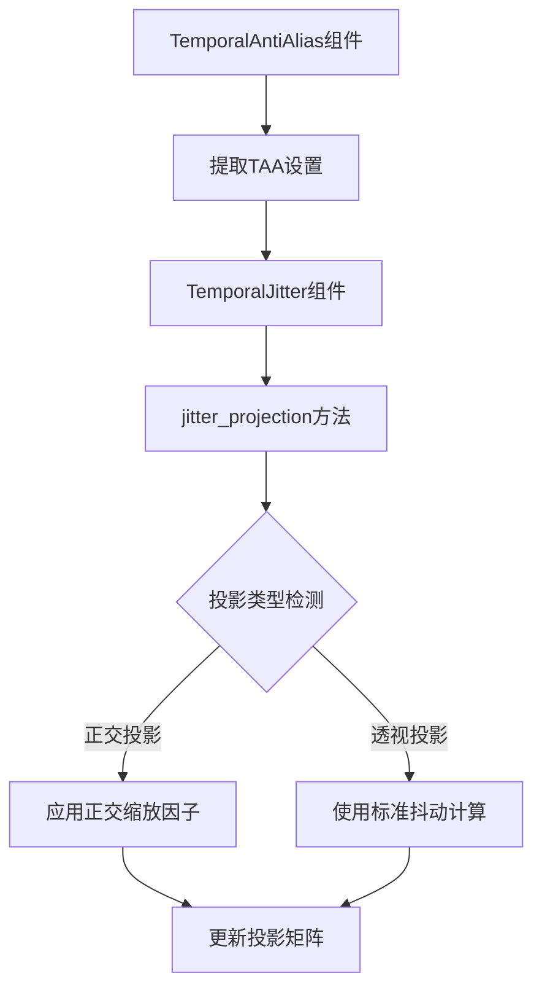

+++
title = "#20951 make taa work with ortho"
date = "2025-09-10T00:00:00"
draft = false
template = "pull_request_page.html"
in_search_index = false

[extra]
current_language = "zh-cn"
available_languages = {"en" = { name = "English", url = "/pull_request/bevy/2025-09/pr-20951-en-20250910" }, "zh-cn" = { name = "中文", url = "/pull_request/bevy/2025-09/pr-20951-zh-cn-20250910" }}
labels = ["C-Feature", "A-Rendering"]
+++

# Title
make taa work with ortho

## Basic Information
- **Title**: make taa work with ortho
- **PR Link**: https://github.com/bevyengine/bevy/pull/20951
- **Author**: atlv24
- **Status**: MERGED
- **Labels**: C-Feature, A-Rendering, S-Ready-For-Final-Review
- **Created**: 2025-09-10T16:01:06Z
- **Merged**: 2025-09-10T17:35:11Z
- **Merged By**: alice-i-cecile

## Description Translation
# Objective

- 修复正交投影下的时间性抖动 (temporal jitter)

## Solution

- 查看正交矩阵定义并推导正确的像素值范围
- 移除关于无法在正交投影下使用TAA的内容

## Testing

- #20950

## The Story of This Pull Request

这个PR解决了一个具体的渲染问题：时间性抗锯齿 (Temporal Anti-Aliasing, TAA) 在正交投影 (orthographic projection) 相机下无法正常工作的问题。

问题的根源在于TAA实现中的投影矩阵抖动计算。TAA技术需要通过轻微抖动相机视角来采样多个帧，然后将这些帧混合以减少锯齿。对于透视投影，抖动计算相对直接，但正交投影需要不同的数学处理。

在修改前的代码中，`TemporalJitter::jitter_projection` 方法有一个明显的限制：它检查投影矩阵的w分量是否为1.0（这是正交投影的特征），如果是就直接发出警告并返回，不进行任何抖动计算。这导致正交相机完全无法使用TAA功能。

```rust
// 修改前的代码：
if clip_from_view.w_axis.w == 1.0 {
    warn!(
        "TemporalJitter not supported with OrthographicProjection. Use PerspectiveProjection instead."
    );
    return;
}
```

开发者通过分析正交投影矩阵的数学特性，发现问题的核心在于如何正确计算正交投影下的像素偏移。正交投影与透视投影的主要区别在于它没有透视除法，因此抖动计算需要考虑不同的缩放因子。

解决方案是保留对正交投影的检测，但不跳过计算，而是应用适当的缩放因子：

```rust
// 修改后的代码：
if clip_from_view.w_axis.w == 1.0 {
    jitter *= vec2(clip_from_view.x_axis.x, clip_from_view.y_axis.y) * 0.5;
}
```

这里的关键洞察是：正交投影矩阵的x_axis.x和y_axis.y分量实际上包含了视图的宽度和高度信息，可以用来正确缩放抖动偏移量。乘以0.5是因为正交投影的裁剪空间范围是[-1, 1]，而抖动需要在正确的像素尺度上应用。

除了核心算法修复，PR还进行了相关的文档和类型系统清理：

1. 移除了 `bevy_anti_alias/src/taa/mod.rs` 中对 `Projection` 类型的依赖，因为不再需要检查投影类型
2. 更新了文档注释，删除了关于TAA不能用于正交投影的限制说明
3. 将 `TemporalAntiAlias` 组件的描述从"3D perspective camera"改为更通用的"3D camera"

这些更改虽然看似简单，但体现了对图形学原理的深入理解。开发者没有选择复杂的重写，而是通过精确的数学修正解决了问题，这种针对性的修复最小化了代码变更范围和潜在风险。

从架构角度看，这个修改保持了API的一致性，用户现在可以在透视和正交投影中使用相同的TAA组件，无需特殊处理。这对于使用正交相机进行2D游戏或UI渲染的场景特别有价值。

## Visual Representation



## Key Files Changed

### `crates/bevy_anti_alias/src/taa/mod.rs` (+6/-13)

主要修改是移除了对透视投影的强制要求，使TAA能够支持正交投影：

```rust
// 修改前：
for (entity, camera, camera_projection, taa_settings) in cameras_3d.iter_mut(&mut main_world) {
    // ...
    if let Some(mut taa_settings) = taa_settings
        && camera.is_active
        && camera_projection.is_perspective()  // 只允许透视投影
    {
        // ...
    }
}

// 修改后：
for (entity, camera, taa_settings) in cameras_3d.iter_mut(&mut main_world) {
    // ...
    if let Some(mut taa_settings) = taa_settings
        && camera.is_active  // 移除了投影类型检查
    {
        // ...
    }
}
```

### `crates/bevy_render/src/camera.rs` (+5/-11)

核心修改在 `TemporalJitter::jitter_projection` 方法中，添加了对正交投影的正确支持：

```rust
// 修改前：
pub fn jitter_projection(&self, clip_from_view: &mut Mat4, view_size: Vec2) {
    if clip_from_view.w_axis.w == 1.0 {
        warn!("TemporalJitter not supported with OrthographicProjection...");
        return;  // 直接返回，不进行处理
    }
    
    let jitter = (self.offset * vec2(2.0, -2.0)) / view_size;
    // ...
}

// 修改后：
pub fn jitter_projection(&self, clip_from_view: &mut Mat4, view_size: Vec2) {
    let mut jitter = (self.offset * vec2(2.0, -2.0)) / view_size;

    if clip_from_view.w_axis.w == 1.0 {
        jitter *= vec2(clip_from_view.x_axis.x, clip_from_view.y_axis.y) * 0.5;
    }

    clip_from_view.z_axis.x += jitter.x;
    clip_from_view.z_axis.y += jitter.y;
}
```

## Further Reading

1. [Bevy渲染引擎文档](https://bevyengine.org/learn/books/introduction/)
2. [时间性抗锯齿原理](https://en.wikipedia.org/wiki/Temporal_anti-aliasing)
3. [FidelityFX SDK中的抖动空间参考](https://github.com/GPUOpen-LibrariesAndSDKs/FidelityFX-SDK/blob/docs/techniques/media/super-resolution-temporal/jitter-space.svg)
4. [投影矩阵数学](https://www.scratchapixel.com/lessons/3d-basic-rendering/perspective-and-orthographic-projection-matrix/)

# Full Code Diff
```diff
diff --git a/crates/bevy_anti_alias/src/taa/mod.rs b/crates/bevy_anti_alias/src/taa/mod.rs
index 1781f90d9935f..44aa6624c1111 100644
--- a/crates/bevy_anti_alias/src/taa/mod.rs
+++ b/crates/bevy_anti_alias/src/taa/mod.rs
@@ -1,6 +1,6 @@
 use bevy_app::{App, Plugin};
 use bevy_asset::{embedded_asset, load_embedded_asset, AssetServer, Handle};
-use bevy_camera::{Camera, Camera3d, Projection};
+use bevy_camera::{Camera, Camera3d};
 use bevy_core_pipeline::{
     core_3d::graph::{Core3d, Node3d},
     prepass::{DepthPrepass, MotionVectorPrepass, ViewPrepassTextures},
@@ -83,7 +83,7 @@ impl Plugin for TemporalAntiAliasPlugin {
     }
 }
 
-/// Component to apply temporal anti-aliasing to a 3D perspective camera.
+/// Component to apply temporal anti-aliasing to a 3D camera.
 ///
 /// Temporal anti-aliasing (TAA) is a form of image smoothing/filtering, like
 /// multisample anti-aliasing (MSAA), or fast approximate anti-aliasing (FXAA).
@@ -109,8 +109,6 @@ impl Plugin for TemporalAntiAliasPlugin {
 ///
 /// Any camera with this component must also disable [`Msaa`] by setting it to [`Msaa::Off`].
 ///
-/// [Currently](https://github.com/bevyengine/bevy/issues/8423), TAA cannot be used with [`bevy_camera::OrthographicProjection`].
-///
 /// TAA also does not work well with alpha-blended meshes, as it requires depth writing to determine motion.
 ///
 /// It is very important that correct motion vectors are written for everything on screen.
@@ -344,20 +342,15 @@ impl SpecializedRenderPipeline for TaaPipeline {
 }
 
 fn extract_taa_settings(mut commands: Commands, mut main_world: ResMut<MainWorld>) {
-    let mut cameras_3d = main_world.query::<(
-        RenderEntity,
-        &Camera,
-        &Projection,
-        Option<&mut TemporalAntiAliasing>,
-    )>();
-
-    for (entity, camera, camera_projection, taa_settings) in cameras_3d.iter_mut(&mut main_world) {
+    let mut cameras_3d =
+        main_world.query::<(RenderEntity, &Camera, Option<&mut TemporalAntiAliasing>)>();
+
+    for (entity, camera, taa_settings) in cameras_3d.iter_mut(&mut main_world) {
         let mut entity_commands = commands
             .get_entity(entity)
             .expect("Camera entity wasn't synced.");
         if let Some(mut taa_settings) = taa_settings
             && camera.is_active
-            && camera_projection.is_perspective()
         {
             entity_commands.insert(taa_settings.clone());
             taa_settings.reset = false;
diff --git a/crates/bevy_render/src/camera.rs b/crates/bevy_render/src/camera.rs
index 085e7733ad397..24047d86402c8 100644
--- a/crates/bevy_render/src/camera.rs
+++ b/crates/bevy_render/src/camera.rs
@@ -658,10 +658,6 @@ pub fn sort_cameras(
 /// A subpixel offset to jitter a perspective camera's frustum by.
 ///
 /// Useful for temporal rendering techniques.
-///
-/// Do not use with [`OrthographicProjection`].
-///
-/// [`OrthographicProjection`]: bevy_camera::OrthographicProjection
 #[derive(Component, Clone, Default, Reflect)]
 #[reflect(Default, Component, Clone)]
 pub struct TemporalJitter {
@@ -671,16 +667,14 @@ pub struct TemporalJitter {
 
 impl TemporalJitter {
     pub fn jitter_projection(&self, clip_from_view: &mut Mat4, view_size: Vec2) {
+        // https://github.com/GPUOpen-LibrariesAndSDKs/FidelityFX-SDK/blob/d7531ae47d8b36a5d4025663e731a47a38be882f/docs/techniques/media/super-resolution-temporal/jitter-space.svg
+        let mut jitter = (self.offset * vec2(2.0, -2.0)) / view_size;
+
+        // orthographic
         if clip_from_view.w_axis.w == 1.0 {
-            warn!(
-                "TemporalJitter not supported with OrthographicProjection. Use PerspectiveProjection instead."
-            );
-            return;
+            jitter *= vec2(clip_from_view.x_axis.x, clip_from_view.y_axis.y) * 0.5;
         }
 
-        // https://github.com/GPUOpen-LibrariesAndSDKs/FidelityFX-SDK/blob/d7531ae47d8b36a5d4025663e731a47a38be882f/docs/techniques/media/super-resolution-temporal/jitter-space.svg
-        let jitter = (self.offset * vec2(2.0, -2.0)) / view_size;
-
         clip_from_view.z_axis.x += jitter.x;
         clip_from_view.z_axis.y += jitter.y;
     }
```