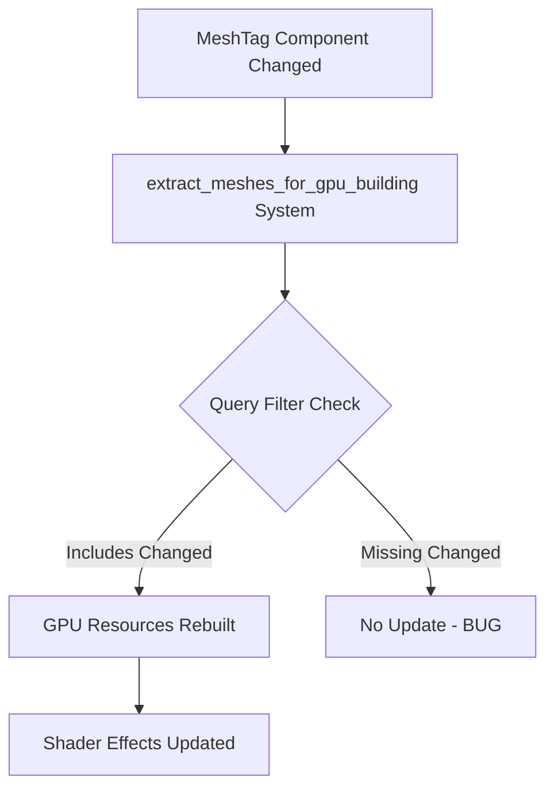

+++
title = "#20954 Fix `MeshTag` changes having no effect"
date = "2025-09-10T00:00:00"
draft = false
template = "pull_request_page.html"
in_search_index = true

[taxonomies]
list_display = ["show"]

[extra]
current_language = "en"
available_languages = {"en" = { name = "English", url = "/pull_request/bevy/2025-09/pr-20954-en-20250910" }, "zh-cn" = { name = "中文", url = "/pull_request/bevy/2025-09/pr-20954-zh-cn-20250910" }}
labels = ["C-Bug", "D-Trivial", "A-Rendering"]
+++

# Fix `MeshTag` changes having no effect

## Basic Information
- **Title**: Fix `MeshTag` changes having no effect
- **PR Link**: https://github.com/bevyengine/bevy/pull/20954
- **Author**: EmbersArc
- **Status**: MERGED
- **Labels**: C-Bug, D-Trivial, A-Rendering, S-Ready-For-Final-Review
- **Created**: 2025-09-10T20:26:57Z
- **Merged**: 2025-09-10T21:22:01Z
- **Merged By**: alice-i-cecile

## Description Translation
**Objective**

Changing only the mesh tag on a mesh did not have an effect.

**Solution**

Check if the mesh tag has changed when extracting the mesh.

**Testing**

Can be tested with a modified `storage_buffer`  example:

<details>
  <summary>Click to view the code</summary>

```rust
//! This example demonstrates how to use a storage buffer with `AsBindGroup` in a custom material.
use bevy::{
    mesh::MeshTag,
    prelude::*,
    reflect::TypePath,
    render::{render_resource::AsBindGroup, storage::ShaderStorageBuffer},
    shader::ShaderRef,
};

const SHADER_ASSET_PATH: &str = "shaders/storage_buffer.wgsl";

fn main() {
    App::new()
        .add_plugins((DefaultPlugins, MaterialPlugin::<CustomMaterial>::default()))
        .add_systems(Startup, setup)
        .add_systems(Update, update)
        .run();
}

/// set up a simple 3D scene
fn setup(
    mut commands: Commands,
    mut meshes: ResMut<Assets<Mesh>>,
    mut buffers: ResMut<Assets<ShaderStorageBuffer>>,
    mut materials: ResMut<Assets<CustomMaterial>>,
) {
    // Example data for the storage buffer
    let color_data: Vec<[f32; 4]> = (0..13)
        .map(|i| {
            [
                ops::sin(i as f32) / 2.0 + 0.5,
                ops::sin(i as f32 + 2.0) / 2.0 + 0.5,
                ops::sin(i as f32 + 4.0) / 2.0 + 0.5,
                1.0,
            ]
        })
        .collect::<Vec<[f32; 4]>>();

    let colors = buffers.add(ShaderStorageBuffer::from(color_data));

    let mesh_handle = meshes.add(Cuboid::from_size(Vec3::splat(0.3)));
    // Create the custom material with the storage buffer
    let material_handle = materials.add(CustomMaterial {
        colors: colors.clone(),
    });

    // Spawn cubes with the custom material
    for col in -6..=6 {
        for row in -3..=3 {
            commands.spawn((
                Mesh3d(mesh_handle.clone()),
                MeshMaterial3d(material_handle.clone()),
                MeshTag(5),
                Transform::from_xyz(col as f32, row as f32, 0.0),
            ));
        }
    }

    // Camera
    commands.spawn((
        Camera3d::default(),
        Transform::from_xyz(0.0, 0.0, 10.0).looking_at(Vec3::ZERO, Vec3::Y),
    ));
}

// Update the mesh tags.
fn update(time: Res<Time>, mut cubes: Query<&mut MeshTag, With<Mesh3d>>) {
    cubes.iter_mut().for_each(|mut tag| {
        let new_tag = time.elapsed_secs() as u32 % 13;
        dbg!(new_tag);
        **tag = new_tag;
    });
}

// This struct defines the data that will be passed to your shader
#[derive(Asset, TypePath, AsBindGroup, Debug, Clone)]
struct CustomMaterial {
    #[storage(0, read_only)]
    colors: Handle<ShaderStorageBuffer>,
}

impl Material for CustomMaterial {
    fn vertex_shader() -> ShaderRef {
        SHADER_ASSET_PATH.into()
    }

    fn fragment_shader() -> ShaderRef {
        SHADER_ASSET_PATH.into()
    }
}
```

</details>

## The Story of This Pull Request

This PR addresses a specific bug in Bevy's rendering system where changes to `MeshTag` components weren't being detected by the mesh extraction system. The `MeshTag` component is used to associate metadata with meshes that can be utilized in shaders, particularly for custom rendering effects.

The core issue was in the `extract_meshes_for_gpu_building` system, which handles detecting changes to mesh-related components and rebuilding GPU resources when necessary. The system's query filter was missing `Changed<MeshTag>` from its list of change detectors, meaning that when only the `MeshTag` component changed (without other mesh properties changing), the system wouldn't trigger a rebuild of the mesh instance buffer.

The fix is straightforward - adding `Changed<MeshTag>` to the query filter ensures that mesh tag changes are properly detected and trigger the necessary GPU updates. This maintains consistency with how other mesh-related components are handled and ensures the rendering system responds appropriately to all relevant component changes.

The provided test case demonstrates how this change enables dynamic updates to mesh tags, which could be used for effects like color cycling or other shader-based animations that depend on per-mesh metadata.

## Visual Representation



## Key Files Changed

**File: `crates/bevy_pbr/src/render/mesh.rs`**

This file contains the mesh extraction system that processes mesh entities and prepares them for rendering. The change adds `Changed<MeshTag>` to the query filter to ensure mesh tag changes are properly detected.

**Code Change:**
```rust
// Before:
pub fn extract_meshes_for_gpu_building(
    mut commands: Commands,
    mut previous_len: Local<usize>,
    meshes: Query<
        (
            Entity,
            &Mesh3d,
            &MeshFlags,
            &GlobalTransform,
            Option<&Lightmap>,
            Option<&Aabb>,
            Option<&NoFrustumCulling>,
            Option<&NotShadowReceiver>,
            Option<&TransmittedShadowReceiver>,
            Option<&NotShadowCaster>,
        ),
        Or<(
            Changed<Mesh3d>,
            Changed<MeshFlags>,
            Changed<GlobalTransform>,
            Changed<Lightmap>,
            Changed<Aabb>,
            Changed<NoFrustumCulling>,
            Changed<NotShadowReceiver>,
            Changed<TransmittedShadowReceiver>,
            Changed<NotShadowCaster>,
        )>,
    >,
    // ... rest of function
)

// After:
pub fn extract_meshes_for_gpu_building(
    mut commands: Commands,
    mut previous_len: Local<usize>,
    meshes: Query<
        (
            Entity,
            &Mesh3d,
            &MeshFlags,
            &GlobalTransform,
            Option<&Lightmap>,
            Option<&Aabb>,
            Option<&NoFrustumCulling>,
            Option<&NotShadowReceiver>,
            Option<&TransmittedShadowReceiver>,
            Option<&NotShadowCaster>,
        ),
        Or<(
            Changed<Mesh3d>,
            Changed<MeshFlags>,
            Changed<GlobalTransform>,
            Changed<Lightmap>,
            Changed<Aabb>,
            Changed<MeshTag>, // Added this line
            Changed<NoFrustumCulling>,
            Changed<NotShadowReceiver>,
            Changed<TransmittedShadowReceiver>,
            Changed<NotShadowCaster>,
        )>,
    >,
    // ... rest of function
)
```

## Further Reading

- [Bevy ECS Query Filters Documentation](https://docs.rs/bevy/latest/bevy/ecs/system/struct.Query.html#query-filters)
- [Bevy Change Detection System](https://bevy-cheatbook.github.io/programming/change-detection.html)
- [WGSL Shader Programming](https://gpuweb.github.io/gpuweb/wgsl/)