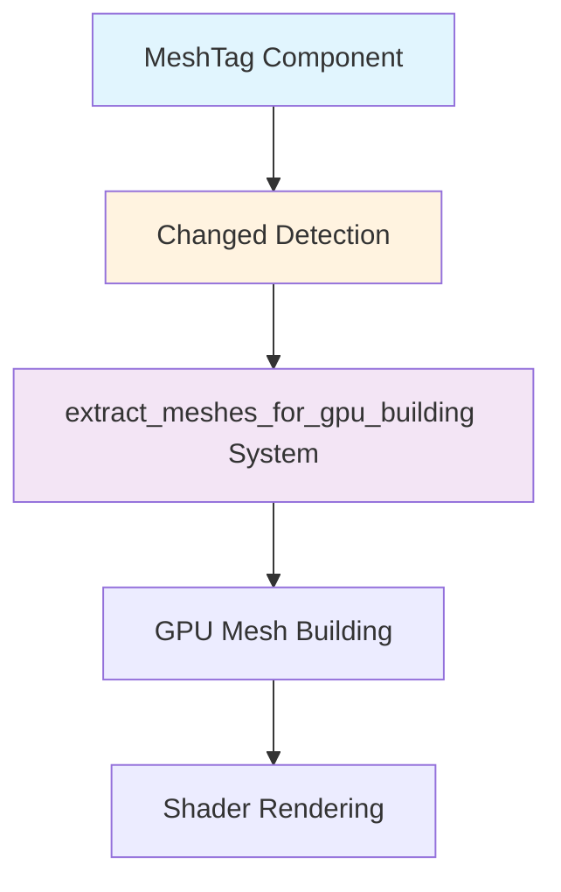

+++
title = "#20954 Fix `MeshTag` changes having no effect"
date = "2025-09-10T00:00:00"
draft = false
template = "pull_request_page.html"
in_search_index = false

[extra]
current_language = "zh-cn"
available_languages = {"en" = { name = "English", url = "/pull_request/bevy/2025-09/pr-20954-en-20250910" }, "zh-cn" = { name = "中文", url = "/pull_request/bevy/2025-09/pr-20954-zh-cn-20250910" }}
+++

# Fix `MeshTag` changes having no effect

## 基本信息
- **标题**: Fix `MeshTag` changes having no effect
- **PR链接**: https://github.com/bevyengine/bevy/pull/20954
- **作者**: EmbersArc
- **状态**: 已合并
- **标签**: C-Bug, D-Trivial, A-Rendering, S-Ready-For-Final-Review
- **创建时间**: 2025-09-10T20:26:57Z
- **合并时间**: 2025-09-10T21:22:01Z
- **合并者**: alice-i-cecile

## 描述翻译

### 目标
仅更改网格上的 mesh tag 时，更改没有生效。

### 解决方案
在提取网格时检查 mesh tag 是否已更改。

### 测试
可以通过修改后的 `storage_buffer` 示例进行测试：

<details>
  <summary>点击查看代码</summary>

```rust
//! This example demonstrates how to use a storage buffer with `AsBindGroup` in a custom material.
use bevy::{
    mesh::MeshTag,
    prelude::*,
    reflect::TypePath,
    render::{render_resource::AsBindGroup, storage::ShaderStorageBuffer},
    shader::ShaderRef,
};

const SHADER_ASSET_PATH: &str = "shaders/storage_buffer.wgsl";

fn main() {
    App::new()
        .add_plugins((DefaultPlugins, MaterialPlugin::<CustomMaterial>::default()))
        .add_systems(Startup, setup)
        .add_systems(Update, update)
        .run();
}

/// set up a simple 3D scene
fn setup(
    mut commands: Commands,
    mut meshes: ResMut<Assets<Mesh>>,
    mut buffers: ResMut<Assets<ShaderStorageBuffer>>,
    mut materials: ResMut<Assets<CustomMaterial>>,
) {
    // Example data for the storage buffer
    let color_data: Vec<[f32; 4]> = (0..13)
        .map(|i| {
            [
                ops::sin(i as f32) / 2.0 + 0.5,
                ops::sin(i as f32 + 2.0) / 2.0 + 0.5,
                ops::sin(i as f32 + 4.0) / 2.0 + 0.5,
                1.0,
            ]
        })
        .collect::<Vec<[f32; 4]>>();

    let colors = buffers.add(ShaderStorageBuffer::from(color_data));

    let mesh_handle = meshes.add(Cuboid::from_size(Vec3::splat(0.3)));
    // Create the custom material with the storage buffer
    let material_handle = materials.add(CustomMaterial {
        colors: colors.clone(),
    });

    // Spawn cubes with the custom material
    for col in -6..=6 {
        for row in -3..=3 {
            commands.spawn((
                Mesh3d(mesh_handle.clone()),
                MeshMaterial3d(material_handle.clone()),
                MeshTag(5),
                Transform::from_xyz(col as f32, row as f32, 0.0),
            ));
        }
    }

    // Camera
    commands.spawn((
        Camera3d::default(),
        Transform::from_xyz(0.0, 0.0, 10.0).looking_at(Vec3::ZERO, Vec3::Y),
    ));
}

// Update the mesh tags.
fn update(time: Res<Time>, mut cubes: Query<&mut MeshTag, With<Mesh3d>>) {
    cubes.iter_mut().for_each(|mut tag| {
        let new_tag = time.elapsed_secs() as u32 % 13;
        dbg!(new_tag);
        **tag = new_tag;
    });
}

// This struct defines the data that will be passed to your shader
#[derive(Asset, TypePath, AsBindGroup, Debug, Clone)]
struct CustomMaterial {
    #[storage(0, read_only)]
    colors: Handle<ShaderStorageBuffer>,
}

impl Material for CustomMaterial {
    fn vertex_shader() -> ShaderRef {
        SHADER_ASSET_PATH.into()
    }

    fn fragment_shader() -> ShaderRef {
        SHADER_ASSET_PATH.into()
    }
}
```

</details>

## 本次PR的故事

这个PR解决了一个在Bevy渲染系统中关于`MeshTag`组件变化检测的具体问题。问题出现在当开发者只修改实体的`MeshTag`组件时，这些更改没有在渲染管线中生效。

### 问题背景
在Bevy的ECS架构中，`MeshTag`是一个用于标记网格的组件，通常用于在着色器中标识特定的网格或实现特定的渲染效果。问题出现在`extract_meshes_for_gpu_building`系统中，这个系统负责检测网格相关的组件变化，并将变化的网格数据提取到GPU进行构建。

原来的系统查询只包含了以下组件的变更检测：
```rust
Changed<Lightmap>,
Changed<Aabb>, 
Changed<Mesh3d>,
Changed<NoFrustumCulling>,
Changed<NotShadowReceiver>,
Changed<TransmittedShadowReceiver>,
```

但缺少了对`MeshTag`组件变化的检测。这意味着当只有`MeshTag`发生变化时，系统不会重新提取和构建网格，导致着色器无法获取到更新的tag值。

### 解决方案
解决方案很直接：在`extract_meshes_for_gpu_building`系统的查询条件中添加`Changed<MeshTag>`。这样当`MeshTag`组件发生变化时，系统会正确地将网格标记为需要重新提取和构建。

### 实现细节
这个修复只需要在现有的查询条件中添加一行代码：

```rust
pub fn extract_meshes_for_gpu_building(
    // ...
    query: Query<
        (
            Entity,
            &Mesh3d,
            &MeshTag,
            &NoFrustumCulling,
            &NotShadowReceiver,
            &TransmittedShadowReceiver,
            &Lightmap,
            Option<&Aabb>,
        ),
        Or<(
            Changed<Lightmap>,
            Changed<Aabb>,
            Changed<Mesh3d>,
            Changed<MeshTag>,  // 新增的变更检测
            Changed<NoFrustumCulling>,
            Changed<NotShadowReceiver>,
            Changed<TransmittedShadowReceiver>,
        )>,
    >,
    // ...
) {
    // 系统实现
}
```

### 技术影响
这个修复确保了`MeshTag`组件的变化能够正确触发网格的重新提取和GPU构建流程。对于使用`MeshTag`来实现动态着色器效果的应用来说，这个修复至关重要。

从性能角度来看，这个改动的影响很小，因为：
1. 只在`MeshTag`实际发生变化时才会触发额外的处理
2. 变更检测是Bevy ECS的核心功能，效率很高
3. 不会对不使用`MeshTag`的应用产生任何影响

### 测试验证
PR作者提供了一个修改后的`storage_buffer`示例来验证修复。这个示例创建了多个带有`MeshTag`的立方体，并在每帧更新它们的tag值。修复后，这些tag变化能够正确反映在渲染结果中。

## 可视化表示



## 关键文件更改

### `crates/bevy_pbr/src/render/mesh.rs`
**更改描述**: 在网格提取系统的查询条件中添加了对`MeshTag`组件变化的检测

**代码变更**:
```rust
// 变更前:
Or<(
    Changed<Lightmap>,
    Changed<Aabb>,
    Changed<Mesh3d>,
    Changed<NoFrustumCulling>,
    Changed<NotShadowReceiver>,
    Changed<TransmittedShadowReceiver>,
)>

// 变更后:
Or<(
    Changed<Lightmap>,
    Changed<Aabb>,
    Changed<Mesh3d>,
    Changed<MeshTag>,  // 新增的行
    Changed<NoFrustumCulling>,
    Changed<NotShadowReceiver>,
    Changed<TransmittedShadowReceiver>,
)>
```

这个简单的单行添加确保了当只有`MeshTag`组件发生变化时，网格也会被重新提取和构建，解决了原本的功能缺陷。

## 延伸阅读

- [Bevy ECS Change Detection](https://bevyengine.org/learn/books/0.13/programming/ecs/change-detection/) - Bevy官方文档中关于变更检测的详细说明
- [Bevy Rendering Pipeline](https://bevyengine.org/learn/books/0.13/programming/rendering/) - Bevy渲染管线的工作原理
- [WGSL Shader Programming](https://gpuweb.github.io/gpuweb/wgsl/) - WebGPU Shading Language规范