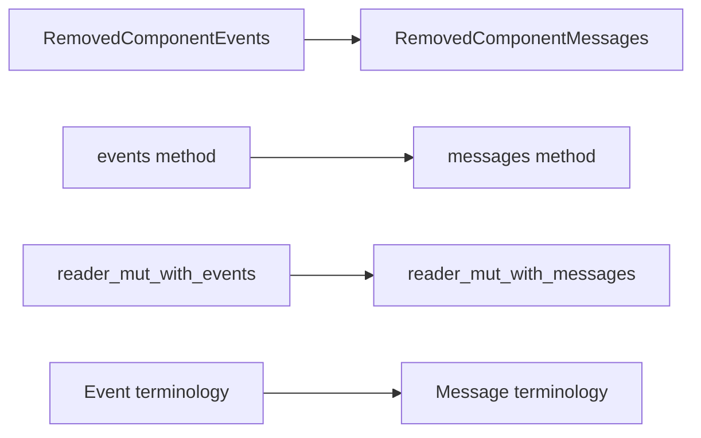

+++
title = "#20955 `RemovedComponents` methods renamed to match `Event` to `Message` rename"
date = "2025-09-11T00:00:00"
draft = false
template = "pull_request_page.html"
in_search_index = true

[taxonomies]
list_display = ["show"]

[extra]
current_language = "en"
available_languages = {"en" = { name = "English", url = "/pull_request/bevy/2025-09/pr-20955-en-20250911" }, "zh-cn" = { name = "中文", url = "/pull_request/bevy/2025-09/pr-20955-zh-cn-20250911" }}
labels = ["A-ECS", "C-Code-Quality", "D-Straightforward"]
+++

# RemovedComponents methods renamed to match Event to Message rename

## Basic Information
- **Title**: `RemovedComponents` methods renamed to match `Event` to `Message` rename
- **PR Link**: https://github.com/bevyengine/bevy/pull/20955
- **Author**: alice-i-cecile
- **Status**: MERGED
- **Labels**: A-ECS, C-Code-Quality, S-Ready-For-Final-Review, X-Uncontroversial, D-Straightforward
- **Created**: 2025-09-10T21:57:16Z
- **Merged**: 2025-09-11T03:37:07Z
- **Merged By**: alice-i-cecile

## Description Translation
# Objective

Cleans up the inconsistency noted in https://github.com/bevyengine/bevy/pull/20953#discussion_r2337865381 by @janis-bhm

This implementation will continue to use buffered messages for as long as it exists, so this rename is correct despite the caveats listed by @cart [here](https://github.com/bevyengine/bevy/pull/20953#issuecomment-3276401449).

## Solution

- Search for all usages of `event` in this file, and replace with messages manually where appropriate
- Make some deprecated aliases to ease migration
- Write a quick migration guide

## The Story of This Pull Request

This PR addresses a naming inconsistency in Bevy's ECS system that emerged after a broader architectural change. The core issue was that while Bevy had recently renamed buffered events to messages (to distinguish them from observer events), the `RemovedComponents` system still used event-based terminology throughout its API.

The problem was identified during code review of PR #20953, where @janis-bhm noticed the inconsistent naming pattern. The `RemovedComponents` system internally uses buffered messaging (formerly events) to track component removals, but its methods and types still contained "event" terminology that didn't align with the new messaging convention.

The solution was straightforward but required careful attention to detail. The developer systematically searched for all occurrences of "event" in the relevant files and replaced them with "message" where appropriate. To maintain backward compatibility during migration, deprecated aliases were created for the old method names, allowing existing code to continue working while developers transition to the new API.

The implementation involved renaming the core storage type from `RemovedComponentEvents` to `RemovedComponentMessages` and updating all related methods:
- `events()` became `messages()`
- `reader_mut_with_events()` became `reader_mut_with_messages()`
- Documentation was updated to reflect the new messaging terminology
- Deprecated aliases were added to ease the migration path

This change improves code consistency and reduces cognitive load for developers working with both observer events and buffered messages. The clear terminology distinction helps prevent confusion about which system uses which communication pattern.

## Visual Representation



## Key Files Changed

### `crates/bevy_ecs/src/lifecycle.rs` (+63/-39)
This file contained the core implementation of the removed components tracking system. The changes included renaming the main storage type and its methods to use message terminology instead of event terminology.

**Key changes:**
```rust
// Before:
pub struct RemovedComponentEvents { /* ... */ }
impl RemovedComponentEvents {
    pub fn events(&self) -> Option<&Messages<RemovedComponentEntity>> { /* ... */ }
    pub fn reader_mut_with_events(&mut self) -> Option<(...)> { /* ... */ }
}

// After:
pub struct RemovedComponentMessages { /* ... */ }
impl RemovedComponentMessages {
    pub fn messages(&self) -> Option<&Messages<RemovedComponentEntity>> { /* ... */ }
    pub fn reader_mut_with_messages(&mut self) -> Option<(...)> { /* ... */ }
}
```

### `release-content/migration-guides/removed_components_stores_messages.md` (+16/-0)
A new migration guide was created to document the changes and help developers update their code.

**Content:**
```markdown
As part of the broader shift to differentiate between buffered events (0.16's `EventWriter`/`EventReader`) and observer-events,
various methods and types related to `RemovedComponents` have been renamed.

The implementation of `RemovedComponents` uses buffered events (now, messages):
and as a result, the following types and messages have been renamed:

| Old                                         | New                                           |
| ------------------------------------------- | --------------------------------------------- |
| `RemovedComponents::events`                 | `RemovedComponents::messages`                 |
| `RemovedComponents::reader_mut_with_events` | `RemovedComponents::reader_mut_with_messages` |
| `RemovedComponentEvents`                    | `RemovedComponentMessages`                    |
```

### `release-content/migration-guides/send_event_rename.md` (+5/-5)
An existing migration guide was updated to include the changes from this PR.

**Changes:**
```markdown
-| `RemovedComponentEvents::send`      | `RemovedComponentEvents::write`      |
+| `RemovedComponentEvents::send`      | `RemovedComponentEvents::write`        |
```

### `crates/bevy_ecs/src/world/mod.rs` (+4/-4) and `crates/bevy_ecs/src/world/unsafe_world_cell.rs` (+3/-3)
These files needed updates to reference the newly renamed types and methods throughout the codebase.

**Example change:**
```rust
// Before:
use lifecycle::{ComponentHooks, RemovedComponentEvents, /* ... */};
pub(crate) removed_components: RemovedComponentEvents,

// After:
use lifecycle::{ComponentHooks, RemovedComponentMessages, /* ... */};
pub(crate) removed_components: RemovedComponentMessages,
```

## Further Reading

- [PR #20953](https://github.com/bevyengine/bevy/pull/20953) - The original PR that introduced the Event to Message rename
- [Bevy ECS Documentation](https://bevyengine.org/learn/books/the-bevy-book/ecs/) - Official documentation on Bevy's Entity Component System
- [Message System in Bevy](https://bevyengine.org/learn/books/the-bevy-book/ecs/messages/) - Guide to Bevy's messaging system

# Full Code Diff
[See provided code diff in original request]