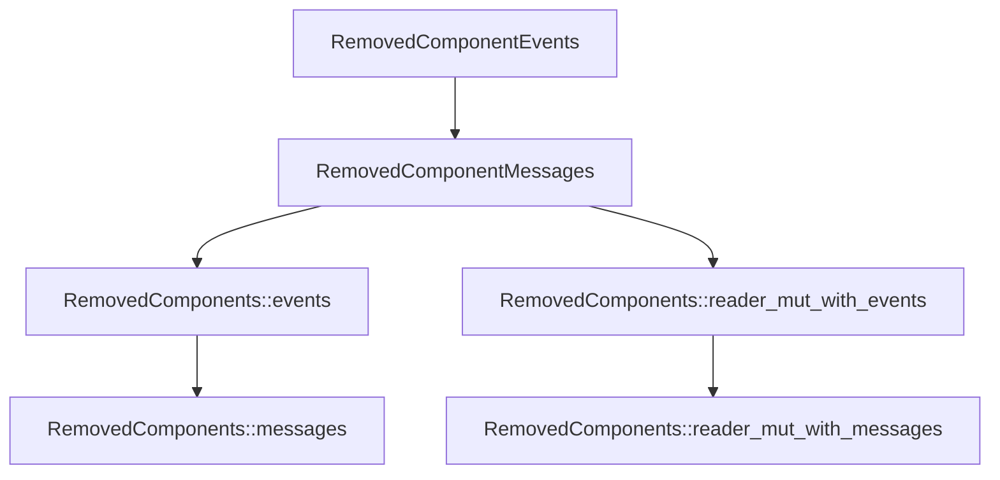

+++
title = "#20955 RemovedComponents` methods renamed to match `Event` to `Message` rename"
date = "2025-09-11T00:00:00"
draft = false
template = "pull_request_page.html"
in_search_index = false

[extra]
current_language = "zh-cn"
available_languages = {"en" = { name = "English", url = "/pull_request/bevy/2025-09/pr-20955-en-20250911" }, "zh-cn" = { name = "中文", url = "/pull_request/bevy/2025-09/pr-20955-zh-cn-20250911" }}
+++

# RemovedComponents 方法重命名以匹配 Event 到 Message 的重命名

## 基本信息
- **标题**: `RemovedComponents` methods renamed to match `Event` to `Message` rename
- **PR 链接**: https://github.com/bevyengine/bevy/pull/20955
- **作者**: alice-i-cecile
- **状态**: 已合并
- **标签**: A-ECS, C-Code-Quality, S-Ready-For-Final-Review, X-Uncontroversial, D-Straightforward
- **创建时间**: 2025-09-10T21:57:16Z
- **合并时间**: 2025-09-11T03:37:07Z
- **合并者**: alice-i-cecile

## 描述翻译
# 目标

清理在 https://github.com/bevyengine/bevy/pull/20953#discussion_r2337865381 由 @janis-bhm 指出的不一致性

尽管 @cart 在此处列出的注意事项，此实现将继续使用缓冲消息，因此此重命名是正确的。

## 解决方案

- 在此文件中搜索所有 `event` 的使用，并在适当的地方手动替换为 messages
- 创建一些弃用的别名以简化迁移
- 编写快速迁移指南

## 这个 PR 的故事

这个 PR 源于 Bevy 引擎中一个命名一致性的问题。在之前的 PR #20953 中，开发者注意到代码库中存在命名不一致的情况：`RemovedComponents` 相关的方法仍然使用 "event" 术语，而系统的其他部分已经统一使用 "message" 术语。

问题的核心在于 Bevy 正在进行从 "event" 到 "message" 的术语转变，以更清晰地区分缓冲事件（buffered events）和观察者事件（observer events）。`RemovedComponents` 的实现使用的是缓冲事件机制，因此应该使用 "message" 术语来保持一致性。

开发者采取了直接而实用的方法来解决这个问题。首先，他们系统地搜索了相关文件中所有使用 "event" 的地方，并在适当的位置手动替换为 "message"。这不是简单的全局替换，而是有选择性的更改，确保只影响确实需要修改的部分。

为了确保向后兼容性和平滑迁移，开发者添加了弃用别名。这意味着现有代码不会立即中断，但会收到警告提示需要更新到新的命名约定。这种方法是处理 API 变更的最佳实践，既推动了代码库的现代化，又给了用户足够的时间来适应变化。

```rust
// 添加弃用别名以保持向后兼容
#[deprecated(since = "0.17.0", note = "Use `RemovedComponentMessages` instead.")]
pub type RemovedComponentEvents = RemovedComponentMessages;
```

实现中还包含了详细的文档更新，确保所有注释和说明都反映新的命名约定。这对于维护代码的可读性和可维护性至关重要。

最后，开发者创建了迁移指南文档，明确列出了所有需要更改的API，并提供了新旧名称的对照表。这种文档工作对于帮助用户理解变更和顺利迁移非常重要。

这个 PR 的影响是提高了代码库的一致性，使术语使用更加准确。虽然这是一个相对简单的重命名操作，但它体现了良好的工程实践：保持命名一致性、提供平滑迁移路径、以及完善的文档支持。

## 可视化表示



## 关键文件变更

### `crates/bevy_ecs/src/lifecycle.rs` (+63/-39)
这个文件包含了主要的命名变更，将 "event" 相关术语统一改为 "message"。

主要变更包括：
- `RemovedComponentEvents` 类型重命名为 `RemovedComponentMessages`
- 添加了弃用别名以保持向后兼容
- 更新了方法名和文档注释

```rust
// 之前:
pub struct RemovedComponentEvents {
    event_sets: SparseSet<ComponentId, Messages<RemovedComponentEntity>>,
}

// 之后:
pub struct RemovedComponentMessages {
    event_sets: SparseSet<ComponentId, Messages<RemovedComponentEntity>>,
}

// 添加弃用别名
#[deprecated(since = "0.17.0", note = "Use `RemovedComponentMessages` instead.")]
pub type RemovedComponentEvents = RemovedComponentMessages;
```

### `release-content/migration-guides/removed_components_stores_messages.md` (+16/-0)
新创建的迁移指南文档，详细说明了从 "event" 到 "message" 的命名变更。

```markdown
| Old                                         | New                                           |
| ------------------------------------------- | --------------------------------------------- |
| `RemovedComponents::events`                 | `RemovedComponents::messages`                 |
| `RemovedComponents::reader_mut_with_events` | `RemovedComponents::reader_mut_with_messages` |
| `RemovedComponentEvents`                    | `RemovedComponentMessages`                    |
```

### `release-content/migration-guides/send_event_rename.md` (+5/-5)
更新现有的迁移指南，包含 `RemovedComponentEvents::send` 到 `RemovedComponentEvents::write` 的变更。

### `crates/bevy_ecs/src/world/mod.rs` (+4/-4) 和 `crates/bevy_ecs/src/world/unsafe_world_cell.rs` (+3/-3)
这些文件更新了类型引用以匹配新的命名约定。

```rust
// 之前:
pub(crate) removed_components: RemovedComponentEvents,

// 之后:
pub(crate) removed_components: RemovedComponentMessages,
```

## 进一步阅读

- [Bevy ECS 官方文档](https://bevyengine.org/learn/books/ecs/)
- [消息系统与事件系统的区别](https://en.wikipedia.org/wiki/Message_passing)
- [API 设计中的命名约定最佳实践](https://stackoverflow.com/questions/22892120/what-are-some-best-practices-for-naming-conventions-in-api-design)