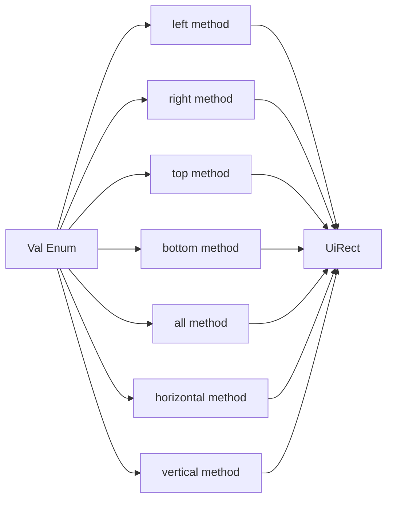

+++
title = "#20956 Constify `Val` functions"
date = "2025-09-10T00:00:00"
draft = false
template = "pull_request_page.html"
in_search_index = true

[taxonomies]
list_display = ["show"]

[extra]
current_language = "en"
available_languages = {"en" = { name = "English", url = "/pull_request/bevy/2025-09/pr-20956-en-20250910" }, "zh-cn" = { name = "中文", url = "/pull_request/bevy/2025-09/pr-20956-zh-cn-20250910" }}
labels = ["D-Trivial", "A-UI", "C-Usability"]
+++

# Constify `Val` Functions

## Basic Information
- **Title**: Constify `Val` functions
- **PR Link**: https://github.com/bevyengine/bevy/pull/20956
- **Author**: ickshonpe
- **Status**: MERGED
- **Labels**: D-Trivial, A-UI, C-Usability, S-Ready-For-Final-Review
- **Created**: 2025-09-10T22:08:24Z
- **Merged**: 2025-09-10T22:56:31Z
- **Merged By**: alice-i-cecile

## Description Translation
The original description is in English and remains unchanged:

**Objective**

Constify these `Val` functions

## The Story of This Pull Request

This PR addresses a straightforward but meaningful improvement to Bevy's UI geometry system. The core issue was that several convenience methods in the `Val` type couldn't be used in const contexts, limiting their utility for compile-time calculations and constant definitions.

The `Val` enum represents various types of values used in UI layout calculations, including pixels, percentages, and auto values. It provides several builder-style methods that return `UiRect` instances configured with specific values for different sides (left, right, top, bottom) or combinations thereof.

The solution was simple yet effective: add the `const` keyword to seven methods in the `Val` implementation. This change enables these methods to be evaluated at compile time, which provides several benefits:

1. **Compile-time evaluation**: Developers can now use these methods in const contexts
2. **Performance**: Calculations can be done during compilation rather than runtime
3. **Expressiveness**: Enables more idiomatic Rust code with const expressions

The implementation required minimal changes - just adding the `const` qualifier to each function declaration. This was possible because:
- The functions are pure and have no side effects
- They only call other const functions (specifically the `UiRect` constructor methods)
- They don't perform any operations that would prevent const evaluation

This change follows Rust's ongoing trend toward const-evaluable functions, which has been progressively expanding with each language edition. The modifications maintain backward compatibility while extending functionality.

## Visual Representation



## Key Files Changed

### `crates/bevy_ui/src/geometry.rs` (+7/-7)

This file contains the `Val` enum implementation and its geometry-related methods. The changes convert seven methods from regular functions to const functions.

**Before:**
```rust
pub fn left(self) -> UiRect {
    UiRect::left(self)
}

pub fn right(self) -> UiRect {
    UiRect::right(self)
}

// ... similar for top, bottom, all, horizontal, vertical
```

**After:**
```rust
pub const fn left(self) -> UiRect {
    UiRect::left(self)
}

pub const fn right(self) -> UiRect {
    UiRect::right(self)
}

// ... similar for top, bottom, all, horizontal, vertical
```

These changes allow developers to use these methods in const contexts, enabling compile-time creation of `UiRect` values.

## Further Reading

- [Rust Reference: Const Functions](https://doc.rust-lang.org/reference/const_eval.html#const-functions)
- [Bevy UI Documentation](https://docs.rs/bevy_ui/latest/bevy_ui/)
- [Rust Blog: Const Generics](https://blog.rust-lang.org/2021/02/26/const-generics-mvp-beta.html)

## Full Code Diff

```diff
diff --git a/crates/bevy_ui/src/geometry.rs b/crates/bevy_ui/src/geometry.rs
index f533870521423..ae4e274876333 100644
--- a/crates/bevy_ui/src/geometry.rs
+++ b/crates/bevy_ui/src/geometry.rs
@@ -182,7 +182,7 @@ impl Val {
     /// assert_eq!(ui_rect.top, Val::ZERO);
     /// assert_eq!(ui_rect.bottom, Val::ZERO);
     /// ```
-    pub fn left(self) -> UiRect {
+    pub const fn left(self) -> UiRect {
         UiRect::left(self)
     }
 
@@ -202,7 +202,7 @@ impl Val {
     /// assert_eq!(ui_rect.top, Val::ZERO);
     /// assert_eq!(ui_rect.bottom, Val::ZERO);
     /// ```
-    pub fn right(self) -> UiRect {
+    pub const fn right(self) -> UiRect {
         UiRect::right(self)
     }
 
@@ -222,7 +222,7 @@ impl Val {
     /// assert_eq!(ui_rect.top, Val::Px(1.));
     /// assert_eq!(ui_rect.bottom, Val::ZERO);
     /// ```
-    pub fn top(self) -> UiRect {
+    pub const fn top(self) -> UiRect {
         UiRect::top(self)
     }
 
@@ -242,7 +242,7 @@ impl Val {
     /// assert_eq!(ui_rect.top, Val::ZERO);
     /// assert_eq!(ui_rect.bottom, Val::Px(1.));
     /// ```
-    pub fn bottom(self) -> UiRect {
+    pub const fn bottom(self) -> UiRect {
         UiRect::bottom(self)
     }
 
@@ -260,7 +260,7 @@ impl Val {
     /// assert_eq!(ui_rect.top, Val::Px(1.));
     /// assert_eq!(ui_rect.bottom, Val::Px(1.));
     /// ```
-    pub fn all(self) -> UiRect {
+    pub const fn all(self) -> UiRect {
         UiRect::all(self)
     }
 
@@ -279,7 +279,7 @@ impl Val {
     /// assert_eq!(ui_rect.top, Val::ZERO);
     /// assert_eq!(ui_rect.bottom, Val::ZERO);
     /// ```
-    pub fn horizontal(self) -> UiRect {
+    pub const fn horizontal(self) -> UiRect {
         UiRect::horizontal(self)
     }
 
@@ -298,7 +298,7 @@ impl Val {
     /// assert_eq!(ui_rect.top, Val::Px(1.));
     /// assert_eq!(ui_rect.bottom, Val::Px(1.));
     /// ```
-    pub fn vertical(self) -> UiRect {
+    pub const fn vertical(self) -> UiRect {
         UiRect::vertical(self)
     }
 }
```