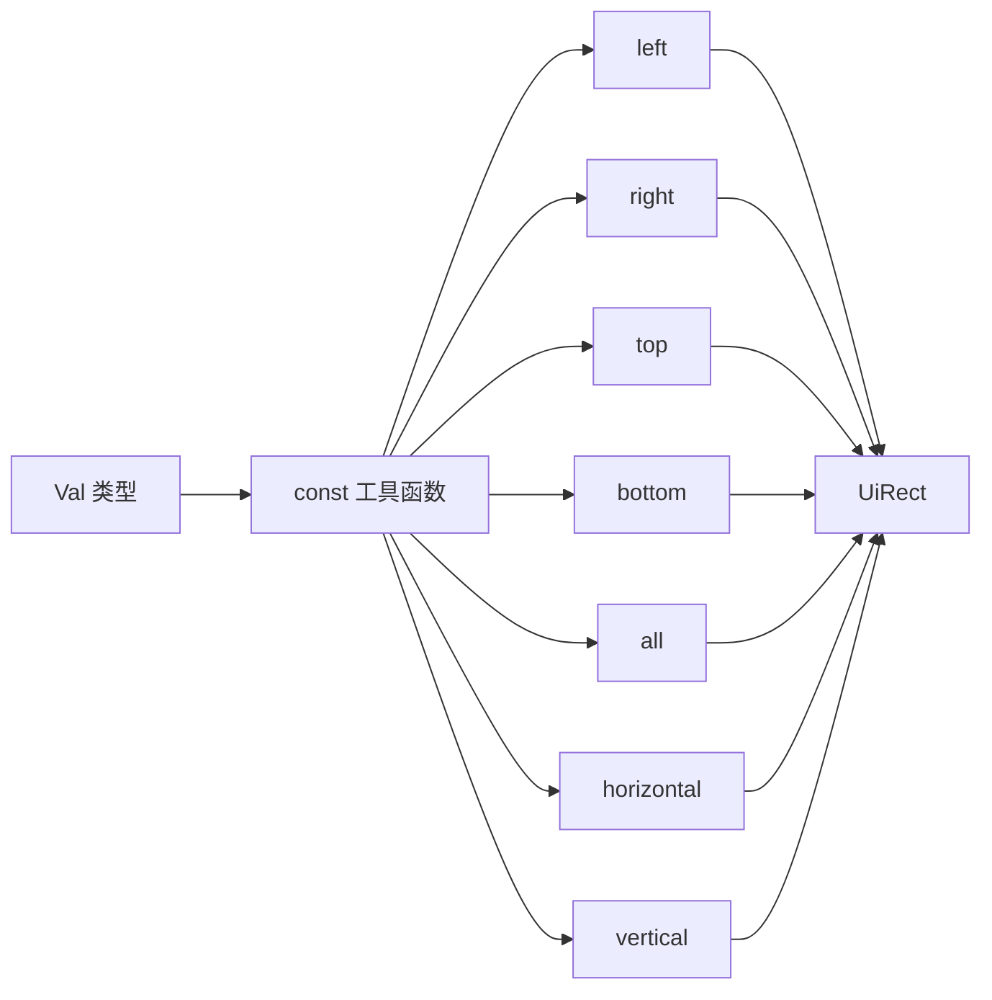

+++
title = "#20956 Constify `Val` functions"
date = "2025-09-10T00:00:00"
draft = false
template = "pull_request_page.html"
in_search_index = false

[extra]
current_language = "zh-cn"
available_languages = {"en" = { name = "English", url = "/pull_request/bevy/2025-09/pr-20956-en-20250910" }, "zh-cn" = { name = "中文", url = "/pull_request/bevy/2025-09/pr-20956-zh-cn-20250910" }}
+++

# Title: Constify `Val` functions

## 基本信息
- **标题**: Constify `Val` functions
- **PR链接**: https://github.com/bevyengine/bevy/pull/20956  
- **作者**: ickshonpe
- **状态**: 已合并
- **标签**: D-Trivial, A-UI, C-Usability, S-Ready-For-Final-Review
- **创建时间**: 2025-09-10T22:08:24Z
- **合并时间**: 2025-09-10T22:56:31Z
- **合并者**: alice-i-cecile

## 描述翻译
# 目标

将这些 `Val` 函数常量化 (constify)

## 这个PR的故事

这个PR解决了一个简单但重要的优化问题：让Bevy UI系统中的`Val`类型的工具函数能够在编译时求值。`Val`是Bevy UI布局系统中的一个枚举类型，用于表示各种尺寸值，包括像素值、百分比、自动布局等。

问题的核心在于，虽然这些工具函数（如`left()`, `right()`, `top()`, `bottom()`等）只是简单地构造`UiRect`对象，但它们没有被标记为`const`，这意味着无法在编译时使用这些函数创建常量表达式。

开发者采用了最直接的解决方案：为这些函数添加`const`关键字。这些函数都是纯函数，不修改任何状态，只是基于输入值返回新的`UiRect`实例，完全符合Rust中const函数的要求。

从技术实现角度看，这个修改涉及7个方法的签名变更：

```rust
// 修改前:
pub fn left(self) -> UiRect

// 修改后:  
pub const fn left(self) -> UiRect
```

每个方法都遵循相同的模式：接收一个`Val`值，返回一个只在特定方向设置该值的`UiRect`，其他方向保持`Val::ZERO`。由于`UiRect::left()`等构造函数本身已经是const函数，这些包装函数也可以安全地标记为const。

这个修改的影响是让开发者能够在const上下文或静态声明中使用这些便捷方法，例如：

```rust
const LEFT_MARGIN: UiRect = Val::Px(10.0).left();
const HORIZONTAL_PADDING: UiRect = Val::Percent(5.0).horizontal();
```

这种优化虽然微小，但符合Rust的最佳实践，允许更多的编译时计算，减少运行时开销，同时保持代码的简洁性和可读性。

## 视觉表示



## 关键文件变更

- `crates/bevy_ui/src/geometry.rs` (+7/-7)

这个文件包含了`Val`类型的实现，修改内容是将7个返回`UiRect`的方法从普通函数改为const函数：

```rust
// 修改前:
pub fn left(self) -> UiRect {
    UiRect::left(self)
}

// 修改后:
pub const fn left(self) -> UiRect {
    UiRect::left(self)
}
```

同样的修改应用于以下方法：
- `right()`
- `top()` 
- `bottom()`
- `all()`
- `horizontal()`
- `vertical()`

这些修改使得这些方法可以在编译时求值，提高了代码的灵活性和性能。

## 扩展阅读

- [Rust const functions 文档](https://doc.rust-lang.org/reference/const_eval.html)
- [Bevy UI 系统指南](https://bevy-cheatbook.github.io/ui.html)
- [Rust 编译时计算模式](https://doc.rust-lang.org/std/keyword.const.html)

# 完整代码差异

```diff
diff --git a/crates/bevy_ui/src/geometry.rs b/crates/bevy_ui/src/geometry.rs
index f533870521423..ae4e274876333 100644
--- a/crates/bevy_ui/src/geometry.rs
+++ b/crates/bevy_ui/src/geometry.rs
@@ -182,7 +182,7 @@ impl Val {
     /// assert_eq!(ui_rect.top, Val::ZERO);
     /// assert_eq!(ui_rect.bottom, Val::ZERO);
     /// ```
-    pub fn left(self) -> UiRect {
+    pub const fn left(self) -> UiRect {
         UiRect::left(self)
     }
 
@@ -202,7 +202,7 @@ impl Val {
     /// assert_eq!(ui_rect.top, Val::ZERO);
     /// assert_eq!(ui_rect.bottom, Val::ZERO);
     /// ```
-    pub fn right(self) -> UiRect {
+    pub const fn right(self) -> UiRect {
         UiRect::right(self)
     }
 
@@ -222,7 +222,7 @@ impl Val {
     /// assert_eq!(ui_rect.top, Val::Px(1.));
     /// assert_eq!(ui_rect.bottom, Val::ZERO);
     /// ```
-    pub fn top(self) -> UiRect {
+    pub const fn top(self) -> UiRect {
         UiRect::top(self)
     }
 
@@ -242,7 +242,7 @@ impl Val {
     /// assert_eq!(ui_rect.top, Val::ZERO);
     /// assert_eq!(ui_rect.bottom, Val::Px(1.));
     /// ```
-    pub fn bottom(self) -> UiRect {
+    pub const fn bottom(self) -> UiRect {
         UiRect::bottom(self)
     }
 
@@ -260,7 +260,7 @@ impl Val {
     /// assert_eq!(ui_rect.top, Val::Px(1.));
     /// assert_eq!(ui_rect.bottom, Val::Px(1.));
     /// ```
-    pub fn all(self) -> UiRect {
+    pub const fn all(self) -> UiRect {
         UiRect::all(self)
     }
 
@@ -279,7 +279,7 @@ impl Val {
     /// assert_eq!(ui_rect.top, Val::ZERO);
     /// assert_eq!(ui_rect.bottom, Val::ZERO);
     /// ```
-    pub fn horizontal(self) -> UiRect {
+    pub const fn horizontal(self) -> UiRect {
         UiRect::horizontal(self)
     }
 
@@ -298,7 +298,7 @@ impl Val {
     /// assert_eq!(ui_rect.top, Val::Px(1.));
     /// assert_eq!(ui_rect.bottom, Val::Px(1.));
     /// ```
-    pub fn vertical(self) -> UiRect {
+    pub const fn vertical(self) -> UiRect {
         UiRect::vertical(self)
     }
 }
```