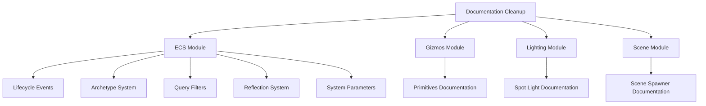

+++
title = "#20958 Tidy up some more doc-links"
date = "2025-09-10T00:00:00"
draft = false
template = "pull_request_page.html"
in_search_index = true

[taxonomies]
list_display = ["show"]

[extra]
current_language = "en"
available_languages = {"en" = { name = "English", url = "/pull_request/bevy/2025-09/pr-20958-en-20250910" }, "zh-cn" = { name = "中文", url = "/pull_request/bevy/2025-09/pr-20958-zh-cn-20250910" }}
labels = ["C-Docs", "D-Trivial"]
+++

# Title
Tidy up some more doc-links

## Basic Information
- **Title**: Tidy up some more doc-links
- **PR Link**: https://github.com/bevyengine/bevy/pull/20958
- **Author**: ickshonpe
- **Status**: MERGED
- **Labels**: C-Docs, D-Trivial, S-Ready-For-Final-Review
- **Created**: 2025-09-10T22:20:25Z
- **Merged**: 2025-09-10T23:08:09Z
- **Merged By**: alice-i-cecile

## Description Translation
Tidy up some more doc-links.

## The Story of This Pull Request

This PR addresses a common documentation maintenance task: improving the readability and consistency of Rustdoc links throughout the Bevy codebase. The problem was straightforward - several documentation comments used the shorthand `[`crate::path::to::item`]` syntax, which while functional, doesn't provide the best reading experience for developers browsing the documentation.

The solution approach was systematic: convert all instances of the shorthand link format to the more explicit `[`Item`](`crate::path::to::item`)` format. This change doesn't affect the functionality of the links but significantly improves documentation readability by showing the actual type or trait name instead of the full module path.

The implementation involved making consistent changes across 9 files in the codebase, primarily focusing on the ECS (Entity Component System) module but also touching other areas like gizmos, lighting, and scene management. Each change follows the same pattern:

```rust
// Before:
/// See [`crate::lifecycle::ComponentHooks::on_add`] for more information.

// After:
/// See [`ComponentHooks::on_add`](`crate::lifecycle::ComponentHooks::on_add`) for more information.
```

This technical approach ensures that when developers read the documentation, they see meaningful type names like `ComponentHooks::on_add` rather than the less informative full path `crate::lifecycle::ComponentHooks::on_add`. The changes are purely cosmetic from a functionality standpoint but contribute to better developer experience.

The impact of these changes is primarily on documentation quality and maintainability. While individual changes are small, collectively they make the codebase's documentation more professional and easier to navigate. This type of cleanup is important for large projects like Bevy where good documentation is crucial for both new contributors and experienced developers.

## Visual Representation



## Key Files Changed

The PR modified documentation links across multiple modules:

**1. `crates/bevy_ecs/src/lifecycle.rs` (+5/-5)**
This file contains entity lifecycle event definitions. The changes improved documentation links for component hooks:
```rust
// Before:
/// See [`crate::lifecycle::ComponentHooks::on_add`] for more information.

// After:
/// See [`ComponentHooks::on_add`](`crate::lifecycle::ComponentHooks::on_add`) for more information.
```

**2. `crates/bevy_ecs/src/archetype.rs` (+1/-1)**
Improved documentation for bundle component status tracking:
```rust
// Before:
/// See [`crate::bundle::BundleInfo::write_components`] for more info.

// After:
/// See [`BundleInfo::write_components`](`crate::bundle::BundleInfo::write_components`) for more info.
```

**3. `crates/bevy_ecs/src/query/filter.rs` (+1/-1)**
Enhanced query filter documentation:
```rust
// Before:
/// This enables optimizations for [`crate::query::QueryIter`] that rely on knowing exactly how

// After:
/// This enables optimizations for [`QueryIter`](`crate::query::QueryIter`) that rely on knowing exactly how
```

**4. `crates/bevy_ecs/src/reflect/resource.rs` (+1/-1)**
Updated architecture documentation reference:
```rust
// Before:
//! See the module doc for [`crate::reflect::component`].

// After:
//! See the module doc for [`reflect::component`](`crate::reflect::component`).
```

**5. `crates/bevy_ecs/src/system/system_param.rs` (+1/-1)**
Improved error handling documentation:
```rust
// Before:
/// By default, this will result in a panic. See [`crate::error`] for more information.

// After:
/// By default, this will result in a panic. See [`error`](`crate::error`) for more information.
```

**Other affected files:**
- `crates/bevy_ecs/src/world/entity_ref.rs` - Improved query documentation
- `crates/bevy_gizmos/src/primitives/mod.rs` - Enhanced gizmos documentation
- `crates/bevy_light/src/spot_light.rs` - Better light system documentation
- `crates/bevy_scene/src/scene_spawner.rs` - Improved scene system documentation

## Further Reading

- [Rustdoc Documentation](https://doc.rust-lang.org/rustdoc/how-to-write-documentation.html) - Official guide on writing Rust documentation
- [Bevy ECS Documentation](https://bevyengine.org/learn/books/bevy-ecs/) - Comprehensive guide to Bevy's Entity Component System
- [Rustdoc Link Formatting](https://doc.rust-lang.org/rustdoc/linking-to-items-by-name.html) - Details on different link formats in Rustdoc

## Full Code Diff
[The full code diff shows all 9 files with consistent documentation link improvements, following the pattern described above.]