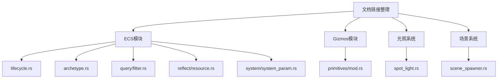

+++
title = "#20958 Tidy up some more doc-links"
date = "2025-09-10T00:00:00"
draft = false
template = "pull_request_page.html"
in_search_index = false

[extra]
current_language = "zh-cn"
available_languages = {"en" = { name = "English", url = "/pull_request/bevy/2025-09/pr-20958-en-20250910" }, "zh-cn" = { name = "中文", url = "/pull_request/bevy/2025-09/pr-20958-zh-cn-20250910" }}
+++

# Tidy up some more doc-links

## 基本信息
- **标题**: Tidy up some more doc-links
- **PR链接**: https://github.com/bevyengine/bevy/pull/20958
- **作者**: ickshonpe
- **状态**: 已合并
- **标签**: C-Docs, D-Trivial, S-Ready-For-Final-Review
- **创建时间**: 2025-09-10T22:20:25Z
- **合并时间**: 2025-09-10T23:08:09Z
- **合并者**: alice-i-cecile

## 描述翻译
整理更多的文档链接。

## 这个Pull Request的故事

这个PR是一个典型的文档维护任务，专注于改进Bevy引擎代码库中的文档链接格式。虽然看起来是一个简单的修改，但它体现了良好的代码维护实践和对文档一致性的关注。

问题的核心在于Rust文档注释中的链接格式不一致。在Rust的文档系统中，可以使用特殊的链接语法来引用其他模块、类型或函数。然而，在代码库的不同地方，这些链接的写法存在差异，有些使用了简写形式，有些则使用了完整形式。

开发者注意到代码库中存在多种不同的文档链接格式，这降低了文档的一致性和可读性。虽然这些链接在功能上是等价的，但统一的格式能让文档更加专业和易于维护。

解决方案很简单但有效：将所有使用简写格式的文档链接转换为标准的完整格式。具体来说，将形如`[`crate::module::Type`]`的链接改为`[`Type`](`crate::module::Type`)`格式。这种格式更明确地显示了链接文本和目标，提高了可读性。

从技术实现角度看，这个PR涉及9个文件的修改，全部是文档注释的更新。这些修改分布在Bevy引擎的不同模块中，包括ECS（实体组件系统）、gizmos（可视化工具）、光照系统和场景系统等。

例如，在`bevy_ecs/src/lifecycle.rs`文件中，有多个事件类型的文档链接被更新：

```rust
// 修改前:
/// See [`crate::lifecycle::ComponentHooks::on_add`] for more information.

// 修改后:
/// See [`ComponentHooks::on_add`](`crate::lifecycle::ComponentHooks::on_add`) for more information.
```

这种修改虽然简单，但有几个重要好处：
1. 提高了文档的一致性，所有链接都遵循相同的格式
2. 增强了可读性，链接文本明确显示了引用的类型名称
3. 保持了IDE和文档生成工具的兼容性

在`bevy_ecs/src/query/filter.rs`中的另一个例子：

```rust
// 修改前:
/// This enables optimizations for [`crate::query::QueryIter`] that rely on knowing exactly how

// 修改后:
/// This enables optimizations for [`QueryIter`](`crate::query::QueryIter`) that rely on knowing exactly how
```

这个PR的影响主要体现在开发体验和代码维护方面。虽然不会改变任何运行时行为，但它使代码库的文档更加一致和专业。对于新贡献者来说，一致的文档格式降低了学习成本；对于维护者来说，统一的格式使文档更易于维护和更新。

从工程实践的角度看，这种看似微小的改进实际上很重要。它体现了对代码质量的持续关注，即使是文档这样的"次要"方面也值得认真对待。这种态度有助于保持大型代码库的长期健康性。

## 可视化表示



## 关键文件更改

以下是此PR中修改的主要文件：

- `crates/bevy_ecs/src/lifecycle.rs` (+5/-5)
- `crates/bevy_ecs/src/archetype.rs` (+1/-1)
- `crates/bevy_ecs/src/query/filter.rs` (+1/-1)
- `crates/bevy_ecs/src/reflect/resource.rs` (+1/-1)
- `crates/bevy_ecs/src/system/system_param.rs` (+1/-1)

### 文件详情

**crates/bevy_ecs/src/lifecycle.rs**
```rust
// 修改前:
/// See [`crate::lifecycle::ComponentHooks::on_add`] for more information.

// 修改后:
/// See [`ComponentHooks::on_add`](`crate::lifecycle::ComponentHooks::on_add`) for more information.
```
这个文件包含了5处类似的修改，统一了组件生命周期事件的文档链接格式。

**crates/bevy_ecs/src/archetype.rs**
```rust
// 修改前:
/// See [`crate::bundle::BundleInfo::write_components`] for more info.

// 修改后:
/// See [`BundleInfo::write_components`](`crate::bundle::BundleInfo::write_components`) for more info.
```
更新了Bundle组件状态报告的文档链接。

**crates/bevy_ecs/src/query/filter.rs**
```rust
// 修改前:
/// This enables optimizations for [`crate::query::QueryIter`] that rely on knowing exactly how

// 修改后:
/// This enables optimizations for [`QueryIter`](`crate::query::QueryIter`) that rely on knowing exactly how
```
改进了查询过滤器文档中的链接格式。

**crates/bevy_ecs/src/reflect/resource.rs**
```rust
// 修改前:
//! See the module doc for [`crate::reflect::component`].

// 修改后:
//! See the module doc for [`reflect::component`](`crate::reflect::component`).
```
更新了反射资源模块架构文档中的链接。

**crates/bevy_ecs/src/system/system_param.rs**
```rust
// 修改前:
/// By default, this will result in a panic. See [`crate::error`] for more information.

// 修改后:
/// By default, this will result in a panic. See [`error`](`crate::error`) for more information.
```
统一了系统参数验证错误文档中的链接格式。

## 延伸阅读

对于想要了解更多关于Rust文档系统和链接格式的开发者，可以参考以下资源：

1. [Rust文档注释指南](https://doc.rust-lang.org/rustdoc/how-to-write-documentation.html)
2. [Rustdoc链接语法](https://doc.rust-lang.org/rustdoc/linking-to-items-by-name.html)
3. [Bevy贡献指南](https://github.com/bevyengine/bevy/blob/main/CONTRIBUTING.md)

# 完整代码差异
<details>
<summary>显示完整差异</summary>
<div>

```diff
diff --git a/crates/bevy_ecs/src/archetype.rs b/crates/bevy_ecs/src/archetype.rs
index c6fa3dc81dd53..9a9f80aa0d995 100644
--- a/crates/bevy_ecs/src/archetype.rs
+++ b/crates/bevy_ecs/src/archetype.rs
@@ -165,7 +165,7 @@ impl ArchetypeAfterBundleInsert {
 
 /// This trait is used to report the status of [`Bundle`](crate::bundle::Bundle) components
 /// being inserted into a given entity, relative to that entity's original archetype.
-/// See [`crate::bundle::BundleInfo::write_components`] for more info.
+/// See [`BundleInfo::write_components`](`crate::bundle::BundleInfo::write_components`) for more info.
 pub(crate) trait BundleComponentStatus {
     /// Returns the Bundle's component status for the given "bundle index".
     ///
diff --git a/crates/bevy_ecs/src/lifecycle.rs b/crates/bevy_ecs/src/lifecycle.rs
index cc16250dfc978..6a36eca8329ac 100644
--- a/crates/bevy_ecs/src/lifecycle.rs
+++ b/crates/bevy_ecs/src/lifecycle.rs
@@ -327,7 +327,7 @@ pub const DESPAWN: EventKey = EventKey(ComponentId::new(4));
 
 /// Trigger emitted when a component is inserted onto an entity that does not already have that
 /// component. Runs before `Insert`.
-/// See [`crate::lifecycle::ComponentHooks::on_add`] for more information.
+/// See [`ComponentHooks::on_add`](`crate::lifecycle::ComponentHooks::on_add`) for more information.
 #[derive(Debug, Clone, EntityEvent)]
 #[entity_event(trigger = EntityComponentsTrigger<'a>)]
 #[cfg_attr(feature = "bevy_reflect", derive(Reflect))]
@@ -340,7 +340,7 @@ pub struct Add {
 
 /// Trigger emitted when a component is inserted, regardless of whether or not the entity already
 /// had that component. Runs after `Add`, if it ran.
-/// See [`crate::lifecycle::ComponentHooks::on_insert`] for more information.
+/// See [`ComponentHooks::on_insert`](`crate::lifecycle::ComponentHooks::on_insert`) for more information.
 #[derive(Debug, Clone, EntityEvent)]
 #[entity_event(trigger = EntityComponentsTrigger<'a>)]
 #[cfg_attr(feature = "bevy_reflect", derive(Reflect))]
@@ -355,7 +355,7 @@ pub struct Insert {
 /// of whether or not it is later replaced.
 ///
 /// Runs before the value is replaced, so you can still access the original component data.
-/// See [`crate::lifecycle::ComponentHooks::on_replace`] for more information.
+/// See [`ComponentHooks::on_replace`](`crate::lifecycle::ComponentHooks::on_replace`) for more information.
 #[derive(Debug, Clone, EntityEvent)]
 #[entity_event(trigger = EntityComponentsTrigger<'a>)]
 #[cfg_attr(feature = "bevy_reflect", derive(Reflect))]
@@ -368,7 +368,7 @@ pub struct Replace {
 
 /// Trigger emitted when a component is removed from an entity, and runs before the component is
 /// removed, so you can still access the component data.
-/// See [`crate::lifecycle::ComponentHooks::on_remove`] for more information.
+/// See [`ComponentHooks::on_remove`](`crate::lifecycle::ComponentHooks::on_remove`) for more information.
 #[derive(Debug, Clone, EntityEvent)]
 #[entity_event(trigger = EntityComponentsTrigger<'a>)]
 #[cfg_attr(feature = "bevy_reflect", derive(Reflect))]
@@ -380,7 +380,7 @@ pub struct Remove {
 }
 
 /// [`EntityEvent`] emitted for each component on an entity when it is despawned.
-/// See [`crate::lifecycle::ComponentHooks::on_despawn`] for more information.
+/// See [`ComponentHooks::on_despawn`](`crate::lifecycle::ComponentHooks::on_despawn`) for more information.
 #[derive(Debug, Clone, EntityEvent)]
 #[entity_event(trigger = EntityComponentsTrigger<'a>)]
 #[cfg_attr(feature = "bevy_reflect", derive(Reflect))]
diff --git a/crates/bevy_ecs/src/query/filter.rs b/crates/bevy_ecs/src/query/filter.rs
index dbc6483d8021e..4ebc38098503a 100644
--- a/crates/bevy_ecs/src/query/filter.rs
+++ b/crates/bevy_ecs/src/query/filter.rs
@@ -84,7 +84,7 @@ pub unsafe trait QueryFilter: WorldQuery {
     /// Returns true if (and only if) this Filter relies strictly on archetypes to limit which
     /// components are accessed by the Query.
     ///
-    /// This enables optimizations for [`crate::query::QueryIter`] that rely on knowing exactly how
+    /// This enables optimizations for [`QueryIter`](`crate::query::QueryIter`) that rely on knowing exactly how
     /// many elements are being iterated (such as `Iterator::collect()`).
     ///
     /// If this is `true`, then [`QueryFilter::filter_fetch`] must always return true.
diff --git a/crates/bevy_ecs/src/reflect/resource.rs b/crates/bevy_ecs/src/reflect/resource.rs
index 60cf7bc609169..16362b046f87f 100644
--- a/crates/bevy_ecs/src/reflect/resource.rs
+++ b/crates/bevy_ecs/src/reflect/resource.rs
@@ -2,7 +2,7 @@
 //!
 //! # Architecture
 //!
-//! See the module doc for [`crate::reflect::component`].
+//! See the module doc for [`reflect::component`](`crate::reflect::component`).
 
 use crate::{
     change_detection::Mut,
diff --git a/crates/bevy_ecs/src/system/system_param.rs b/crates/bevy_ecs/src/system/system_param.rs
index d9adab6fe34b7..1b4286c1f6662 100644
--- a/crates/bevy_ecs/src/system/system_param.rs
+++ b/crates/bevy_ecs/src/system/system_param.rs
@@ -2777,7 +2777,7 @@ pub struct SystemParamValidationError {
     /// Whether the system should be skipped.
     ///
     /// If `false`, the error should be handled.
-    /// By default, this will result in a panic. See [`crate::error`] for more information.
+    /// By default, this will result in a panic. See [`error`](`crate::error`) for more information.
     ///
     /// This is the default behavior, and is suitable for system params that should *always* be valid,
     /// either because sensible fallback behavior exists (like [`Query`]) or because
diff --git a/crates/bevy_ecs/src/world/entity_ref.rs b/crates/bevy_ecs/src/world/entity_ref.rs
index b4dd981f07f61..e1170d03950c7 100644
--- a/crates/bevy_ecs/src/world/entity_ref.rs
+++ b/crates/bevy_ecs/src/world/entity_ref.rs
@@ -4372,7 +4372,7 @@ unsafe impl<B: Bundle> EntityEquivalent for EntityRefExcept<'_, '_, B> {}
 /// *all* components of an entity, while still allowing you to consult other
 /// queries that might match entities that this query also matches. If you don't
 /// need access to all components, prefer a standard query with a
-/// [`crate::query::Without`] filter.
+/// [`Without`](`crate::query::Without`) filter.
 pub struct EntityMutExcept<'w, 's, B>
 where
     B: Bundle,
diff --git a/crates/bevy_gizmos/src/primitives/mod.rs b/crates/bevy_gizmos/src/primitives/mod.rs
index 86e2c4511f3c1..419ef50217450 100644
--- a/crates/bevy_gizmos/src/primitives/mod.rs
+++ b/crates/bevy_gizmos/src/primitives/mod.rs
@@ -1,4 +1,4 @@
-//! A module for rendering each of the 2D and 3D [`bevy_math::primitives`] with [`crate::prelude::Gizmos`].
+//! A module for rendering each of the 2D and 3D [`bevy_math::primitives`] with [`Gizmos`](`crate::prelude::Gizmos`).
 
 pub mod dim2;
 pub mod dim3;
diff --git a/crates/bevy_light/src/spot_light.rs b/crates/bevy_light/src/spot_light.rs
index e4bc5696ac809..00026ff0328e9 100644
--- a/crates/bevy_light/src/spot_light.rs
+++ b/crates/bevy_light/src/spot_light.rs
@@ -18,7 +18,7 @@ use crate::cluster::{ClusterVisibilityClass, GlobalVisibleClusterableObjects};
 /// shines light only in a given direction. The direction is taken from
 /// the transform, and can be specified with [`Transform::looking_at`](Transform::looking_at).
 ///
-/// To control the resolution of the shadow maps, use the [`crate::DirectionalLightShadowMap`] resource.
+/// To control the resolution of the shadow maps, use the [`DirectionalLightShadowMap`](`crate::DirectionalLightShadowMap`)  resource.
 #[derive(Component, Debug, Clone, Copy, Reflect)]
 #[reflect(Component, Default, Debug, Clone)]
 #[require(Frustum, VisibleMeshEntities, Transform, Visibility, VisibilityClass)]
diff --git a/crates/bevy_scene/src/scene_spawner.rs b/crates/bevy_scene/src/scene_spawner.rs
index 76b47d62d86f2..a7d1f51ea88cd 100644
--- a/crates/bevy_scene/src/scene_spawner.rs
+++ b/crates/bevy_scene/src/scene_spawner.rs
@@ -22,7 +22,7 @@ use bevy_ecs::{
     system::{Commands, Query},
 };
 
-/// Triggered on a scene's parent entity when [`crate::SceneInstance`] becomes ready to use.
+/// Triggered on a scene's parent entity when [`SceneInstance`](`crate::SceneInstance`) becomes ready to use.
 ///
 /// See also [`On`], [`SceneSpawner::instance_is_ready`].
 ///
```

</div>
</details>