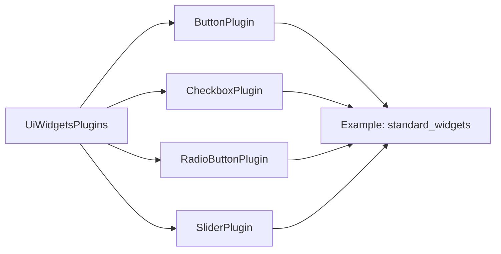

+++
title = "#20964 Rename `WidgetBehaviorPlugins` to `UIWidgetsPlugins`"
date = "2025-09-11T00:00:00"
draft = false
template = "pull_request_page.html"
in_search_index = true

[taxonomies]
list_display = ["show"]

[extra]
current_language = "en"
available_languages = {"en" = { name = "English", url = "/pull_request/bevy/2025-09/pr-20964-en-20250911" }, "zh-cn" = { name = "中文", url = "/pull_request/bevy/2025-09/pr-20964-zh-cn-20250911" }}
labels = ["D-Trivial", "A-UI"]
+++

# Rename `WidgetBehaviorPlugins` to `UIWidgetsPlugins`

## Basic Information
- **Title**: Rename `WidgetBehaviorPlugins` to `UIWidgetsPlugins`
- **PR Link**: https://github.com/bevyengine/bevy/pull/20964
- **Author**: Zeophlite
- **Status**: MERGED
- **Labels**: D-Trivial, A-UI, S-Ready-For-Final-Review
- **Created**: 2025-09-11T09:24:26Z
- **Merged**: 2025-09-11T18:37:42Z
- **Merged By**: alice-i-cecile

## Description Translation
# Objective

- Fixes #20962

## Testing

- `feathers`, `virtual_keyboard`, `standard_widgets`, `standard_widgets_observers` examples

## The Story of This Pull Request

This PR addresses a naming inconsistency in Bevy's UI widget system. The issue (#20962) identified that the `WidgetBehaviorPlugins` struct name didn't follow the established naming conventions for plugin groups in the Bevy ecosystem.

The problem was straightforward: while most plugin groups in Bevy use descriptive names that clearly indicate their purpose and follow consistent patterns, `WidgetBehaviorPlugins` stood out as an exception. This inconsistency could cause confusion for developers working with the UI system, especially when trying to discover available plugin groups through auto-completion or documentation.

The solution implemented a simple but effective rename from `WidgetBehaviorPlugins` to `UiWidgetsPlugins`. This change aligns with Bevy's naming conventions where:
- Plugin group names typically end with "Plugins"
- The prefix clearly indicates the system domain (UI widgets in this case)
- The name follows camel case conventions

The implementation required changes across multiple files:
1. The main definition in `crates/bevy_ui_widgets/src/lib.rs`
2. Four example files that demonstrated usage of these plugins

Each change followed the same pattern: replacing the old struct name with the new one in both import statements and plugin registration calls. The consistency of these changes across all affected files demonstrates the systematic approach taken to ensure complete coverage.

From a technical perspective, this rename doesn't change any functionality - it's purely a naming improvement. However, such consistency improvements are valuable for maintainability and developer experience. The new name `UiWidgetsPlugins` more clearly communicates that this is a plugin group for UI widgets, making the codebase more intuitive for new contributors.

The testing approach was practical and focused: running the affected examples (`feathers`, `virtual_keyboard`, `standard_widgets`, and `standard_widgets_observers`) to verify that the rename didn't break any functionality. This minimal testing was appropriate given the nature of the change.

## Visual Representation



## Key Files Changed

### `crates/bevy_ui_widgets/src/lib.rs`
**Change**: Renamed struct from `WidgetBehaviorPlugins` to `UiWidgetsPlugins`
**Why**: To align with Bevy's plugin naming conventions and improve clarity

```rust
// Before:
pub struct WidgetBehaviorPlugins;

impl PluginGroup for WidgetBehaviorPlugins {
    fn build(self) -> PluginGroupBuilder {
        PluginGroupBuilder::start::<Self>()
            .add(ButtonPlugin)
            // ... other plugins
    }
}

// After:
pub struct UiWidgetsPlugins;

impl PluginGroup for UiWidgetsPlugins {
    fn build(self) -> PluginGroupBuilder {
        PluginGroupBuilder::start::<Self>()
            .add(ButtonPlugin)
            // ... other plugins
    }
}
```

### Example files (`feathers.rs`, `standard_widgets.rs`, `standard_widgets_observers.rs`, `virtual_keyboard.rs`)
**Change**: Updated imports and usage from `WidgetBehaviorPlugins` to `UiWidgetsPlugins`
**Why**: To maintain consistency with the renamed struct

```rust
// Before:
use bevy::ui_widgets::WidgetBehaviorPlugins;
// ...
.add_plugins(WidgetBehaviorPlugins)

// After:
use bevy::ui_widgets::UiWidgetsPlugins;
// ...
.add_plugins(UiWidgetsPlugins)
```

## Further Reading

- [Bevy Plugin System Documentation](https://bevyengine.org/learn/book/getting-started/plugins/)
- [Rust API Guidelines on Naming](https://rust-lang.github.io/api-guidelines/naming.html)
- [Bevy Contributing Guidelines](https://github.com/bevyengine/bevy/blob/main/CONTRIBUTING.md)