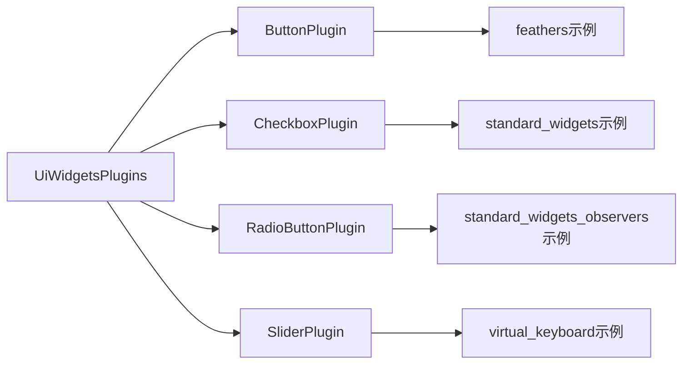

+++
title = "#20964 Rename `WidgetBehaviorPlugins` to `UIWidgetsPlugins"
date = "2025-09-11T00:00:00"
draft = false
template = "pull_request_page.html"
in_search_index = false

[extra]
current_language = "zh-cn"
available_languages = {"en" = { name = "English", url = "/pull_request/bevy/2025-09/pr-20964-en-20250911" }, "zh-cn" = { name = "中文", url = "/pull_request/bevy/2025-09/pr-20964-zh-cn-20250911" }}
+++

# 标题

## 基本信息
- **标题**: Rename `WidgetBehaviorPlugins` to `UIWidgetsPlugins`
- **PR链接**: https://github.com/bevyengine/bevy/pull/20964
- **作者**: Zeophlite
- **状态**: 已合并
- **标签**: D-Trivial, A-UI, S-Ready-For-Final-Review
- **创建时间**: 2025-09-11T09:24:26Z
- **合并时间**: 2025-09-11T18:37:42Z
- **合并者**: alice-i-cecile

## 描述翻译
# 目标

- 修复 #20962

## 测试

- `feathers`, `virtual_keyboard`, `standard_widgets`, `standard_widgets_observers` 示例

## 本次PR的故事

这个PR解决了一个简单的命名不一致问题。在Bevy引擎的UI组件系统中，存在一个插件组命名与其它相关组件命名模式不匹配的情况。

问题的核心在于`WidgetBehaviorPlugins`这个名称没有遵循Bevy UI系统中已有的命名约定。在Bevy的UI模块中，大多数相关组件和插件都使用"UI"前缀或"Ui"作为命名的一部分，以保持命名一致性并明确标识其属于UI系统。

开发者通过将`WidgetBehaviorPlugins`重命名为`UiWidgetsPlugins`来解决这个问题。这个修改虽然简单，但对于维护代码库的整洁性和一致性很重要。新的名称更好地反映了这个插件组的实际功能——它提供的是UI小部件(UI widgets)相关的功能，而不仅仅是"小部件行为"。

修改涉及两个主要部分：
1. 在`crates/bevy_ui_widgets/src/lib.rs`中修改结构体定义和实现
2. 在四个示例文件中更新对这个插件组的引用

这种类型的重命名在大型代码库中很常见，目的是保持命名一致性，使新开发者更容易理解代码结构。虽然修改本身很简单，但需要确保所有使用该名称的地方都同步更新，否则会导致编译错误。

测试方面，作者验证了四个UI示例(`feathers`, `virtual_keyboard`, `standard_widgets`, `standard_widgets_observers`)都能正常工作，确认了重命名没有破坏现有功能。

## 视觉表示



## 关键文件更改

### `crates/bevy_ui_widgets/src/lib.rs`
**修改描述**: 将插件组的主要结构体重命名以符合命名约定

```rust
// 修改前:
pub struct WidgetBehaviorPlugins;

impl PluginGroup for WidgetBehaviorPlugins {
    fn build(self) -> PluginGroupBuilder {
        PluginGroupBuilder::start::<Self>()
            .add(ButtonPlugin)
// 修改后:
pub struct UiWidgetsPlugins;

impl PluginGroup for UiWidgetsPlugins {
    fn build(self) -> PluginGroupBuilder {
        PluginGroupBuilder::start::<Self>()
            .add(ButtonPlugin)
```

### 示例文件更新
所有四个UI示例文件都进行了相同的导入和使用方式修改：

```rust
// 修改前:
use bevy::ui_widgets::WidgetBehaviorPlugins;
// 在插件注册中:
.add_plugins(WidgetBehaviorPlugins)

// 修改后:
use bevy::ui_widgets::UiWidgetsPlugins;
// 在插件注册中:
.add_plugins(UiWidgetsPlugins)
```

**影响的文件**:
- `examples/ui/feathers.rs` (+2/-2)
- `examples/ui/standard_widgets.rs` (+2/-2)
- `examples/ui/standard_widgets_observers.rs` (+2/-2)
- `examples/ui/virtual_keyboard.rs` (+2/-2)

## 完整代码差异

```diff
diff --git a/crates/bevy_ui_widgets/src/lib.rs b/crates/bevy_ui_widgets/src/lib.rs
index da73a04959b14..d809420cbbe9b 100644
--- a/crates/bevy_ui_widgets/src/lib.rs
+++ b/crates/bevy_ui_widgets/src/lib.rs
@@ -29,9 +29,9 @@ use bevy_ecs::entity::Entity;
 
 /// A plugin group that registers the observers for all of the widgets in this crate. If you don't want to
 /// use all of the widgets, you can import the individual widget plugins instead.
-pub struct WidgetBehaviorPlugins;
+pub struct UiWidgetsPlugins;
 
-impl PluginGroup for WidgetBehaviorPlugins {
+impl PluginGroup for UiWidgetsPlugins {
     fn build(self) -> PluginGroupBuilder {
         PluginGroupBuilder::start::<Self>()
             .add(ButtonPlugin)
diff --git a/examples/ui/feathers.rs b/examples/ui/feathers.rs
index cb1abb4bbf77a..493a8bc2ca945 100644
--- a/examples/ui/feathers.rs
+++ b/examples/ui/feathers.rs
@@ -21,7 +21,7 @@ use bevy::{
     ui::{Checked, InteractionDisabled},
     ui_widgets::{
         Activate, Callback, RadioButton, RadioGroup, SliderPrecision, SliderStep, SliderValue,
-        ValueChange, WidgetBehaviorPlugins,
+        UiWidgetsPlugins, ValueChange,
     },
 };
 
@@ -42,7 +42,7 @@ fn main() {
     App::new()
         .add_plugins((
             DefaultPlugins,
-            WidgetBehaviorPlugins,
+            UiWidgetsPlugins,
             InputDispatchPlugin,
             TabNavigationPlugin,
             FeathersPlugin,
diff --git a/examples/ui/standard_widgets.rs b/examples/ui/standard_widgets.rs
index 1934952b5db02..8bcb76ec9b791 100644
--- a/examples/ui/standard_widgets.rs
+++ b/examples/ui/standard_widgets.rs
@@ -11,7 +11,7 @@ use bevy::{
     ui::{Checked, InteractionDisabled, Pressed},
     ui_widgets::{
         Activate, Button, Callback, Checkbox, CoreSliderDragState, RadioButton, RadioGroup, Slider,
-        SliderRange, SliderThumb, SliderValue, TrackClick, ValueChange, WidgetBehaviorPlugins,
+        SliderRange, SliderThumb, SliderValue, TrackClick, UiWidgetsPlugins, ValueChange,
     },
 };
 
@@ -19,7 +19,7 @@ fn main() {
     App::new()
         .add_plugins((
             DefaultPlugins,
-            WidgetBehaviorPlugins,
+            UiWidgetsPlugins,
             InputDispatchPlugin,
             TabNavigationPlugin,
         ))
diff --git a/examples/ui/standard_widgets_observers.rs b/examples/ui/standard_widgets_observers.rs
index 1ff2ca80314aa..54220a0214c38 100644
--- a/examples/ui/standard_widgets_observers.rs
+++ b/examples/ui/standard_widgets_observers.rs
@@ -12,7 +12,7 @@ use bevy::{
     ui::{Checked, InteractionDisabled, Pressed},
     ui_widgets::{
         Activate, Button, Callback, Checkbox, Slider, SliderRange, SliderThumb, SliderValue,
-        ValueChange, WidgetBehaviorPlugins,
+        UiWidgetsPlugins, ValueChange,
     },
 };
 
@@ -20,7 +20,7 @@ fn main() {
     App::new()
         .add_plugins((
             DefaultPlugins,
-            WidgetBehaviorPlugins,
+            UiWidgetsPlugins,
             InputDispatchPlugin,
             TabNavigationPlugin,
         ))
diff --git a/examples/ui/virtual_keyboard.rs b/examples/ui/virtual_keyboard.rs
index 870e153dfa305..9460475129941 100644
--- a/examples/ui/virtual_keyboard.rs
+++ b/examples/ui/virtual_keyboard.rs
@@ -8,14 +8,14 @@ use bevy::{
     },
     input_focus::{tab_navigation::TabNavigationPlugin, InputDispatchPlugin},
     prelude::*,
-    ui_widgets::{Activate, WidgetBehaviorPlugins},
+    ui_widgets::{Activate, UiWidgetsPlugins},
 };
 
 fn main() {
     App::new()
         .add_plugins((
             DefaultPlugins,
-            WidgetBehaviorPlugins,
+            UiWidgetsPlugins,
             InputDispatchPlugin,
             TabNavigationPlugin,
             FeathersPlugin,
```

## 延伸阅读

对于想要了解更多关于Bevy插件系统和命名约定的开发者，可以参考以下资源：

1. [Bevy插件系统文档](https://bevyengine.org/learn/books/plugins/) - 了解Bevy插件的工作原理
2. [Rust命名约定](https://rust-lang.github.io/api-guidelines/naming.html) - Rust官方命名指南
3. [Bevy UI系统](https://bevyengine.org/learn/books/ui/) - Bevy UI组件和插件的详细说明