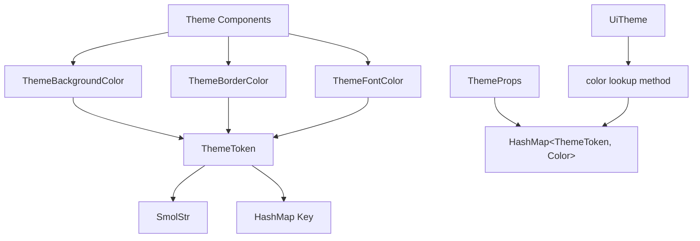

+++
title = "#20969 Feathers theme now uses `ThemeToken(SmolStr)` instread of &'static str"
date = "2025-09-11T00:00:00"
draft = false
template = "pull_request_page.html"
in_search_index = true

[taxonomies]
list_display = ["show"]

[extra]
current_language = "en"
available_languages = {"en" = { name = "English", url = "/pull_request/bevy/2025-09/pr-20969-en-20250911" }, "zh-cn" = { name = "中文", url = "/pull_request/bevy/2025-09/pr-20969-zh-cn-20250911" }}
labels = ["C-Performance", "A-UI"]
+++

# Feathers theme now uses `ThemeToken(SmolStr)` instead of &'static str

## Basic Information
- **Title**: Feathers theme now uses `ThemeToken(SmolStr)` instread of &'static str
- **PR Link**: https://github.com/bevyengine/bevy/pull/20969
- **Author**: viridia
- **Status**: MERGED
- **Labels**: C-Performance, A-UI, S-Ready-For-Final-Review
- **Created**: 2025-09-11T20:47:01Z
- **Merged**: 2025-09-11T23:16:43Z
- **Merged By**: james7132

## Description Translation
Fixes: #20967

EIBTI!

## The Story of This Pull Request

This PR addresses a performance optimization in Bevy's Feathers UI theming system by replacing the use of `&'static str` with a dedicated `ThemeToken` struct that wraps `SmolStr`. The change was motivated by the observation that using string literals as keys in hash maps was inefficient due to the overhead of string hashing and comparisons.

The core issue was that the theming system used `HashMap<String, Color>` to map design tokens to colors, with token constants defined as `&'static str`. Every time a theme lookup occurred, these static strings were converted to `String` instances, requiring allocation and introducing unnecessary overhead. Additionally, using raw strings as map keys meant that hash computations had to process the entire string content each time.

The solution introduces a `ThemeToken` newtype that wraps `SmolStr` - a string type optimized for small strings that can store short strings inline without heap allocation. This approach provides several benefits:

1. **Type safety**: `ThemeToken` is a distinct type rather than a string, preventing accidental misuse
2. **Performance**: `SmolStr` avoids heap allocation for short strings and provides efficient hashing
3. **Memory efficiency**: The small string optimization reduces memory overhead

The implementation required changes across multiple areas of the codebase:
- Definition of a new `ThemeToken` struct in the theme module
- Conversion of all token constants from `&'static str` to `ThemeToken`
- Updates to the `ThemeProps` struct to use `ThemeToken` as map keys instead of `String`
- Modifications to theme component types (`ThemeBackgroundColor`, `ThemeBorderColor`, `ThemeFontColor`) to store `ThemeToken` instead of `&'static str`
- Updates to the dark theme definition to remove unnecessary string conversions

The changes maintain backward compatibility in the API while significantly improving performance. The `ThemeToken` struct implements necessary traits like `Clone`, `PartialEq`, `Eq`, `Hash`, and `Reflect` to ensure it works seamlessly with Bevy's ECS and reflection systems.

One notable aspect of this implementation is the use of `SmolStr::new_static()` for creating token constants, which allows the underlying strings to remain as static references while benefiting from `SmolStr`'s efficient storage and hashing characteristics.

The performance improvement comes from several factors:
- Elimination of string allocations during theme lookups
- Faster hash computations due to `SmolStr`'s optimized hashing
- Reduced memory footprint for theme token storage
- More efficient equality comparisons

This change follows the principle of making invalid states unrepresentable by using a dedicated type for theme tokens rather than relying on raw strings. It also demonstrates good practice in performance optimization by addressing the fundamental data structure choices rather than applying superficial optimizations.

## Visual Representation



## Key Files Changed

### `crates/bevy_feathers/src/theme.rs` (+46/-15)
This file introduces the new `ThemeToken` struct and updates the theme system to use it:

```rust
// New ThemeToken definition
#[derive(Clone, PartialEq, Eq, Hash, Reflect)]
pub struct ThemeToken(SmolStr);

impl ThemeToken {
    pub const fn new(text: SmolStr) -> Self {
        Self(text)
    }

    pub const fn new_static(text: &'static str) -> Self {
        Self(SmolStr::new_static(text))
    }
}

// Updated ThemeProps with ThemeToken keys
pub struct ThemeProps {
    pub color: HashMap<ThemeToken, Color>,
}

// Updated component definitions
pub struct ThemeBackgroundColor(pub ThemeToken);
pub struct ThemeBorderColor(pub ThemeToken);
pub struct ThemeFontColor(pub ThemeToken);
```

### `crates/bevy_feathers/src/tokens.rs` (+65/-48)
This file converts all token constants from `&'static str` to `ThemeToken`:

```rust
// Before:
pub const WINDOW_BG: &str = "feathers.window.bg";

// After:
pub const WINDOW_BG: ThemeToken = ThemeToken::new_static("feathers.window.bg");
```

### `crates/bevy_feathers/src/dark_theme.rs` (+45/-72)
This file updates the theme definition to remove unnecessary string conversions:

```rust
// Before:
(WINDOW_BG.into(), palette::GRAY_0),

// After:
(WINDOW_BG, palette::GRAY_0),
```

### `crates/bevy_feathers/src/controls/slider.rs` (+2/-2)
This file updates theme lookup calls to pass references to ThemeToken:

```rust
// Before:
let bar_color = theme.color(tokens::SLIDER_BAR);

// After:
let bar_color = theme.color(&tokens::SLIDER_BAR);
```

### `release-content/release-notes/feathers.md` (+2/-2)
This file adds the PR to the release notes:

```markdown
pull_requests: [19730, 19900, 19928, 20237, 20169, 20422, 20350, 20548, 20969]
```

## Further Reading

- [SmolStr documentation](https://docs.rs/smol_str/latest/smol_str/) - Details about the small string optimization library used in this PR
- [Bevy ECS Components](https://bevyengine.org/learn/book/getting-started/ecs/) - Understanding how components work in Bevy's Entity Component System
- [Rust Hash Maps Performance](https://nnethercote.github.io/perf-book/collections.html#hash-maps) - Performance considerations when using hash maps in Rust
- [Newtype Pattern in Rust](https://rust-unofficial.github.io/patterns/patterns/behavioural/newtype.html) - Explanation of the newtype pattern used for ThemeToken