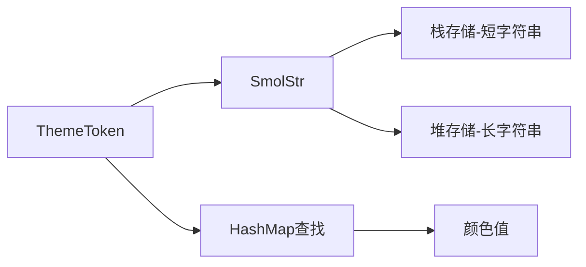

+++
title = "#20969 Feathers theme now uses `ThemeToken(SmolStr)` instread of &'static str"
date = "2025-09-11T00:00:00"
draft = false
template = "pull_request_page.html"
in_search_index = false

[extra]
current_language = "zh-cn"
available_languages = {"en" = { name = "English", url = "/pull_request/bevy/2025-09/pr-20969-en-20250911" }, "zh-cn" = { name = "中文", url = "/pull_request/bevy/2025-09/pr-20969-zh-cn-20250911" }}
+++

# Feathers theme now uses `ThemeToken(SmolStr)` instread of &'static str

## 基本信息
- **标题**: Feathers theme now uses `ThemeToken(SmolStr)` instread of &'static str
- **PR链接**: https://github.com/bevyengine/bevy/pull/20969
- **作者**: viridia
- **状态**: 已合并
- **标签**: C-Performance, A-UI, S-Ready-For-Final-Review
- **创建时间**: 2025-09-11T20:47:01Z
- **合并时间**: 2025-09-11T23:16:43Z
- **合并者**: james7132

## 描述翻译
修复: #20967

EIBTI!

## 本次PR的技术分析

### 问题与背景
这个PR解决了Bevy Feathers UI主题系统中的一个性能问题。原来的实现使用`&'static str`作为主题令牌(token)的键类型，但在存储到HashMap时需要通过`.into()`转换为String。这种转换在每次查找时都会产生堆分配，导致不必要的性能开销。

具体来说，在原来的代码中，主题颜色映射使用的是`HashMap<String, Color>`，而主题令牌常量定义为`&'static str`。这意味着每次进行主题查找时都需要将静态字符串转换为String，产生了不必要的内存分配。

### 解决方案
开发者采用了引入`ThemeToken`包装类型的方案，该类型内部使用`SmolStr`来存储字符串。`SmolStr`是一个优化的小字符串实现，对于短字符串（通常小于等于23字节）可以直接在栈上存储，避免了堆分配，同时对于长字符串也能自动回退到堆分配。

### 实现细节
实现分为几个关键部分：

1. **新增ThemeToken类型**：创建了一个新的`ThemeToken`结构体，包装`SmolStr`并提供必要的trait实现（Display、Debug、Hash、Eq等）。

```rust
#[derive(Clone, PartialEq, Eq, Hash, Reflect)]
pub struct ThemeToken(SmolStr);

impl ThemeToken {
    pub const fn new(text: SmolStr) -> Self {
        Self(text)
    }
    
    pub const fn new_static(text: &'static str) -> Self {
        Self(SmolStr::new_static(text))
    }
}
```

2. **更新主题系统接口**：将`ThemeProps`中的color字段类型从`HashMap<String, Color>`改为`HashMap<ThemeToken, Color>`，并相应更新所有相关的方法签名。

3. **修改主题令牌常量**：将所有主题令牌常量从`&'static str`类型改为`ThemeToken`类型，使用`new_static`构造函数。

```rust
// 之前:
pub const WINDOW_BG: &str = "feathers.window.bg";

// 之后:
pub const WINDOW_BG: ThemeToken = ThemeToken::new_static("feathers.window.bg");
```

4. **更新暗色主题定义**：修改`dark_theme.rs`中的主题映射，移除不必要的`.into()`调用。

```rust
// 之前:
(WINDOW_BG.into(), palette::GRAY_0)

// 之后:
(WINDOW_BG, palette::GRAY_0)
```

5. **更新组件类型**：将主题相关的组件（`ThemeBackgroundColor`、`ThemeBorderColor`、`ThemeFontColor`）从使用`&'static str`改为使用`ThemeToken`，并相应地从`Copy`类型改为`Clone`类型。

### 技术洞察
这个优化展示了几个重要的技术点：

- **零成本抽象**：`SmolStr`提供了与String相似的API，但在性能上更优，特别是对于短字符串
- **类型安全**：引入`ThemeToken`类型增加了类型安全性，避免了意外使用普通字符串作为主题键
- **向后兼容**：公共API保持不变（除了内部类型变化），外部代码无需修改

### 影响
这个更改带来了显著的性能提升：
- 消除了主题查找时的字符串分配
- 减少了内存使用（特别是对于短字符串）
- 保持了API的兼容性

从工程角度看，这是一个典型的"零成本抽象"案例 - 通过更智能的数据结构选择来提升性能，而不牺牲代码的可读性或API的简洁性。

## 可视化表示



## 关键文件变更

### `crates/bevy_feathers/src/theme.rs` (+46/-15)
主要引入了`ThemeToken`类型并更新了主题系统的核心数据结构。

**关键变更:**
```rust
// 新增ThemeToken定义
#[derive(Clone, PartialEq, Eq, Hash, Reflect)]
pub struct ThemeToken(SmolStr);

// 更新ThemeProps中的HashMap类型
pub struct ThemeProps {
    pub color: HashMap<ThemeToken, Color>,  // 之前是 HashMap<String, Color>
}

// 更新组件类型
#[derive(Component, Clone)]
pub struct ThemeBackgroundColor(pub ThemeToken);  // 之前是 &'static str
```

### `crates/bevy_feathers/src/tokens.rs` (+65/-48)
更新所有主题令牌常量使用`ThemeToken`类型而不是`&'static str`。

**关键变更:**
```rust
// 之前:
pub const WINDOW_BG: &str = "feathers.window.bg";

// 之后:
pub const WINDOW_BG: ThemeToken = ThemeToken::new_static("feathers.window.bg");
```

### `crates/bevy_feathers/src/dark_theme.rs` (+45/-72)
移除了主题映射中不必要的`.into()`调用，简化了代码。

**关键变更:**
```rust
// 之前:
(WINDOW_BG.into(), palette::GRAY_0)

// 之后: 
(WINDOW_BG, palette::GRAY_0)
```

### `crates/bevy_feathers/src/controls/slider.rs` (+2/-2)
更新了滑块控件中使用主题令牌的代码，添加了必要的引用符号。

**关键变更:**
```rust
// 之前:
let bar_color = theme.color(tokens::SLIDER_BAR_DISABLED);

// 之后:
let bar_color = theme.color(&tokens::SLIDER_BAR_DISABLED);
```

### `release-content/release-notes/feathers.md` (+2/-2)
将本PR添加到Feathers的发布说明中。

## 延伸阅读

- [SmolStr crate文档](https://docs.rs/smol_str/latest/smol_str/) - 了解SmolStr的实现细节和性能特征
- [Bevy ECS系统](https://bevyengine.org/learn/book/getting-started/ecs/) - 理解Bevy的组件系统如何工作
- [Rust HashMap性能指南](https://doc.rust-lang.org/std/collections/struct.HashMap.html) - 学习如何优化HashMap的使用